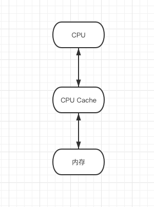

# Concurrency

一个程序的运行离不开三个最基本的计算机资源：CPU、内存、IO设备，然而这三种资源之间由于各种原因，一直存在速度差异性问题，众所周知就访问速度而言`CPU > 内存 > IO`，而且这里的差异是百倍级别的差异。如果我们的程序都是**串行运行**的话，那必然会存在**资源浪费**的问题，CPU更多的时候可能是在等待内存和IO，我们想要获得更大的收益，提升整个计算机系统的吞吐率的话，就需要想办法平衡这三者的速度差异，提升整体运行速度：

> 1. CPU与内存之间增加多级缓存，平衡内存相对于CPU的慢
> 2. CPU能者多劳，通过**分时复用**，平衡IO的慢，即采用**并发**的方式，让程序在等待IO的时候，CPU去执行其他的程序
> 3. 优化编译指令，即**CPU指令重排序**，提高CPU各个部件的执行效率

并发的核心其实就是：**对CPU资源的有效压榨**，我们期望的是能够尽量提高CPU**有效利用率**，甚至让CPU满负荷运行（当然得是有效利用）；同时要保证我们的任务能够**安全可靠**的完成；


#### 并发

随着计算机硬件能力不断加强，对操作系统的能力需求也在不断的增加，为了更高的资源利用率，我们希望内存中同时有多个系统和用户程序被启动交替、穿插地执行，即**并发**，其优势主要体现在以下三点：

1. **资源利用率**：对于大多数的应用来说，CPU不是也不应该是系统的瓶颈，CPU大多数时候都在等待IO完成，并发模型无疑能够大大的提高CPU的利用率，即进行有效压榨，发挥多处理器的强大能力
2. **公平性**：不同的应用对于系统的资源有着相同的使用权，操作系统通过粗粒度的**时间分片**让这些应用能共享系统资源，而不是由一个程序从头运行到尾再启动下一个程序
3. **建模的简单性**：在`Java并发编程实践`一书上，翻译成的是**便利性**，我总觉得有点不太贴切，所以就直接引用其后会提到的`建模的简单性`这样的概念...我的理解其实是当我们想要通过程序完成一个具体的任务的时候，在这个任务的各个子任务本身就是串行执行的，串行编程思维的优势（直观且简单）就很明显了；但是如果这个任务存在多个可以**异步**执行的子任务时，更高效的做法其实应该让其**并发**的执行，各个任务在必要的时候相互通信，相对来说比使用串行思维去实现更加直观容易一些，且最重要的是更高效

首先**并发**和**并行**是两个概念，并行甚至可以是实现并发的一种手段：

- **并行(Parallel)**：多个动作**同时执行**，只有在**多核**计算机上才能真正的实现；

- **并发(Concurrency)**：多个动作**同时存在**，它们之间快速的轮换执行，但是由于切换速度特别快，所以整体看起来是同时进行的，其真正执行可能是同时的（多核），也可能是串行的（单核）；（具体可参考：[Concurrency vs. Parallelism](http://tutorials.jenkov.com/java-concurrency/concurrency-vs-parallelism.html)）


**操作系统的并发性**保证了并发的能力，**进程让操作系统的并发性成为了可能，而线程让进程的内部并发成为了可能**；

- **进程**：**进程是操作系统进行资源分配的基本单位**，这些资源包括：内存、文件句柄等，**系统开销大**，**进程切换开销大**（进程的创建和销毁不仅需要保存寄存器和栈信息，还需要资源的分配回收以及页调度，开销较大），且每个进程之间资源是**隔离的**，所以进程之间的通信只能依靠一些比较粗粒度的机制，比如：套接字、信号处理器、共享内存、信号量、文件等。如果还想要深入研究的话，就是操作系统相关的内容了，等我研究明白了之后再来补充...
- **线程**：**线程是操作系统进行调度的基本单位**，线程也被称作轻量级的进程，线程会共享进程范围内的资源，但是每个线程也有各自的程序计数器、栈、局部变量等，因为其共享进程范围内的资源，线程间的通信相对于进程来说就很方便了，但是其协同机制相对来说就相对较复杂了，线程独有的资源很少，**线程间切换相对开销小**，所以现有的大部分操作系统都是以线程为基本调度单位。

Java中的Thread模型，这里直接引用一张图，图源：[Java线程生命周期与状态切换](http://throwable.club/2020/08/04/java-concurrency-thread-state/)


#### 并发正确性问题

任何方案都不能做到完美，总会有其弊端。并发模型、底层优化（即如何平衡CPU、内存、IO速度差异）也会给我们的应用带来一些风险，我们需要知道这些风险是什么，以及如何解决优化它们：

**底层优化带来的三大问题**

1. **可见性**：一个线程对共享变量进行了修改，另一个线程在其修改时序之后对共享变量读取，那么应该读到修改后的值

   造成可见性会出现问题的原因就是**CPU与内存之间的多级缓存**，CPU读取和保存数据都不会直接和内存进行交互，而是与缓存进行交互，CPU将缓存中的值刷新到内存或者重新从内存中Load值的时间是不固定的，即存在如下图所示流转：

   

   那么在多核系统中，不同线程在不同的CPU上运行，其对共享变量的修改可能还未刷新回内存中，那么其他的CPU读到的就是失效的值；

   解决方案就是**缓存一致性协议**，比如**MESI**；

   针对与Java语言的话，因其JMM模型（工作内存相当于CPU缓存，这里并不是说工作内存中的数据就在CPU缓存中，它有可能是在缓存中，也有可能是在内存中），同样会产生可见性的问题，解决方案就是**volatile**或者**锁**；

2. **原子性**：所谓原子操作是指不会被线程调度机制打断的操作；这种操作一旦开始，就一直运行到结束，中间不会有任何 context switch

   造成原子性会出现问题的原因就是**操作系统的线程调度机制**，经常使用的简单例子就是`i++`，解决办法就是**锁机制**，可以是**乐观锁(CAS)**，也可以是**悲观锁(synchronized)**

3. **有序性**：由于**CPU指令重排序**的存在，且很多编译器会在**不改变单线程程序语义**的前提下，可以重新安排语句的执行顺序（比如Java的编译器），导致我们代码的实际执行顺序可能并不是我们所写的那样；一个很经典的例子就是Java中用**双重检验锁模式**写的单例模式，`INSTANCE`变量必须要加上`volatile`关键字，否则可能会导致获取到未初始化的对象；

   ```java
   public class Singleton {
   
       private static volatile Singleton INSTANCE;
   
       private Singleton() { }
   
       public static Singleton getInstance() {
           if (INSTANCE == null) {
               synchronized (Singleton.class) {
                   if (INSTANCE == null) {
                       /***
                        * 这里JVM其实是分为三步进行的，由于编译器优化指令重排，执行顺序可能是1-2-3，也可能是1-3-2
                        * 1. 给 instance 分配内存
                        * 2. 调用 Singleton 的构造函数来初始化成员变量
                        * 3. 将instance对象指向分配的内存空间（执行完这步 instance 就为非 null 了）
                        * 那么可能以1-3-2的方式执行时，在执行3的时候，另一线程进入了 getInstance 方法，
                        * 那么就会判断到 instance 非NULL，直接返回一个未初始化的 instance，
                        * 所以 instance 要申明为 volatitle ，进制指令重排序
                        *
                        */
                       INSTANCE = new Singleton();
                   }
               }
           }
           return INSTANCE;
       }
   }
   ```

**多线程并发模型带来的三大问题**

1. **安全性问题**：
2. **活跃性问题**：死锁、饥饿、活锁
3. **性能问题**：**线程上下文切换**其实也是一个比较重的操作，

**线程数量如何设置**


