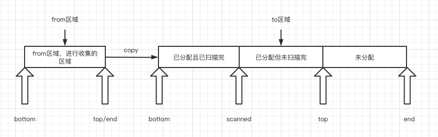
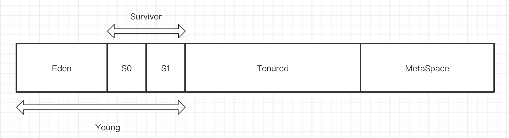
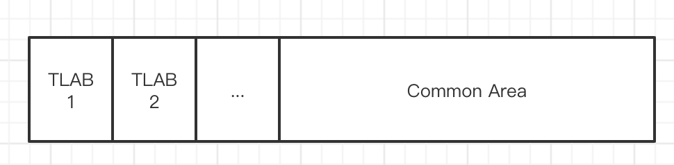

# JVM - Garbage Collection

找到特定内存空间中（一般是`Heap`和`Metaspace`）中**正在使用的对象**，标记为活跃对象，然后将**未标记的对象**的内存空间回收，从而实现内存的自动管理，这个过程就是JVM的GC。

> 以下所以内容均基于JDK8，Hotspot JVM

垃圾收集器肯定是独立与应用线程运行的，那么在其运行的过程中，不可避免的会对应用线程造成影响，最突出的一点即是争夺`CPU`，甚至完全占用`CPU`。因为垃圾收集器会直接对内存进行管理分配，那么其也必须要考虑内存管理分配时会不会产生**内存碎片化**的问题，并且同时需要保证**内存分配和释放的性能**。

**性能指标**

- 吞吐量：应用程序执行时间 / (应用程序执行时间 + 垃圾收集执行时间)
- 垃圾收集开销：垃圾收集执行时间 / (应用程序执行时间 + 垃圾收集执行时间)
- 停顿时间：当垃圾收集执行时，应用程序被挂起的总时间
- 垃圾收集频率：垃圾收集多久发生一次
- 占用空间：垃圾收集锁占用空间的大小
- 及时性：一个对象从被标记为垃圾对象到该对象所占用空间被释放的时间


####GC算法

GC算法所要达到的目标是：

1. 找到所有存活的对象，对它们进行标记
2. 然后移出所有无用的对象

**标记（Mark）**

标记阶段，也就是常说的**Mark**阶段，有两种标记方法：**可达性算法**，引用计数法（很少使用，所以不进行展开）。`Tracing GC`的根本思路就是：给定一个集合的**引用**作为根出发，通过引用关系遍历对象图，能被遍历到的（可到达的）对象就被判定为存活，其余对象（也就是没有被遍历到的）就自然被判定为死亡。根据GC算法的不同，遍历方式有**广度优先搜索（BFS）**和**深度优先搜索（DFS）**。

`HotSpot`虚拟机使用基于`GC Roots`的可达性算法，所谓的`GC Roots`其实**一组必须活跃的引用**，注意这里说的是**引用**，而不是对象。能够作为`GC Roots`的引用可能包括：

- 执行上下文，即所有线程的当前栈帧中指向 **堆** 中对象的引用；即正在被调用的方法的引用类型的参数/局部变量/临时值（虚拟机栈、本地方法栈中当前栈帧的 **局部变量表**）；
- 全局性引用/静态数据结构，**方法区**中的**类静态字段**，方法区中的**常量**
- 在方法区中常量引用的对象，比如字符串常量池 ( `String Table` ) 里的引用。
- JNI 相关，JNI 方法的局部变量与参数（JNI Local），全局 JNI 引用（JNI Global）
- 所有被同步锁 ( `synchronized`关键字 ) 持有的对象引用。
- 等等...

另外，对于之后要讲到的`Young区`和`Old区(Tenured区)`分代回收来说，不同分代之间的对象也很有可能相互引用，比如进行`Young区`收集时，`Old区`中持有的`Young区`对象的引用，也是`GC Roots`，JVM中采用了`Card Table`的方式来实现这些`GC Roots`的查找。

`Mark`阶段一定是会`Stop The World`的，即暂停业务线程，主要是为了避免在进行`Mark`的时候，有新的对象引用关系产生。对于一些新的收集器（`CMS`，`G1`）来说，`old gc`时第一阶段的`Mark`可以不用STW，但是之后也一定会有需要STW的`remark`阶段，这样可以显著降低STW的时间。

**如何找到GC Roots**

> todo: https://www.iteye.com/blog/rednaxelafx-1044951

- **oopMap**：安全区域？在类被加载完成以后，JVM 就会把这个类里的属性类型，偏移量都计算出来，在特定的位置记录下栈空间和寄存器里哪些位置有引用关系

  >举个例子：OopMp 记录 Person p = new Person() 关系如下：
  >
  >0x1453eab7f :call  0xwef2656e0 ; OopMap{ebx= Oop [16] = Oop, off = 142}
  >
  >EBX 寄存器 和栈偏移量为 16 的内存 区域有个对象指针
  >
  >在 内存地址 0x1453eab7f  到 0xwef2656e0 处记录了 变量 p 的引用关系，
  >
  >然后 垃圾回收器知道这个信息之后就会在堆空间把 new Person() 这个对象当做 GC Root 节点
  >
  >
  >
  >作者：晨曦
  >链接：https://www.zhihu.com/question/33210180/answer/1404087850
  >来源：知乎
  >著作权归作者所有。商业转载请联系作者获得授权，非商业转载请注明出处。

- **Card Table**：老年代对年轻代对象的引用

- 年轻代对老年代的引用：


**复制（Copy）**

`Copy`算法是3中清理算法中最简单也最效率的一种，即把所有存活对象复制到内存中预先划分好的一块空闲区间（**to空间**），之前的内存空间（**from空间**）就可以直接整块清除，`Copy`可以有效的避免内存碎片化的问题，但是对内存空间的利用率不高，因为总有一块空闲内存区间。



进行`copy`工作时，`to-space`如果有新的对象分配请求到来时，只需要更新`to-space`的分配指针（top），并初始化对象即可，实现快速分配。在GC结束后，不需要对原本的`from-space`做什么清理动作，只要把它的分配指针（top）设回到初始位置（bottom）即可，之前在里面的对象就当作不存在了。按照这种方式，JVM内部维护了一个指针`allocatedTail`，它始终指向先前已分配对象的尾部，同时为了保证对象分配时的线程安全，同时避免全局锁带来的性能问题，`HotSpot JVM`内部使用了`Thread-Local Allocation Buffers (TLABs)`来提升对线程内存分配的吞吐量。

同时，为了解决对象的指针变化问题，JVM引入了`forward`方法，具体内容会在下文`Copying GC算法`的时候讲到。

**清理（Sweep）**

`Sweep`算法即将未标记未活跃的对象直接进行清理和回收，但是不可避免的会产生内存碎片。而如果内存有碎片就得用`freelist`之类的方式管理，分配速度通常会慢一些。

**清理算法过程**

> todo

**压缩（Compact）**

`Compact`算法是为了解决`Sweep`算法产生的内存碎片，即将存活对象移动到内存区域的起始端，然后清理掉存活对象端边界之外的内存空间，能够有效的降低内存碎片化。

清理算法都是需要和标记算法一起使用的，所以我们经常见到的就是：`Mark - Copy`、`Mark - Sweep`、`Mark - Compact`这样的词，表示的是不同的收集器使用的算法。

**压缩算法过程**

> todo


####内存分代

内存分代是基于一个基本假设 - weak generational hypothesis，大部分对象的生命期很短（die young），而没有die young的对象则很可能会存活很长时间（live long）。

基于这个假设，如果让新创建的对象都在young gen里创建，GC时进行可达性分析的范围能大大降低，然后频繁收集young gen，则大部分垃圾都能在young GC中被收集掉。由于young gen的大小配置通常只占整个GC堆的较小部分，而且较高的对象死亡率（或者说较低的对象存活率）让它非常适合使用copying算法来收集，这样就不但能降低单次GC的时间长度，还可以提高GC的工作效率。

基于此，JVM把内存池划分为多个内存区域：



- 年轻代（`Young Generation`）：包括`Eden`和`Survivor`，其中`Survivor`又分为`Survivor0`和`Survivor1`，这两个区域总有一个区域是空的。在进行GC时，其中一个`Survivor`和`Eden`组成`from space`，另外一个`suivivor`就是`to space`了
- 老年代（`Old Generation`）：一般称为`Tenured`，一个对象在经历了多次`Young GC`之后，就会晋升(`promote`)到`Tenured`区，在老年代里的对象很可能会存活很长一段时间
- 元空间（`MetaSpace`）：存放类元数据的内存区域

**Young Generation**

年轻代是JVM主要的创建对象的区域，一般我们`new`的对象都分配在了`eden`区，除非是年轻代放不下的大对象，这样的大对象直接进行老年代分配。`Young`区采用的GC算法都是`Mark - Copy`算法，根据不同的收集器的实现有**串行**和**并行**之分，后续会详细讲到。

年轻代的大小可以通过以下参数配置：

- **-Xmn：**直接设置年轻代大小
- **-XX:NewRatio=n：**设置老年代：年轻代 = n，即年轻代占堆内存的1/(n + 1)，n默认为2

在采用`CMS`垃圾收集器时，只是配置了`-XX:NewRatio=n`或者没有配置任何参数（即采用默认`-XX:NewRatio=2`），那么JVM不一定会设置年轻代为我们想要的大小，会设置为：`preferred_max_new_size = MIN2(max_heap/(NewRatio+1), ScaleForWordSize(young_gen_per_worker * parallel_gc_threads))`，具体参考：[CMS GC 默认新生代是多大？](https://www.jianshu.com/p/832fc4d4cb53)

**Eden**



而**Eden**进一步划分为驻留在**Eden**空间中的一个或者多个**Thread Local Allocation Buffer(线程本地分配缓冲区，简称TLAB)**，**TLAB**是线程独占的。JVM允许线程在创建大多数对象的时候直接在相应的**TLAB**中进行分配，这样可以避免多线程之间进行同步带来的性能开销。当无法在**TLAB**中进行对象分配的时候(一般是缓冲区没有足够的空间)，那么对象分配操作将会在**Eden**中共享的空间(**Common Area**)中进行。如果整个**Eden**都没有足够的空间，则会触发**YGC(Young Generation Garbage Collection)**，以释放更多的**Eden**中的空间。触发YGC后依然没有足够的内存，那么对象就会在老年代中分配（一般这种情况称为**分配担保(Handle Promotion)**，是有前置条件的）。

**Survivor**

即满足`Copy`算法而划分出来的内存区域，`S0`和`S1`总有一个区域是空闲的，他们两互为`From`和`To`的关系，一次YGC的过程即是将`Eden`区和`From`区的存活对象移动到`To`区，移动完成后，`Eden`和`From`就会清空，如此循环往复。

`Survivor`区的大小可以通过`-XX:SurvivorRatio=n`来配置，其中n表示`Eden`:`S0`:`S1`，即`S0`的大小为：`Young`区大小 / (1 + 1 + n)，其中n默认为8。

而经过多次移动都还存活下来的对象，就会直接移动到老年代区，然后直到老年代GC时判断其时候可达将其回收掉。

如果对象在`Eden`中创建，那么其初始年龄为0，经历过一次YGC后依然存活，那么其年龄加1，当其年龄增加到晋升老年代的年龄阈值的时候，那么它就会直接被移动到老年代。**晋升老年代的年龄阈值**的JVM参数是`-XX:MaxTenuringThreshold=n`，其中n默认为**6（jdk8，jdk8之前是15）**，也是可以设置的最大值，但是6也不是绝对的。JVM还具备**动态对象年龄判断**的功能，JVM并不是永远地要求存活对象的年龄必须达到`MaxTenuringThreshold`才能晋升到老年代，如果在**Survivor Spaces**中相同年龄的所有对象的大小总和大于**Survivor Spaces**的一半，那么年龄大于或者等于该年龄的对象可以直接晋升到老年代，不需要等待对象年龄到达`MaxTenuringThreshold`。

- 多次YGC对象存活下来并且年龄到达设定的`-XX:MaxTenuringThreshold=n`导致对象晋升。
- 因为动态对象年龄判断导致对象晋升（如果在`Survivor Spaces`中相同年龄的所有对象的大小总和大于`Survivor Spaces`的一半）。
- 大对象直接进入老年代。
- 年轻代空间不足的时候，老年代会进行空间分配担保，这种情况下对象也是直接在老年代分配。

**Tenured**

老年代承载的对象一般不会是内存垃圾，其回收率要比年轻代低很多，但是回收开销要高很多（存活对象更多，内存空间更大），所以老年代不能采用`Copy`的方式进行垃圾清理，一般是采用`Sweep`或`Compact`的方式。


#### GC 类型

在`HotSpot VM`中，GC分类只有两大种：

- `Partial GC`：也就是部分GC，不收集整个堆
  - `Young GC`：只收集`Young gen`，`Young GC`有多种实现，其触发条件都是`Eden gen`分配满了的情况，但其基本算法都是基于`Copying GC`，`Copying GC`时都会`stop the world`的，但是因为`Young gen`的空间我们一般不会设置很大，所以其停顿时间很短，可以接受的。
  - `Old GC`：只收集`Old gen`，目前只有`CMS`的`concurrent collection`是这个模式
  - `Mixed GC`：收集整个`Young gen`和部分`old gen`，目前只有`G1`有这个模式
- `Full GC`：收集整个堆，包括`Young gen`、`Old gen`、`Metaspace`，触发条件根据不同的`Collector`不同

而我们常说的`Minor GC`、`Major GC`都只是俗称，`Major GC`通常是跟`full GC`是等价的，收集整个GC堆。


#### GC Collector

`Hotspot VM`中通过不同的GC算法的组合实现对不同分代的垃圾收集（其中`Serial GC`和`Parallel GC`因为已经过时，所以这里不做详细分析）：

- `Serial GC`算法：即**串行**GC，`Serial Young GC`(负责`Young gen`，`Copying gc`算法) ＋ `Serial Old GC`(是`Full GC`，会收集整个`heap`，`mark - compact`算法)的组合，启动参数：`-XX:+UseSerialGC`

  注意`Serial Old GC`是进行的**Full GC**，是对整个堆进行垃圾回收。其`full gc`触发条件：

  - 当准备要触发一次young GC时，如果发现统计数据说之前young GC的平均晋升大小比目前old gen剩余的空间大，则不会触发young GC而是转为触发full GC
  - 如果有perm gen的话，要在perm gen分配空间但已经没有足够空间时，也要触发一次full GC
  - 或者System.gc()、heap dump带GC，默认也是触发full GC

- `Parallel GC`算法：即**并行**GC，`Parallel Young GC` (负责`Young gen`，`Copying gc`算法) ＋ 非并行的`PS MarkSweep GC` / 并行的`Parallel Old GC`(是`Full GC`，会收集整个`heap`，`mark - compact`算法)的组合，启动参数：`–XX:+UseParallelGC` + `–XX:+UseParallelOldGC`

  这里`PS MarkSweep GC`和`Parallel Old GC`都是进行的`Full GC`，并且在其触发的时候，会默认先进行一次`Young GC`，以期降低`full GC`的暂停时间（因为`young GC`会尽量清理了`young gen`的死对象，减少了`full GC`的工作量），触发条件同`Serial Old GC`

- `CMS`算法：`jdk8`默认采用的GC算法（`Non-default VM flags: -XX:+UseConcMarkSweepGC -XX:+UseParNewGC`），`ParNew（Young）GC` + `CMS（Old）GC` （`concurrent collection`模式，`mark - sweep`算法，会产生内存碎片，piggyback on ParNew的结果／老生代存活下来的object只做记录，不做`compaction`）＋ `Full GC for CMS`算法（如果并发收集所回收到的空间赶不上分配的需求(`concurrent mode failure`、`promotion failed`)，就会回退到使用`serial GC`的`mark-compact`算法做`full GC`，也就是mark-sweep为主，mark-compact为备份的经典配置）

- `Garbage-First（G1）GC`算法：启动参数`-XX:+UseG1GC`，`Young GC` + `mixed GC`（新生代，再加上部分老生代）＋ `Full GC for G1 GC`算法

##### Hotspot GC Collector启动分析

```c++
// /src/share/vm/prims/jni.cpp
_JNI_IMPORT_OR_EXPORT_ jint JNICALL JNI_CreateJavaVM(JavaVM **vm, void **penv, void *args) {
  ...
  // 创建虚拟机
  result = Threads::create_vm((JavaVMInitArgs*) args, &can_try_again);
  ...
}

// /src/share/vm/runtime/thread.cpp
jint Threads::create_vm(JavaVMInitArgs* args, bool* canTryAgain) {
  // 各种模块init()
  ...
  // Initialize global modules
  /*
   * 初始化全局模块
   * ========================================
   * 1. 初始化management模块
   * 2. 初始化字节码/操作符表
   * 3. 初始化ClassLoader
   * 4. 根据命令行参数决定编译策略
   * 5. 代码缓存初始化
   * 6. 虚拟机版本初始化
   * 7. OS全局初始化
   * ....
   *
   * ========================================
   */
  jint status = init_globals();
  ...
}

// /src/share/vm/runtime/init.cpp
jint init_globals() {
  ...
  // 初始化堆以及决定所使用GC策略
  jint status = universe_init();  // dependent on codeCache_init and
                                  // stubRoutines_init1 and metaspace_init.
  if (status != JNI_OK)
    return status;
  ...
}

// /src/share/vm/memory/universe.cpp
jint universe_init() {
  ...
  // 初始化堆空间
  // 流程：根据启动参数决定使用的回收策略，初始化回收策略时会指定所使用的代规范，
  // 	  	最后根据规范创建对应类型的回收堆。
  //    	i.e. arguments -> policy -> spec -> heap
  jint status = Universe::initialize_heap();
  if (status != JNI_OK) {
    return status;
  }
	// 初始化元数据空间
  Metaspace::global_initialize();
  ...
}

// 根据GC策略创建堆空间
jint Universe::initialize_heap() {
  if (UseParallelGC) {
#if INCLUDE_ALL_GCS
    Universe::_collectedHeap = new ParallelScavengeHeap();
#else  // INCLUDE_ALL_GCS
    fatal("UseParallelGC not supported in this VM.");
#endif // INCLUDE_ALL_GCS

  } else if (UseG1GC) {
  #if INCLUDE_ALL_GCS
    G1CollectorPolicy* g1p = new G1CollectorPolicy();
    g1p->initialize_all();
    G1CollectedHeap* g1h = new G1CollectedHeap(g1p);
    Universe::_collectedHeap = g1h;
#else  // INCLUDE_ALL_GCS
    fatal("UseG1GC not supported in java kernel vm.");
#endif // INCLUDE_ALL_GCS

  } else {
    // 默认实现
    GenCollectorPolicy *gc_policy;

    if (UseSerialGC) {
      gc_policy = new MarkSweepPolicy();
    } else if (UseConcMarkSweepGC) {
      // UseConcMarkSweepGC参数
#if INCLUDE_ALL_GCS
      if (UseAdaptiveSizePolicy) {
        gc_policy = new ASConcurrentMarkSweepPolicy();
      } else {
        // CMS回收策略
        gc_policy = new ConcurrentMarkSweepPolicy();
      }
#else  // INCLUDE_ALL_GCS
    fatal("UseConcMarkSweepGC not supported in this VM.");
#endif // INCLUDE_ALL_GCS
    } else { // default old generation
      gc_policy = new MarkSweepPolicy();
    }
    // 初始化GenCollectorPolicy
    gc_policy->initialize_all();
    // 创建堆空间对象
    Universe::_collectedHeap = new GenCollectedHeap(gc_policy);
  }
	
  // 真正向操作系统申请内存，这里heap默认为GenCollectedHeap，GenCollectedHeap即是分代收集堆
  jint status = Universe::heap()->initialize();
  if (status != JNI_OK) {
    return status;
  }
	...
}

// /src/share/vm/memory/genCollectedHeap.cpp
GenCollectedHeap::GenCollectedHeap(GenCollectorPolicy *policy) :
  SharedHeap(policy), // sharedHeap，持有创建GC线程逻辑
  _gen_policy(policy),
  _gen_process_strong_tasks(new SubTasksDone(GCH_PS_NumElements)),
  _full_collections_completed(0)
{
  if (_gen_process_strong_tasks == NULL ||
      !_gen_process_strong_tasks->valid()) {
    vm_exit_during_initialization("Failed necessary allocation.");
  }
  assert(policy != NULL, "Sanity check");
}
jint GenCollectedHeap::initialize() {
  ...
  // 获取各内存代管理器的生成器，
  // 这里的_gen_policy即是new的时候传进来的policy，我们这里主要分析CMS
  // GenCollectorPolicy._generations是在Universe::initialize_heap中调用gc_policy->initialize_all()时
  // 通过initialize_generations()方法初始化，initialize_generations由各个子类复写
  _gen_specs = gen_policy()->generations();
  // Make sure the sizes are all aligned.
  for (i = 0; i < _n_gens; i++) {
    _gen_specs[i]->align(gen_alignment);
  }

  // Allocate space for the heap.

  char* heap_address;
  size_t total_reserved = 0;
  int n_covered_regions = 0;
  ReservedSpace heap_rs;

  size_t heap_alignment = collector_policy()->heap_alignment();
	// 申请内存
  heap_address = allocate(heap_alignment, &total_reserved,
                          &n_covered_regions, &heap_rs);
  ...
  // GenCollectedHeap::heap()获取自己...
  _gch = this;
  // 初始化各内存代管理器，即concurrentMarkSweepGeneration这些东西
  for (i = 0; i < _n_gens; i++) {
    ReservedSpace this_rs = heap_rs.first_part(_gen_specs[i]->max_size(), false, false);
    _gens[i] = _gen_specs[i]->init(this_rs, i, rem_set());
    heap_rs = heap_rs.last_part(_gen_specs[i]->max_size());
  }
  clear_incremental_collection_failed();

#if INCLUDE_ALL_GCS
  // If we are running CMS, create the collector responsible
  // for collecting the CMS generations.
  // 如果当前的GC策略为ConcurrentMarkSweepPolicy，则通过create_cms_collector创建cms_collector
  if (collector_policy()->is_concurrent_mark_sweep_policy()) {
    bool success = create_cms_collector();
    if (!success) return JNI_ENOMEM;
  }
#endif // INCLUDE_ALL_GCS

  return JNI_OK;
}

bool GenCollectedHeap::create_cms_collector() {

  assert(((_gens[1]->kind() == Generation::ConcurrentMarkSweep) ||
         (_gens[1]->kind() == Generation::ASConcurrentMarkSweep)),
         "Unexpected generation kinds");
  // Skip two header words in the block content verification
  NOT_PRODUCT(_skip_header_HeapWords = CMSCollector::skip_header_HeapWords();)
  CMSCollector* collector = new CMSCollector(
    (ConcurrentMarkSweepGeneration*)_gens[1],
    _rem_set->as_CardTableRS(),
    (ConcurrentMarkSweepPolicy*) collector_policy());

  if (collector == NULL || !collector->completed_initialization()) {
    if (collector) {
      delete collector;  // Be nice in embedded situation
    }
    vm_shutdown_during_initialization("Could not create CMS collector");
    return false;
  }
  return true;  // success
}

// /src/share/vm/gc_implementation/concurrentMarkSweep/cmsCollectorPolicy.cpp
void ConcurrentMarkSweepPolicy::initialize_generations() {
  _generations = NEW_C_HEAP_ARRAY3(GenerationSpecPtr, number_of_generations(), mtGC, 0, AllocFailStrategy::RETURN_NULL);
  if (_generations == NULL)
    vm_exit_during_initialization("Unable to allocate gen spec");

  // 初始化内存区0，即young gen
  if (UseParNewGC) {
    if (UseAdaptiveSizePolicy) {
      _generations[0] = new GenerationSpec(Generation::ASParNew,
                                           _initial_gen0_size, _max_gen0_size);
    } else {
      _generations[0] = new GenerationSpec(Generation::ParNew,
                                           _initial_gen0_size, _max_gen0_size);
    }
  } else {
    _generations[0] = new GenerationSpec(Generation::DefNew,
                                         _initial_gen0_size, _max_gen0_size);
  }
  // 初始话内存区1，即old gen
  if (UseAdaptiveSizePolicy) {
    _generations[1] = new GenerationSpec(Generation::ASConcurrentMarkSweep,
                            _initial_gen1_size, _max_gen1_size);
  } else {
    _generations[1] = new GenerationSpec(Generation::ConcurrentMarkSweep,
                            _initial_gen1_size, _max_gen1_size);
  }

  if (_generations[0] == NULL || _generations[1] == NULL) {
    vm_exit_during_initialization("Unable to allocate gen spec");
  }
}

// /src/share/vm/memory/generationSpec.cpp
Generation* GenerationSpec::init(ReservedSpace rs, int level,
                                 GenRemSet* remset) {
  switch (name()) {
    case Generation::DefNew:
      return new DefNewGeneration(rs, init_size(), level);

    case Generation::MarkSweepCompact:
      return new TenuredGeneration(rs, init_size(), level, remset);

#if INCLUDE_ALL_GCS
    case Generation::ParNew:
      return new ParNewGeneration(rs, init_size(), level);

    case Generation::ASParNew:
      return new ASParNewGeneration(rs,
                                    init_size(),
                                    init_size() /* min size */,
                                    level);

    case Generation::ConcurrentMarkSweep: {
      assert(UseConcMarkSweepGC, "UseConcMarkSweepGC should be set");
      CardTableRS* ctrs = remset->as_CardTableRS();
      if (ctrs == NULL) {
        vm_exit_during_initialization("Rem set incompatibility.");
      }
      // Otherwise
      // The constructor creates the CMSCollector if needed,
      // else registers with an existing CMSCollector

      ConcurrentMarkSweepGeneration* g = NULL;
      g = new ConcurrentMarkSweepGeneration(rs,
                 init_size(), level, ctrs, UseCMSAdaptiveFreeLists,
                 (FreeBlockDictionary<FreeChunk>::DictionaryChoice)CMSDictionaryChoice);

      g->initialize_performance_counters();

      return g;
    }

    case Generation::ASConcurrentMarkSweep: {
      assert(UseConcMarkSweepGC, "UseConcMarkSweepGC should be set");
      CardTableRS* ctrs = remset->as_CardTableRS();
      if (ctrs == NULL) {
        vm_exit_during_initialization("Rem set incompatibility.");
      }
      // Otherwise
      // The constructor creates the CMSCollector if needed,
      // else registers with an existing CMSCollector

      ASConcurrentMarkSweepGeneration* g = NULL;
      g = new ASConcurrentMarkSweepGeneration(rs,
                 init_size(), level, ctrs, UseCMSAdaptiveFreeLists,
                 (FreeBlockDictionary<FreeChunk>::DictionaryChoice)CMSDictionaryChoice);

      g->initialize_performance_counters();

      return g;
    }
#endif // INCLUDE_ALL_GCS

    default:
      guarantee(false, "unrecognized GenerationName");
      return NULL;
  }
}

// /src/share/vm/memory/sharedHeap.cpp
SharedHeap::SharedHeap(CollectorPolicy* policy_) :
  CollectedHeap(),
  _collector_policy(policy_),
  _rem_set(NULL),
  _strong_roots_parity(0),
  _process_strong_tasks(new SubTasksDone(SH_PS_NumElements)),
  _workers(NULL)
{
  if (_process_strong_tasks == NULL || !_process_strong_tasks->valid()) {
    vm_exit_during_initialization("Failed necessary allocation.");
  }
  _sh = this;  // ch is static, should be set only once.
  if ((UseParNewGC ||
      (UseConcMarkSweepGC && (CMSParallelInitialMarkEnabled ||
                              CMSParallelRemarkEnabled)) ||
       UseG1GC) &&
      ParallelGCThreads > 0) {
    // 创建GC线程管理调度器，这里ParallelGCThreads默认为0，但是不过JVM会根据当前的GC策略和系统cpu的数量来进行计算调整
    // 其计算逻辑在/src/share/vm/runtime/vm_version.cpp - Abstract_VM_Version::parallel_worker_threads()
    _workers = new FlexibleWorkGang("Parallel GC Threads", ParallelGCThreads,
                            /* are_GC_task_threads */true,
                            /* are_ConcurrentGC_threads */false);
    if (_workers == NULL) {
      vm_exit_during_initialization("Failed necessary allocation.");
    } else {
      _workers->initialize_workers();
    }
  }
}
```

**GC 触发**

`new Object()`时，最终会调用`InstanceKlass::allocate_instance`进行内存申请，其会调用`CollectedHeap::obj_allocate`进行内存分配：

```c++
// /src/share/vm/gc_interface/collectedHeap.inline.hpp
// 1. 调用CollectedHeap::obj_allocate
oop CollectedHeap::obj_allocate(KlassHandle klass, int size, TRAPS) {
  debug_only(check_for_valid_allocation_state());
  assert(!Universe::heap()->is_gc_active(), "Allocation during gc not allowed");
  assert(size >= 0, "int won't convert to size_t");
  // 分配内存
  HeapWord* obj = common_mem_allocate_init(klass, size, CHECK_NULL);
  // 会在这个函数里设置对象头等信息
  post_allocation_setup_obj(klass, obj);
  NOT_PRODUCT(Universe::heap()->check_for_bad_heap_word_value(obj, size));
  return (oop)obj;
}

// 2. CollectedHeap::common_mem_allocate_init并init
HeapWord* CollectedHeap::common_mem_allocate_init(KlassHandle klass, size_t size, TRAPS) {
  HeapWord* obj = common_mem_allocate_noinit(klass, size, CHECK_NULL);
  init_obj(obj, size);
  return obj;
}

void CollectedHeap::init_obj(HeapWord* obj, size_t size) {
  assert(obj != NULL, "cannot initialize NULL object");
  const size_t hs = oopDesc::header_size();
  assert(size >= hs, "unexpected object size");
  // 设置GC分代年龄
  ((oop)obj)->set_klass_gap(0);
  Copy::fill_to_aligned_words(obj + hs, size - hs);
}

// 3. 调用CollectedHeap::common_mem_allocate_noinit分配内存空间
HeapWord* CollectedHeap::common_mem_allocate_noinit(KlassHandle klass, size_t size, TRAPS) {
	// Clear unhandled oops for memory allocation.  Memory allocation might
  // not take out a lock if from tlab, so clear here.
  // 清理当前线程TLAB中未使用的opp
  CHECK_UNHANDLED_OOPS_ONLY(THREAD->clear_unhandled_oops();)
  ...
  HeapWord* result = NULL;
  // 3.1 如果开启了TLAB，先尝试通过TLAB分配
  if (UseTLAB) {
    result = allocate_from_tlab(klass, THREAD, size);
    if (result != NULL) {
      assert(!HAS_PENDING_EXCEPTION,
             "Unexpected exception, will result in uninitialized storage");
      return result;
    }
  }
  bool gc_overhead_limit_was_exceeded = false;
  // 3.2 如果tlab分配失败，就直接调用heap处理分配
  result = Universe::heap()->mem_allocate(size,
                                          &gc_overhead_limit_was_exceeded);
  if (result != NULL) {
    NOT_PRODUCT(Universe::heap()->
      check_for_non_bad_heap_word_value(result, size));
    assert(!HAS_PENDING_EXCEPTION,
           "Unexpected exception, will result in uninitialized storage");
    THREAD->incr_allocated_bytes(size * HeapWordSize);

    AllocTracer::send_allocation_outside_tlab_event(klass, size * HeapWordSize);

    return result;
  }

  // 分配失败，抛出异常
  if (!gc_overhead_limit_was_exceeded) {
    // 异常处理，Java heap space表示当前堆内存严重不足
    // -XX:+HeapDumpOnOutOfMemoryError and -XX:OnOutOfMemoryError support
    report_java_out_of_memory("Java heap space");

    if (JvmtiExport::should_post_resource_exhausted()) {
      JvmtiExport::post_resource_exhausted(
        JVMTI_RESOURCE_EXHAUSTED_OOM_ERROR | JVMTI_RESOURCE_EXHAUSTED_JAVA_HEAP,
        "Java heap space");
    }

    THROW_OOP_0(Universe::out_of_memory_error_java_heap());
  } else {
    // 同上，异常处理，GC overhead limit exceeded表示执行GC后仍不能有效回收内存导致内存不足
    // -XX:+HeapDumpOnOutOfMemoryError and -XX:OnOutOfMemoryError support
    report_java_out_of_memory("GC overhead limit exceeded");

    if (JvmtiExport::should_post_resource_exhausted()) {
      JvmtiExport::post_resource_exhausted(
        JVMTI_RESOURCE_EXHAUSTED_OOM_ERROR | JVMTI_RESOURCE_EXHAUSTED_JAVA_HEAP,
        "GC overhead limit exceeded");
    }

    THROW_OOP_0(Universe::out_of_memory_error_gc_overhead_limit());
  }
}

// 3.1 如果开启了TLAB，先尝试通过TLAB分配
HeapWord* CollectedHeap::allocate_from_tlab(KlassHandle klass, Thread* thread, size_t size) {
  assert(UseTLAB, "should use UseTLAB");

  // thread
  HeapWord* obj = thread->tlab().allocate(size);
  if (obj != NULL) {
    return obj;
  }
  // Otherwise...
  return allocate_from_tlab_slow(klass, thread, size);
}

// 3.2 走慢速模式从tlab中分配内存，
HeapWord* CollectedHeap::allocate_from_tlab_slow(KlassHandle klass, Thread* thread, size_t size) {

  // Retain tlab and allocate object in shared space if
  // the amount free in the tlab is too large to discard.
  // 如果剩余的空间大于允许refill浪费的空间则继续使用该TLAB，返回NULL后就将在Eden区分配内存，
  // 因为必须加锁，所以相对于走TLAB是慢速分配
  if (thread->tlab().free() > thread->tlab().refill_waste_limit()) {
    thread->tlab().record_slow_allocation(size);
    return NULL;
  }

  // Discard tlab and allocate a new one.
  // To minimize fragmentation, the last TLAB may be smaller than the rest.
  // 如果剩余的空闲小于refill浪费的空间则丢弃当前线程的TLAB，重新分配一个新的
  // 为了避免内存碎片化，新分配的TLAB会比之前分配的更小，compute_size就是计算待分配的TLAB的大小，如果返回0说明Eden区内存不足
  size_t new_tlab_size = thread->tlab().compute_size(size);

  // 这里的clear并不是释放当前TALB占用的内存，而是将剩余的允许浪费的空间用无意义的对象填充，让Eden区的内存是连续的
  // 同时将top，end指针等置位NULL
  thread->tlab().clear_before_allocation();

  if (new_tlab_size == 0) {
    return NULL;
  }

  // Allocate a new TLAB...
  HeapWord* obj = Universe::heap()->allocate_new_tlab(new_tlab_size);
  if (obj == NULL) {
    return NULL;
  }

  AllocTracer::send_allocation_in_new_tlab_event(klass, new_tlab_size * HeapWordSize, size * HeapWordSize);

  ...
  // 新分配的TLAB的属性初始化 
  thread->tlab().fill(obj, obj + size, new_tlab_size);
  return obj;
}

// 3.1.1 talb初始化
// src/share/vm/runtime/thread.cpp
// The first routine called by a new Java thread
void JavaThread::run() {
  // initialize thread-local alloc buffer related fields
  this->initialize_tlab();

  // used to test validitity of stack trace backs
  this->record_base_of_stack_pointer();
  ...
}

void initialize_tlab() {
  if (UseTLAB) {
    tlab().initialize();
  }
}

// 3.1.2 tlab.initialize，这里只完成了TLAB的关键属性初始化，并没有真正的分配内存
// 分配内存是在该线程第一次分配对象的时候，或者是TLAB内存不足需要重新创建一个TLAB的时候
// src/share/vm/memory/threadLocalAllocBuffer.cpp
void ThreadLocalAllocBuffer::initialize() {
  initialize(NULL,                    // start
             NULL,                    // top
             NULL);                   // end

  // 计算talb _desired_size
  set_desired_size(initial_desired_size());

  // Following check is needed because at startup the main (primordial)
  // thread is initialized before the heap is.  The initialization for
  // this thread is redone in startup_initialization below.
  if (Universe::heap() != NULL) {
    size_t capacity   = Universe::heap()->tlab_capacity(myThread()) / HeapWordSize;
    double alloc_frac = desired_size() * target_refills() / (double) capacity;
    _allocation_fraction.sample(alloc_frac);
  }

  // 设置当前TLAB的_refill_waste_limit
  set_refill_waste_limit(initial_refill_waste_limit());

  // 初始化一些统计字段
  initialize_statistics();
}

// /src/share/vm/memory/genCollectedHeap.cpp
HeapWord* GenCollectedHeap::mem_allocate(size_t size,
                                         bool* gc_overhead_limit_was_exceeded) {
  // 4. 委托给collector_policy进行分配
  return collector_policy()->mem_allocate_work(size,
                                               false /* is_tlab */,
                                               gc_overhead_limit_was_exceeded);
}

// /src/share/vm/memory/collectorPolicy.cpp
// 从heap中分配指定大小的内存块，并在必要的时候触发gc
HeapWord* GenCollectorPolicy::mem_allocate_work(size_t size,
                                        bool is_tlab,
                                        bool* gc_overhead_limit_was_exceeded) {
  GenCollectedHeap *gch = GenCollectedHeap::heap();
  ...
  HeapWord* result = NULL;

  // Loop until the allocation is satisified,
  // or unsatisfied after GC.
  // 进入一个死循环,退出循环的条件就是:执行return 或者是抛异常
  for (int try_count = 1, gclocker_stalled_count = 0; /* return or throw */; try_count += 1) {
    // First allocation attempt is lock-free.
    // 4.1. 先在young gen分配
    Generation *gen0 = gch->get_gen(0);
    assert(gen0->supports_inline_contig_alloc(),
      "Otherwise, must do alloc within heap lock");
    if (gen0->should_allocate(size, is_tlab)) {
      // generation内部加锁，分配指定大小内存
      result = gen0->par_allocate(size, is_tlab);
      if (result != NULL) {
        assert(gch->is_in_reserved(result), "result not in heap");
        return result;
      }
    }
    unsigned int gc_count_before;  // read inside the Heap_lock locked region
    {
      // 获取heap的锁
      MutexLocker ml(Heap_lock);
      if (PrintGC && Verbose) {
        gclog_or_tty->print_cr("TwoGenerationCollectorPolicy::mem_allocate_work:"
                      " attempting locked slow path allocation");
      }
      // Note that only large objects get a shot at being
      // allocated in later generations.
      // 只有大对象才会在老年代分配
      bool first_only = ! should_try_older_generation_allocation(size);
			// 在heap上一个区一个区的试，直到成功或者都成功不了
      result = gch->attempt_allocation(size, is_tlab, first_only);
      if (result != NULL) {
        assert(gch->is_in_reserved(result), "result not in heap");
        return result;
      }
      if (GC_locker::is_active_and_needs_gc()) {
        // 前GC锁是被激活，有线程处于JNI关键区且需要GC
        if (is_tlab) {
          return NULL;  // Caller will retry allocating individual object
        }
        if (!gch->is_maximal_no_gc()) {
          // 尝试扩展堆并分配
          // Try and expand heap to satisfy request
          result = expand_heap_and_allocate(size, is_tlab);
          // result could be null if we are out of space
          if (result != NULL) {
            return result;
          }
        }
        ...
      }
      // 要GC回收内存,再尝试分配了,向VMThread提交VM_GenCollectForAllocation
      //  VM_Operation
      //      VM_GC_Operation
      //          VM_GC_HeapInspection
      //          VM_GenCollectForAllocation
      //          VM_GenCollectFull
      //          VM_GenCollectFullConcurrent
      //          VM_ParallelGCFailedAllocation
      //          VM_ParallelGCSystemGC
      //  VM_GC_Operation
      //   - implements methods common to all classes in the hierarchy:
      //     prevents multiple gc requests and manages lock on heap;
      //
      //  VM_GC_HeapInspection
      //   - prints class histogram on SIGBREAK if PrintClassHistogram
      //     is specified; and also the attach "inspectheap" operation
      //
      //  VM_GenCollectForAllocation
      //  VM_ParallelGCFailedAllocation
      //   - this operation is invoked when allocation is failed;
      //     operation performs garbage collection and tries to
      //     allocate afterwards;
      //
      //  VM_GenCollectFull
      //  VM_GenCollectFullConcurrent
      //  VM_ParallelGCSystemGC
      //   - these operations preform full collection of heaps of
      //     different kind
      //
      VM_GenCollectForAllocation op(size, is_tlab, gc_count_before);
      // 保存到VMThread的队列中，当前线程会被阻塞直到GC完成
    	VMThread::execute(&op);
      ...
  }
}
  
// Return true if any of the following is true:
// . the allocation won't fit into the current young gen heap
// . gc locker is occupied (jni critical section)
// . heap memory is tight -- the most recent previous collection
//   was a full collection because a partial collection (would
//   have) failed and is likely to fail again
bool GenCollectorPolicy::should_try_older_generation_allocation(
        size_t word_size) const {
  GenCollectedHeap* gch = GenCollectedHeap::heap();
  size_t gen0_capacity = gch->get_gen(0)->capacity_before_gc();
  return    (word_size > heap_word_size(gen0_capacity))
         || GC_locker::is_active_and_needs_gc()
         || gch->incremental_collection_failed();
}

// /src/share/vm/memory/genCollectedHeap.cpp
HeapWord* GenCollectedHeap::attempt_allocation(size_t size,
                                               bool is_tlab,
                                               bool first_only) {
  HeapWord* res;
  for (int i = 0; i < _n_gens; i++) {
    if (_gens[i]->should_allocate(size, is_tlab)) {
      res = _gens[i]->allocate(size, is_tlab);
      if (res != NULL) return res;
      else if (first_only) break;
    }
  }
  // Otherwise...
  return NULL;
}
  
// /src/share/vm/runtime/vmThread.cpp
void VMThread::execute(VM_Operation* op) {
  Thread* t = Thread::current();

  if (!t->is_VM_thread()) {
    // 非VM线程
    ...
    {
      VMOperationQueue_lock->lock_without_safepoint_check();
      // 加入队列
      bool ok = _vm_queue->add(op);
    	op->set_timestamp(os::javaTimeMillis());
      // 5. 唤醒VMThread线程
      VMOperationQueue_lock->notify();
      VMOperationQueue_lock->unlock();
      // VM_Operation got skipped
      if (!ok) {
        assert(concurrent, "can only skip concurrent tasks");
        if (op->is_cheap_allocated()) delete op;
        return;
      }
    }
    ...
  } else {
    // VM线程
    ...
    if (op->evaluate_at_safepoint() && !SafepointSynchronize::is_at_safepoint()) {
      SafepointSynchronize::begin();
      // 6. 开始GC 
      op->evaluate();
      SafepointSynchronize::end();
    } else {
      op->evaluate();
    }
    ...
  }
}
  
// /src/share/vm/runtime/vm_operations.cpp
void VM_Operation::evaluate() {
  ResourceMark rm;
  if (TraceVMOperation) {
    tty->print("[");
    NOT_PRODUCT(print();)
  }
  // 主要逻辑
  doit();
  if (TraceVMOperation) {
    tty->print_cr("]");
  }
}

// /src/share/vm/gc_implementation/shared/vmGCOperations.cpp
void VM_GenCollectForAllocation::doit() {
  SvcGCMarker sgcm(SvcGCMarker::MINOR);

  GenCollectedHeap* gch = GenCollectedHeap::heap();
  GCCauseSetter gccs(gch, _gc_cause);
  // 7. 处理分配失败主要逻辑，GC
  _res = gch->satisfy_failed_allocation(_size, _tlab);
  assert(gch->is_in_reserved_or_null(_res), "result not in heap");

  if (_res == NULL && GC_locker::is_active_and_needs_gc()) {
    set_gc_locked();
  }
}

// /src/share/vm/memory/genCollectedHeap.cpp
HeapWord* GenCollectedHeap::satisfy_failed_allocation(size_t size, bool is_tlab) {
  return collector_policy()->satisfy_failed_allocation(size, is_tlab);
}
  
// /src/share/vm/memory/collectorPolicy.cpp
// 8. 进行GC
HeapWord* GenCollectorPolicy::satisfy_failed_allocation(size_t size,
                                                        bool   is_tlab) {
  GenCollectedHeap *gch = GenCollectedHeap::heap();
  GCCauseSetter x(gch, GCCause::_allocation_failure);
  HeapWord* result = NULL;

  assert(size != 0, "Precondition violated");
  if (GC_locker::is_active_and_needs_gc()) {
    // GC locker is active; instead of a collection we will attempt
    // to expand the heap, if there's room for expansion.
    if (!gch->is_maximal_no_gc()) {
      result = expand_heap_and_allocate(size, is_tlab);
    }
    return result;   // could be null if we are out of space
  } else if (!gch->incremental_collection_will_fail(false /* don't consult_young */)) {
    // Do an incremental collection.
    // incremental_collection_will_fail表示如果执行增量收集是否会失败，参考上一次增量收集的结果
    // 如果可以执行增量收集
    gch->do_collection(false            /* full */,
                       false            /* clear_all_soft_refs */,
                       size             /* size */,
                       is_tlab          /* is_tlab */,
                       number_of_generations() - 1 /* max_level */);
  } else {
    if (Verbose && PrintGCDetails) {
      gclog_or_tty->print(" :: Trying full because partial may fail :: ");
    }
    // Try a full collection; see delta for bug id 6266275
    // for the original code and why this has been simplified
    // with from-space allocation criteria modified and
    // such allocation moved out of the safepoint path.
    // 执行全量full gc
    gch->do_collection(true             /* full */,
                       false            /* clear_all_soft_refs */,
                       size             /* size */,
                       is_tlab          /* is_tlab */,
                       number_of_generations() - 1 /* max_level */);
  }

  // 再次尝试分配内存
  result = gch->attempt_allocation(size, is_tlab, false /*first_only*/);

  if (result != NULL) {
    assert(gch->is_in_reserved(result), "result not in heap");
    return result;
  }

  // OK, collection failed, try expansion.
  result = expand_heap_and_allocate(size, is_tlab);
  if (result != NULL) {
    return result;
  }

  // If we reach this point, we're really out of memory. Try every trick
  // we can to reclaim memory. Force collection of soft references. Force
  // a complete compaction of the heap. Any additional methods for finding
  // free memory should be here, especially if they are expensive. If this
  // attempt fails, an OOM exception will be thrown.
  // 分配失败，说明已经内存不足了，这时需要强制清理软引用，强制压实Java堆(compact)，任何可能的获取可用内存的方法都会执行，尽管代价昂贵
  // 如果尝试失败，抛出OOM异常
  {
    UIntFlagSetting flag_change(MarkSweepAlwaysCompactCount, 1); // Make sure the heap is fully compacted

    gch->do_collection(true             /* full */,
                       true             /* clear_all_soft_refs */,
                       size             /* size */,
                       is_tlab          /* is_tlab */,
                       number_of_generations() - 1 /* max_level */);
  }

  result = gch->attempt_allocation(size, is_tlab, false /* first_only */);
  if (result != NULL) {
    assert(gch->is_in_reserved(result), "result not in heap");
    return result;
  }

  assert(!should_clear_all_soft_refs(),
    "Flag should have been handled and cleared prior to this point");

  // What else?  We might try synchronous finalization later.  If the total
  // space available is large enough for the allocation, then a more
  // complete compaction phase than we've tried so far might be
  // appropriate.
  return NULL;
}

// /src/share/vm/memory/genCollectedHeap.cpp
void GenCollectedHeap::do_collection(bool  full,
                                     bool   clear_all_soft_refs,
                                     size_t size,
                                     bool   is_tlab,
                                     int    max_level) {
  bool prepared_for_verification = false;
  ResourceMark rm;
  ...

  if (GC_locker::check_active_before_gc()) {
    return; // GC is disabled (e.g. JNI GetXXXCritical operation)
  }
  // 是否清除软引用
  const bool do_clear_all_soft_refs = clear_all_soft_refs ||
                          collector_policy()->should_clear_all_soft_refs();
  ClearedAllSoftRefs casr(do_clear_all_soft_refs, collector_policy());
  ...

  {
    FlagSetting fl(_is_gc_active, true);

    bool complete = full && (max_level == (n_gens()-1));
    ...
    // 遍历各Generation执行GC准备工作，即（ParNew和CMS）
    gc_prologue(complete);
    ...

    int starting_level = 0;
    if (full) {
      // Search for the oldest generation which will collect all younger
      // generations, and start collection loop there.
      for (int i = max_level; i >= 0; i--) {
        if (_gens[i]->full_collects_younger_generations()) {
          starting_level = i;
          break;
        }
      }
    }

    bool must_restore_marks_for_biased_locking = false;

    int max_level_collected = starting_level;
    // 遍历Generation，应该执行GC进行GC
    for (int i = starting_level; i <= max_level; i++) {
      if (_gens[i]->should_collect(full, size, is_tlab)) {
        if (i == n_gens() - 1) {  // a major collection is to happen
          if (!complete) {
            // The full_collections increment was missed above.
            increment_total_full_collections();
          }
          pre_full_gc_dump(NULL);    // do any pre full gc dumps
        }
        ...

        // Do collection work
        {
          // Note on ref discovery: For what appear to be historical reasons,
          // GCH enables and disabled (by enqueing) refs discovery.
          // In the future this should be moved into the generation's
          // collect method so that ref discovery and enqueueing concerns
          // are local to a generation. The collect method could return
          // an appropriate indication in the case that notification on
          // the ref lock was needed. This will make the treatment of
          // weak refs more uniform (and indeed remove such concerns
          // from GCH). XXX

          HandleMark hm;  // Discard invalid handles created during gc
          // 重置top和scanned的指针
          save_marks();   // save marks for all gens
          // We want to discover references, but not process them yet.
          // This mode is disabled in process_discovered_references if the
          // generation does some collection work, or in
          // enqueue_discovered_references if the generation returns
          // without doing any work.
          ReferenceProcessor* rp = _gens[i]->ref_processor();
          // If the discovery of ("weak") refs in this generation is
          // atomic wrt other collectors in this configuration, we
          // are guaranteed to have empty discovered ref lists.
          if (rp->discovery_is_atomic()) {
            rp->enable_discovery(true /*verify_disabled*/, true /*verify_no_refs*/);
            rp->setup_policy(do_clear_all_soft_refs);
          } else {
            // collect() below will enable discovery as appropriate
          }
          // 由Generation自行进行GC
          _gens[i]->collect(full, do_clear_all_soft_refs, size, is_tlab);
          if (!rp->enqueuing_is_done()) {
            // enqueuing_is_done为false
            // 将处理后剩余的References实例加入到pending-list中
            rp->enqueue_discovered_references();
          } else {
            // enqueuing_is_done为true，已经加入到pending-list中了，将其恢复成默认值
            rp->set_enqueuing_is_done(false);
          }
          rp->verify_no_references_recorded();
        }
        max_level_collected = i;
        ...
      }
    }

    ...

    for (int j = max_level_collected; j >= 0; j -= 1) {
      // Adjust generation sizes.
      _gens[j]->compute_new_size();
    }

    if (complete) {
      // Delete metaspaces for unloaded class loaders and clean up loader_data graph
      // 删掉被卸载的ClassLoader实例和相关元数据
      ClassLoaderDataGraph::purge();
      MetaspaceAux::verify_metrics();
      // Resize the metaspace capacity after full collections
      // 重置元空间大小
      MetaspaceGC::compute_new_size();
      update_full_collections_completed();
    }
		// 遍历各Generation执行GC收尾工作，即（ParNew和CMS）
    gc_epilogue(complete);

    if (must_restore_marks_for_biased_locking) {
      BiasedLocking::restore_marks();
    }
  }

  AdaptiveSizePolicy* sp = gen_policy()->size_policy();
  AdaptiveSizePolicyOutput(sp, total_collections());

  print_heap_after_gc();

#ifdef TRACESPINNING
  ParallelTaskTerminator::print_termination_counts();
#endif
}

  
/** 
 *  YGC
 */
  

// /src/share/vm/memory/defNewGeneration.cpp
// 以defNew串行收集器为例，parNew继承于defNew，将collect改为并发的而已
void DefNewGeneration::collect(bool   full,
                               bool   clear_all_soft_refs,
                               size_t size,
                               bool   is_tlab) {
  assert(full || size > 0, "otherwise we don't want to collect");

  GenCollectedHeap* gch = GenCollectedHeap::heap();
  ...
  DefNewTracer gc_tracer;
	...
  _next_gen = gch->next_gen(this);

  // If the next generation is too full to accommodate promotion
  // from this generation, pass on collection; let the next generation
  // do it.
  if (!collection_attempt_is_safe()) {
    // 1. 如果old gen没有足够的空间保存晋升的对象，那么通知gch老年了空间不足
    if (Verbose && PrintGCDetails) {
      gclog_or_tty->print(" :: Collection attempt not safe :: ");
    }
    // 通知，设置标识_incremental_collection_failed，
    // 会返回到GenCollectorPolicy::satisfy_failed_allocation中，再次尝试分配内存失败，进行full gc
    // 在进行CMSCollector::collect时，decide_foreground_collection_type中判断出是否需要进行compact
    gch->set_incremental_collection_failed(); // Slight lie: we did not even attempt one
    // 结束YGC
    return;
  }
  assert(to()->is_empty(), "Else not collection_attempt_is_safe");
  // 2. 将_promotion_failed属性置为false，记录promote失败信息的PromotionFailedInfo重置成初始状态
  init_assuming_no_promotion_failure();
  ...
  gch->trace_heap_before_gc(&gc_tracer);
  ...
  // These can be shared for all code paths
  IsAliveClosure is_alive(this);
  ScanWeakRefClosure scan_weak_ref(this);
  // 3. 重置ageTable
  age_table()->clear();
  // 4. 重置to区
  to()->clear(SpaceDecorator::Mangle);
  // 重置
  gch->rem_set()->prepare_for_younger_refs_iterate(false);

  assert(gch->no_allocs_since_save_marks(0),
         "save marks have not been newly set.");

  // Not very pretty.
  CollectorPolicy* cp = gch->collector_policy();
  // 下面两个closure主要用来找出第一批存活的对象，这些存活对象经过复制后可能在to-space，也有可能直接晋升到了 old generation
  // 其扫描区间是gc_roots和老年代，扫描对象是其直接引用
	// FastScanClosure用来遍历年轻代中的存活对象oop，并进行对象的拷贝复制工作
  // 这个用于遍历gc_roots中的引用
  FastScanClosure fsc_with_no_gc_barrier(this, false);
  // 用于遍历old gen remember set中dirty card表示的老年代区对年轻代的引用
  // 第二个参数为true，如果对象复制后还在young gen，会将oop对应的卡表项置为youngergen_card，即还为dirty
  // 但是他会在开始时就将card置为clean，这样会破坏old gc时的标记遍历，所以在其将card置为clean的时候，还会通过cms_gen的MemRegionClosure将mod_union_table置为dirty
  FastScanClosure fsc_with_gc_barrier(this, true);
  // KlassScanClosure用来遍历在上一次GC到当前GC之间创建的新的Klass对应的Class实例
  KlassScanClosure klass_scan_closure(&fsc_with_no_gc_barrier,
                                      gch->rem_set()->klass_rem_set());
  // 设置promote失败时的遍历器
  set_promo_failure_scan_stack_closure(&fsc_with_no_gc_barrier);
  // FastEvacuateFollowersClosure主要用来遍历第一批存活的对象的引用，即间接引用
  FastEvacuateFollowersClosure evacuate_followers(gch, _level, this,
                                                  &fsc_with_no_gc_barrier,
                                                  &fsc_with_gc_barrier);
	...

  int so = SharedHeap::SO_AllClasses | SharedHeap::SO_Strings | SharedHeap::SO_CodeCache;
  // 执行根节点遍历以及老年代新应用的oop遍历，第一遍标记，gc_roots直接引用的对象
  gch->gen_process_strong_roots(_level,
                                true,  // Process younger gens, if any,
                                       // as strong roots.
                                true,  // activate StrongRootsScope
                                true,  // is scavenging
                                SharedHeap::ScanningOption(so),
                                &fsc_with_no_gc_barrier,
                                true,   // walk *all* scavengable nmethods
                                &fsc_with_gc_barrier,
                                &klass_scan_closure);

  // "evacuate followers".
  // 遍历所有已经处理的存活对象，遍历其引用类型属性
  // 第二遍标记，间接引用的对象
  evacuate_followers.do_void();

  FastKeepAliveClosure keep_alive(this, &scan_weak_ref);
  ReferenceProcessor* rp = ref_processor();
  rp->setup_policy(clear_all_soft_refs);
  const ReferenceProcessorStats& stats =
  // 处理do_void方法遍历引用类型属性过程中找到的Reference实例，如果该实例的referent对象是存活的，则从待处理列表中移除，否则将referent属性置为null
  rp->process_discovered_references(&is_alive, &keep_alive, &evacuate_followers,
                                    NULL, _gc_timer);
  gc_tracer.report_gc_reference_stats(stats);

  if (!_promotion_failed) {
    // Swap the survivor spaces.
    // 重置清空eden区和from区
    eden()->clear(SpaceDecorator::Mangle);
    from()->clear(SpaceDecorator::Mangle);
    if (ZapUnusedHeapArea) {
      // This is now done here because of the piece-meal mangling which
      // can check for valid mangling at intermediate points in the
      // collection(s).  When a minor collection fails to collect
      // sufficient space resizing of the young generation can occur
      // an redistribute the spaces in the young generation.  Mangle
      // here so that unzapped regions don't get distributed to
      // other spaces.
      to()->mangle_unused_area();
    }
    // 交换from和to
    swap_spaces();

    assert(to()->is_empty(), "to space should be empty now");
		// 调整tenuing_threshold
    adjust_desired_tenuring_threshold();

    // A successful scavenge should restart the GC time limit count which is
    // for full GC's.
    AdaptiveSizePolicy* size_policy = gch->gen_policy()->size_policy();
    size_policy->reset_gc_overhead_limit_count();
    if (PrintGC && !PrintGCDetails) {
      gch->print_heap_change(gch_prev_used);
    }
    assert(!gch->incremental_collection_failed(), "Should be clear");
  } else {
    // 如果存在promote失败的情形
    assert(_promo_failure_scan_stack.is_empty(), "post condition");
    // drain_promo_failure_scan_stack方法会负责处理掉里面保存的oop，遍历其所引用的其他oop，找到的oop的处理逻辑就是fsc_with_no_gc_barrier
    //释放_promo_failure_scan_stack的内存，
    _promo_failure_scan_stack.clear(true); // Clear cached segments.
    // 移除from区和eden区包含的对象的froward指针
    remove_forwarding_pointers();
    if (PrintGCDetails) {
      gclog_or_tty->print(" (promotion failed) ");
    }
    // Add to-space to the list of space to compact
    // when a promotion failure has occurred.  In that
    // case there can be live objects in to-space
    // as a result of a partial evacuation of eden
    // and from-space.
    // 交换from区和to区，注意此时eden区和from区因为promote失败所以不是空的，还有存活对象
    swap_spaces();   // For uniformity wrt ParNewGeneration.
    // 将to区作为from区的next_compaction_space，正常为NULL
    from()->set_next_compaction_space(to());
    // 将incremental_collection_failed置为true，同最开始时进行collection_attempt_is_safe()判断失败后的处理方式
    // 会抛出: Promotion Failure
    gch->set_incremental_collection_failed();

    // Inform the next generation that a promotion failure occurred.
    // 通知老年代promote失败，CMS老年代实际不做处理
    _next_gen->promotion_failure_occurred();
    gc_tracer.report_promotion_failed(_promotion_failed_info);

    // Reset the PromotionFailureALot counters.
    NOT_PRODUCT(Universe::heap()->reset_promotion_should_fail();)
  }
  // set new iteration safe limit for the survivor spaces
  // 设置并行遍历时的边界
  from()->set_concurrent_iteration_safe_limit(from()->top());
  to()->set_concurrent_iteration_safe_limit(to()->top());
  SpecializationStats::print();

  // We need to use a monotonically non-decreasing time in ms
  // or we will see time-warp warnings and os::javaTimeMillis()
  // does not guarantee monotonicity.
  jlong now = os::javaTimeNanos() / NANOSECS_PER_MILLISEC;
  update_time_of_last_gc(now);

  gch->trace_heap_after_gc(&gc_tracer);
  gc_tracer.report_tenuring_threshold(tenuring_threshold());

  _gc_timer->register_gc_end();

  gc_tracer.report_gc_end(_gc_timer->gc_end(), _gc_timer->time_partitions());
}

// /src/share/vm/memory/genCollectedHeap.cpp
// 根据gc_roots和其他gen内存中的对象查找其引用的活跃对象，并将其复制到to区或者晋升
void GenCollectedHeap::
gen_process_strong_roots(int level,
                         bool younger_gens_as_roots,
                         bool activate_scope,
                         bool is_scavenging,
                         SharedHeap::ScanningOption so,
                         OopsInGenClosure* not_older_gens,
                         bool do_code_roots,
                         OopsInGenClosure* older_gens,
                         KlassClosure* klass_closure) {
  // General strong roots.

  // 遍历gc_roots
  if (!do_code_roots) {
    SharedHeap::process_strong_roots(activate_scope, is_scavenging, so,
                                     not_older_gens, NULL, klass_closure);
  } else {
    bool do_code_marking = (activate_scope || nmethod::oops_do_marking_is_active());
    CodeBlobToOopClosure code_roots(not_older_gens, /*do_marking=*/ do_code_marking);
    SharedHeap::process_strong_roots(activate_scope, is_scavenging, so,
                                     not_older_gens, &code_roots, klass_closure);
  }

  // 在YGC时，这里level=0，所以只有在old gen collect的时候会用到，将young gen作为root
  if (younger_gens_as_roots) {
    if (!_gen_process_strong_tasks->is_task_claimed(GCH_PS_younger_gens)) {
      for (int i = 0; i < level; i++) {
        not_older_gens->set_generation(_gens[i]);
        _gens[i]->oop_iterate(not_older_gens);
      }
      not_older_gens->reset_generation();
    }
  }
  // When collection is parallel, all threads get to cooperate to do
  // older-gen scanning.
  // 扫描old区的cartTable
  for (int i = level+1; i < _n_gens; i++) {
    older_gens->set_generation(_gens[i]);
    rem_set()->younger_refs_iterate(_gens[i], older_gens);
    older_gens->reset_generation();
  }

  _gen_process_strong_tasks->all_tasks_completed();
}
  
// src/share/vm/memory/genOopClosures.inline.hpp
// NOTE! Any changes made here should also be made
// in ScanClosure::do_oop_work()
// 对象的标记和复制实现
template <class T> inline void FastScanClosure::do_oop_work(T* p) {
  T heap_oop = oopDesc::load_heap_oop(p);
  // Should we copy the obj?
  if (!oopDesc::is_null(heap_oop)) {
    oop obj = oopDesc::decode_heap_oop_not_null(heap_oop);
    // 对象处于young gen才做处理
    if ((HeapWord*)obj < _boundary) {
      assert(!_g->to()->is_in_reserved(obj), "Scanning field twice?");
      // 如果对象已经拷贝了，直接使用其对象头包含的forwardee指针，没有的话就进行拷贝
      oop new_obj = obj->is_forwarded() ? obj->forwardee()
                                        : _g->copy_to_survivor_space(obj);
      // 更姓引用指针到对象新的内存地址
      oopDesc::encode_store_heap_oop_not_null(p, new_obj);
      if (is_scanning_a_klass()) {
        do_klass_barrier();
      } else if (_gc_barrier) {
        // Now call parent closure
        do_barrier(p);
      }
    }
  }
}
  
template <class T> inline void OopsInGenClosure::do_barrier(T* p) {
  assert(generation()->is_in_reserved(p), "expected ref in generation");
  T heap_oop = oopDesc::load_heap_oop(p);
  assert(!oopDesc::is_null(heap_oop), "expected non-null oop");
  oop obj = oopDesc::decode_heap_oop_not_null(heap_oop);
  // If p points to a younger generation, mark the card.
  if ((HeapWord*)obj < _gen_boundary) {
    // 对于ygc过程来说，如果对象还是在young gen的话，将card重置为dirty
    _rs->inline_write_ref_field_gc(p, obj);
  }
}
  
// src/share/vm/memory/cardTableRS.hpp
void inline_write_ref_field_gc(void* field, oop new_val) {
  jbyte* byte = _ct_bs->byte_for(field);
  *byte = youngergen_card;
}

// src/share/vm/memory/cardTableModRefBS.hpp
// Mapping from address to card marking array entry
jbyte* byte_for(const void* p) const {
  assert(_whole_heap.contains(p),
         err_msg("Attempt to access p = "PTR_FORMAT" out of bounds of "
                 " card marking array's _whole_heap = ["PTR_FORMAT","PTR_FORMAT")",
                 p, _whole_heap.start(), _whole_heap.end()));
  // card_shift = 9
  jbyte* result = &byte_map_base[uintptr_t(p) >> card_shift];
  assert(result >= _byte_map && result < _byte_map + _byte_map_size,
         "out of bounds accessor for card marking array");
  return result;
}

// src/share/vm/memory/defNewGeneration.cpp
oop DefNewGeneration::copy_to_survivor_space(oop old) {
  assert(is_in_reserved(old) && !old->is_forwarded(),
         "shouldn't be scavenging this oop");
  size_t s = old->size();
  oop obj = NULL;

  // Try allocating obj in to-space (unless too old)
  // 小于晋升阈值，放到to区
  if (old->age() < tenuring_threshold()) {
    obj = (oop) to()->allocate(s);
  }

  // Otherwise try allocating obj tenured
  if (obj == NULL) {
    // 尝试promote到old gen
    obj = _next_gen->promote(old, s);
    if (obj == NULL) {
      handle_promotion_failure(old);
      return old;
    }
  } else {
    // Prefetch beyond obj
    const intx interval = PrefetchCopyIntervalInBytes;
    Prefetch::write(obj, interval);

    // Copy obj
    Copy::aligned_disjoint_words((HeapWord*)old, (HeapWord*)obj, s);

    // Increment age if obj still in new generation
    obj->incr_age();
    age_table()->add(obj, s);
  }

  // Done, insert forward pointer to obj in this header
  // Forwarding pointer安装在对象（oopDesc）头部的mark word（markOop）里，只有在minor GC的时候才会把已拷贝的对象的mark word借用来放转发指针
  old->forward_to(obj);

  return obj;
}

// rem_set()->younger_refs_iterate(_gens[i], older_gens);调用链
// CardTableRS::younger_refs_iterate
// ConcurrentMarkSweepGeneration::younger_refs_iterate
// Generation::younger_refs_in_space_iterate
// CardTableRS::younger_refs_in_space_iterate
// CardTableModRefBS::non_clean_card_iterate_possibly_parallel (并发时)
// CardTableModRefBS::process_stride
// 调用DirtyCardToOopClosure* Space::new_dcto_cl创建一个DirtyCardToOopClosure
// 根据DirtyCardToOopClosure创建ClearNoncleanCardWrapper
// 调用ClearNoncleanCardWrapper::do_MemRegion
// 调用DirtyCardToOopClosure::do_MemRegion

// src/share/vm/memory/cardTableRS.cpp
void CardTableRS::younger_refs_in_space_iterate(Space* sp,
                                                OopsInGenClosure* cl) {
  const MemRegion urasm = sp->used_region_at_save_marks();
#ifdef ASSERT
  // Convert the assertion check to a warning if we are running
  // CMS+ParNew until related bug is fixed.
  MemRegion ur    = sp->used_region();
  assert(ur.contains(urasm) || (UseConcMarkSweepGC && UseParNewGC),
         err_msg("Did you forget to call save_marks()? "
                 "[" PTR_FORMAT ", " PTR_FORMAT ") is not contained in "
                 "[" PTR_FORMAT ", " PTR_FORMAT ")",
                 urasm.start(), urasm.end(), ur.start(), ur.end()));
  // In the case of CMS+ParNew, issue a warning
  if (!ur.contains(urasm)) {
    assert(UseConcMarkSweepGC && UseParNewGC, "Tautology: see assert above");
    warning("CMS+ParNew: Did you forget to call save_marks()? "
            "[" PTR_FORMAT ", " PTR_FORMAT ") is not contained in "
            "[" PTR_FORMAT ", " PTR_FORMAT ")",
             urasm.start(), urasm.end(), ur.start(), ur.end());
    MemRegion ur2 = sp->used_region();
    MemRegion urasm2 = sp->used_region_at_save_marks();
    if (!ur.equals(ur2)) {
      warning("CMS+ParNew: Flickering used_region()!!");
    }
    if (!urasm.equals(urasm2)) {
      warning("CMS+ParNew: Flickering used_region_at_save_marks()!!");
    }
    ShouldNotReachHere();
  }
#endif
  _ct_bs->non_clean_card_iterate_possibly_parallel(sp, urasm, cl, this);
}

// src/share/vm/memory/cardTableModRefBS.cpp
void CardTableModRefBS::non_clean_card_iterate_possibly_parallel(Space* sp,
                                                                 MemRegion mr,
                                                                 OopsInGenClosure* cl,
                                                                 CardTableRS* ct) {
  if (!mr.is_empty()) {
    // Caller (process_strong_roots()) claims that all GC threads
    // execute this call.  With UseDynamicNumberOfGCThreads now all
    // active GC threads execute this call.  The number of active GC
    // threads needs to be passed to par_non_clean_card_iterate_work()
    // to get proper partitioning and termination.
    //
    // This is an example of where n_par_threads() is used instead
    // of workers()->active_workers().  n_par_threads can be set to 0 to
    // turn off parallelism.  For example when this code is called as
    // part of verification and SharedHeap::process_strong_roots() is being
    // used, then n_par_threads() may have been set to 0.  active_workers
    // is not overloaded with the meaning that it is a switch to disable
    // parallelism and so keeps the meaning of the number of
    // active gc workers.  If parallelism has not been shut off by
    // setting n_par_threads to 0, then n_par_threads should be
    // equal to active_workers.  When a different mechanism for shutting
    // off parallelism is used, then active_workers can be used in
    // place of n_par_threads.
    //  This is an example of a path where n_par_threads is
    // set to 0 to turn off parallism.
    //  [7] CardTableModRefBS::non_clean_card_iterate()
    //  [8] CardTableRS::younger_refs_in_space_iterate()
    //  [9] Generation::younger_refs_in_space_iterate()
    //  [10] OneContigSpaceCardGeneration::younger_refs_iterate()
    //  [11] CompactingPermGenGen::younger_refs_iterate()
    //  [12] CardTableRS::younger_refs_iterate()
    //  [13] SharedHeap::process_strong_roots()
    //  [14] G1CollectedHeap::verify()
    //  [15] Universe::verify()
    //  [16] G1CollectedHeap::do_collection_pause_at_safepoint()
    //
    int n_threads =  SharedHeap::heap()->n_par_threads();
    bool is_par = n_threads > 0;
    if (is_par) {
#if INCLUDE_ALL_GCS
      assert(SharedHeap::heap()->n_par_threads() ==
             SharedHeap::heap()->workers()->active_workers(), "Mismatch");
      // 并发
      non_clean_card_iterate_parallel_work(sp, mr, cl, ct, n_threads);
#else  // INCLUDE_ALL_GCS
      fatal("Parallel gc not supported here.");
#endif // INCLUDE_ALL_GCS
    } else {
      // 非并发
      // We do not call the non_clean_card_iterate_serial() version below because
      // we want to clear the cards (which non_clean_card_iterate_serial() does not
      // do for us): clear_cl here does the work of finding contiguous dirty ranges
      // of cards to process and clear.

      DirtyCardToOopClosure* dcto_cl = sp->new_dcto_cl(cl, precision(),
                                                       cl->gen_boundary());
      ClearNoncleanCardWrapper clear_cl(dcto_cl, ct);

      clear_cl.do_MemRegion(mr);
    }
  }
}

// src/share/vm/gc_implementation/parNew/parCardTableModRefBS.cpp
void CardTableModRefBS::non_clean_card_iterate_parallel_work(Space* sp, MemRegion mr,
                                                             OopsInGenClosure* cl,
                                                             CardTableRS* ct,
                                                             int n_threads) {
  assert(n_threads > 0, "Error: expected n_threads > 0");
  assert((n_threads == 1 && ParallelGCThreads == 0) ||
         n_threads <= (int)ParallelGCThreads,
         "# worker threads != # requested!");
  assert(!Thread::current()->is_VM_thread() || (n_threads == 1), "There is only 1 VM thread");
  assert(UseDynamicNumberOfGCThreads ||
         !FLAG_IS_DEFAULT(ParallelGCThreads) ||
         n_threads == (int)ParallelGCThreads,
         "# worker threads != # requested!");
  // Make sure the LNC array is valid for the space.
  jbyte**   lowest_non_clean;
  uintptr_t lowest_non_clean_base_chunk_index;
  size_t    lowest_non_clean_chunk_size;
  get_LNC_array_for_space(sp, lowest_non_clean,
                          lowest_non_clean_base_chunk_index,
                          lowest_non_clean_chunk_size);

  uint n_strides = n_threads * ParGCStridesPerThread;
  SequentialSubTasksDone* pst = sp->par_seq_tasks();
  // Sets the condition for completion of the subtask (how many threads
  // need to finish in order to be done).
  pst->set_n_threads(n_threads);
  pst->set_n_tasks(n_strides);

  uint stride = 0;
  while (!pst->is_task_claimed(/* reference */ stride)) {
    process_stride(sp, mr, stride, n_strides, cl, ct,
                   lowest_non_clean,
                   lowest_non_clean_base_chunk_index,
                   lowest_non_clean_chunk_size);
  }
  if (pst->all_tasks_completed()) {
    // Clear lowest_non_clean array for next time.
    intptr_t first_chunk_index = addr_to_chunk_index(mr.start());
    uintptr_t last_chunk_index  = addr_to_chunk_index(mr.last());
    for (uintptr_t ch = first_chunk_index; ch <= last_chunk_index; ch++) {
      intptr_t ind = ch - lowest_non_clean_base_chunk_index;
      assert(0 <= ind && ind < (intptr_t)lowest_non_clean_chunk_size,
             "Bounds error");
      lowest_non_clean[ind] = NULL;
    }
  }
}
  
void CardTableModRefBS::process_stride(Space* sp,
               MemRegion used,
               jint stride, int n_strides,
               OopsInGenClosure* cl,
               CardTableRS* ct,
               jbyte** lowest_non_clean,
               uintptr_t lowest_non_clean_base_chunk_index,
               size_t    lowest_non_clean_chunk_size) {
  // We go from higher to lower addresses here; it wouldn't help that much
  // because of the strided parallelism pattern used here.

  // Find the first card address of the first chunk in the stride that is
  // at least "bottom" of the used region.
  jbyte*    start_card  = byte_for(used.start());
  jbyte*    end_card    = byte_after(used.last());
  uintptr_t start_chunk = addr_to_chunk_index(used.start());
  uintptr_t start_chunk_stride_num = start_chunk % n_strides;
  jbyte* chunk_card_start;

  if ((uintptr_t)stride >= start_chunk_stride_num) {
    chunk_card_start = (jbyte*)(start_card +
                                (stride - start_chunk_stride_num) *
                                ParGCCardsPerStrideChunk);
  } else {
    // Go ahead to the next chunk group boundary, then to the requested stride.
    chunk_card_start = (jbyte*)(start_card +
                                (n_strides - start_chunk_stride_num + stride) *
                                ParGCCardsPerStrideChunk);
  }

  while (chunk_card_start < end_card) {
    // Even though we go from lower to higher addresses below, the
    // strided parallelism can interleave the actual processing of the
    // dirty pages in various ways. For a specific chunk within this
    // stride, we take care to avoid double scanning or missing a card
    // by suitably initializing the "min_done" field in process_chunk_boundaries()
    // below, together with the dirty region extension accomplished in
    // DirtyCardToOopClosure::do_MemRegion().
    jbyte*    chunk_card_end = chunk_card_start + ParGCCardsPerStrideChunk;
    // Invariant: chunk_mr should be fully contained within the "used" region.
    MemRegion chunk_mr       = MemRegion(addr_for(chunk_card_start),
                                         chunk_card_end >= end_card ?
                                           used.end() : addr_for(chunk_card_end));
    assert(chunk_mr.word_size() > 0, "[chunk_card_start > used_end)");
    assert(used.contains(chunk_mr), "chunk_mr should be subset of used");
    // 创建DirtyCardToOopClosure
    DirtyCardToOopClosure* dcto_cl = sp->new_dcto_cl(cl, precision(),
                                                     cl->gen_boundary());
    ClearNoncleanCardWrapper clear_cl(dcto_cl, ct);


    // Process the chunk.
    process_chunk_boundaries(sp,
                             dcto_cl,
                             chunk_mr,
                             used,
                             lowest_non_clean,
                             lowest_non_clean_base_chunk_index,
                             lowest_non_clean_chunk_size);

    // We want the LNC array updates above in process_chunk_boundaries
    // to be visible before any of the card table value changes as a
    // result of the dirty card iteration below.
    OrderAccess::storestore();

    // We do not call the non_clean_card_iterate_serial() version because
    // we want to clear the cards: clear_cl here does the work of finding
    // contiguous dirty ranges of cards to process and clear.
    clear_cl.do_MemRegion(chunk_mr);

    // Find the next chunk of the stride.
    chunk_card_start += ParGCCardsPerStrideChunk * n_strides;
  }
}

// src/share/vm/memory/space.cpp
DirtyCardToOopClosure* Space::new_dcto_cl(ExtendedOopClosure* cl,
                                          CardTableModRefBS::PrecisionStyle precision,
                                          HeapWord* boundary) {
  return new DirtyCardToOopClosure(this, cl, precision, boundary);
}
  
// src/share/vm/memory/cardTableRS.cpp
void ClearNoncleanCardWrapper::do_MemRegion(MemRegion mr) {
  assert(mr.word_size() > 0, "Error");
  assert(_ct->is_aligned(mr.start()), "mr.start() should be card aligned");
  // mr.end() may not necessarily be card aligned.
  // 找到cartTable的起止位置
  jbyte* cur_entry = _ct->byte_for(mr.last());
  const jbyte* limit = _ct->byte_for(mr.start());
  HeapWord* end_of_non_clean = mr.end();
  HeapWord* start_of_non_clean = end_of_non_clean;
  while (cur_entry >= limit) {
    // 从尾巴开始向前遍历
    HeapWord* cur_hw = _ct->addr_for(cur_entry);
    // 如果当前card非clean，先claer card
    if ((*cur_entry != CardTableRS::clean_card_val()) && clear_card(cur_entry)) {
      // Continue the dirty range by opening the
      // dirty window one card to the left.
      start_of_non_clean = cur_hw;
    } else {
      // 找到clean card，处理在这之前找到的所有非clean cards，这些cards是连续的，一起处理
      // We hit a "clean" card; process any non-empty
      // "dirty" range accumulated so far.
      if (start_of_non_clean < end_of_non_clean) {
        const MemRegion mrd(start_of_non_clean, end_of_non_clean);
        // 最终还是会调用到FastScanClosure::do_oop_work进行处理，此时FastScanClosure._gc_barrier为true
        // 如果最后对象还是在young gen时，card还原为dirty
        _dirty_card_closure->do_MemRegion(mrd);
      }

      // fast forward through potential continuous whole-word range of clean cards beginning at a word-boundary
      if (is_word_aligned(cur_entry)) {
        jbyte* cur_row = cur_entry - BytesPerWord;
        while (cur_row >= limit && *((intptr_t*)cur_row) ==  CardTableRS::clean_card_row()) {
          cur_row -= BytesPerWord;
        }
        cur_entry = cur_row + BytesPerWord;
        cur_hw = _ct->addr_for(cur_entry);
      }

      // Reset the dirty window, while continuing to look
      // for the next dirty card that will start a
      // new dirty window.
      // 处理完成，窗口移动
      end_of_non_clean = cur_hw;
      start_of_non_clean = cur_hw;
    }
    // Note that "cur_entry" leads "start_of_non_clean" in
    // its leftward excursion after this point
    // in the loop and, when we hit the left end of "mr",
    // will point off of the left end of the card-table
    // for "mr".
    cur_entry--;
  }
  // If the first card of "mr" was dirty, we will have
  // been left with a dirty window, co-initial with "mr",
  // which we now process.
  if (start_of_non_clean < end_of_non_clean) {
    const MemRegion mrd(start_of_non_clean, end_of_non_clean);
    _dirty_card_closure->do_MemRegion(mrd);
  }
}
  
// We get called with "mr" representing the dirty region
// that we want to process. Because of imprecise marking,
// we may need to extend the incoming "mr" to the right,
// and scan more. However, because we may already have
// scanned some of that extended region, we may need to
// trim its right-end back some so we do not scan what
// we (or another worker thread) may already have scanned
// or planning to scan.
void DirtyCardToOopClosure::do_MemRegion(MemRegion mr) {

  // Some collectors need to do special things whenever their dirty
  // cards are processed. For instance, CMS must remember mutator updates
  // (i.e. dirty cards) so as to re-scan mutated objects.
  // Such work can be piggy-backed here on dirty card scanning, so as to make
  // it slightly more efficient than doing a complete non-detructive pre-scan
  // of the card table.
  // 这里很重要，获取到当前space的MemRegionClosure，进行调用
  // 对于CMS来说，这里的作用就是改变mod_union_table
  // preconsumptionDirtyCardClosure会在CMS调用ConcurrentMarkSweepGeneration::gc_prologue_work进行设置
  // card table只有一份，既要用来支持young GC又要用来支持CMS。每次young GC过程中都涉及重置和重新扫描card table，这样是满足了young GC的需求，但却破坏了CMS的需求——CMS需要的信息可能被young GC给重置掉了。
	//为了避免丢失信息，就在card table之外另外加了一个bitmap叫做mod-union table。在CMS concurrent marking正在运行的过程中，每当发生一次young GC，当young GC要重置card table里的某个记录时，就会更新mod-union table对应的bit。
  MemRegionClosure* pCl = _sp->preconsumptionDirtyCardClosure();
  if (pCl != NULL) {
    pCl->do_MemRegion(mr);
  }

  HeapWord* bottom = mr.start();
  HeapWord* last = mr.last();
  HeapWord* top = mr.end();
  HeapWord* bottom_obj;
  HeapWord* top_obj;

  assert(_precision == CardTableModRefBS::ObjHeadPreciseArray ||
         _precision == CardTableModRefBS::Precise,
         "Only ones we deal with for now.");

  assert(_precision != CardTableModRefBS::ObjHeadPreciseArray ||
         _cl->idempotent() || _last_bottom == NULL ||
         top <= _last_bottom,
         "Not decreasing");
  NOT_PRODUCT(_last_bottom = mr.start());

  bottom_obj = _sp->block_start(bottom);
  top_obj    = _sp->block_start(last);

  assert(bottom_obj <= bottom, "just checking");
  assert(top_obj    <= top,    "just checking");

  // Given what we think is the top of the memory region and
  // the start of the object at the top, get the actual
  // value of the top.
  top = get_actual_top(top, top_obj);

  // If the previous call did some part of this region, don't redo.
  if (_precision == CardTableModRefBS::ObjHeadPreciseArray &&
      _min_done != NULL &&
      _min_done < top) {
    top = _min_done;
  }

  // Top may have been reset, and in fact may be below bottom,
  // e.g. the dirty card region is entirely in a now free object
  // -- something that could happen with a concurrent sweeper.
  bottom = MIN2(bottom, top);
  MemRegion extended_mr = MemRegion(bottom, top);
  assert(bottom <= top &&
         (_precision != CardTableModRefBS::ObjHeadPreciseArray ||
          _min_done == NULL ||
          top <= _min_done),
         "overlap!");

  // Walk the region if it is not empty; otherwise there is nothing to do.
  if (!extended_mr.is_empty()) {
    walk_mem_region(extended_mr, bottom_obj, top);
  }

  // An idempotent closure might be applied in any order, so we don't
  // record a _min_done for it.
  if (!_cl->idempotent()) {
    _min_done = bottom;
  } else {
    assert(_min_done == _last_explicit_min_done,
           "Don't update _min_done for idempotent cl");
  }
}
  
void DirtyCardToOopClosure::walk_mem_region(MemRegion mr,
                                            HeapWord* bottom,
                                            HeapWord* top) {
  // 1. Blocks may or may not be objects.
  // 2. Even when a block_is_obj(), it may not entirely
  //    occupy the block if the block quantum is larger than
  //    the object size.
  // We can and should try to optimize by calling the non-MemRegion
  // version of oop_iterate() for all but the extremal objects
  // (for which we need to call the MemRegion version of
  // oop_iterate()) To be done post-beta XXX
  for (; bottom < top; bottom += _sp->block_size(bottom)) {
    // As in the case of contiguous space above, we'd like to
    // just use the value returned by oop_iterate to increment the
    // current pointer; unfortunately, that won't work in CMS because
    // we'd need an interface change (it seems) to have the space
    // "adjust the object size" (for instance pad it up to its
    // block alignment or minimum block size restrictions. XXX
    if (_sp->block_is_obj(bottom) &&
        !_sp->obj_allocated_since_save_marks(oop(bottom))) {
      // 遍历oop
      oop(bottom)->oop_iterate(_cl, mr);
    }
  }
}
  
// src/share/vm/gc_implementation/concurrentMarkSweep/concurrentMarkSweepGeneration.inline.hpp
inline void ModUnionClosure::do_MemRegion(MemRegion mr) {
  // Align the end of mr so it's at a card boundary.
  // This is superfluous except at the end of the space;
  // we should do better than this XXX
  MemRegion mr2(mr.start(), (HeapWord*)round_to((intptr_t)mr.end(),
                 CardTableModRefBS::card_size /* bytes */));
  // 标记mod_union_table
  _t->mark_range(mr2);
}
  
// src/share/vm/gc_implementation/concurrentMarkSweep/concurrentMarkSweepGeneration.cpp
void ConcurrentMarkSweepGeneration::gc_prologue_work(bool full,
  bool registerClosure, ModUnionClosure* modUnionClosure) {
  assert(!incremental_collection_failed(), "Shouldn't be set yet");
  assert(cmsSpace()->preconsumptionDirtyCardClosure() == NULL,
    "Should be NULL");
  // 设置PreconsumptionDirtyCardClosure
  // 是否设置判断依据：bool duringMarking =    _collectorState >= Marking && _collectorState < Sweeping;
  if (registerClosure) {
    cmsSpace()->setPreconsumptionDirtyCardClosure(modUnionClosure);
  }
}

// src/share/vm/memory/defNewGeneration.cpp
// 对象成员扫描，即young gen的to区，以及old gen中_promoInfo
void DefNewGeneration::FastEvacuateFollowersClosure::do_void() {
  do {
    // 对整个堆进行扫描，会分别调用各个gen的oop_since_save_marks_iterate方法实现
    _gch->oop_since_save_marks_iterate(_level, _scan_cur_or_nonheap,
                                       _scan_older);
    // 对于to区来说当save_mark指针追上top指针时（隐式队列），说明已经扫描完了
    // 对于old gen来说，_promoInfo.noPromotions()说明扫描完了
  } while (!_gch->no_allocs_since_save_marks(_level));
  guarantee(_gen->promo_failure_scan_is_complete(), "Failed to finish scan");
}

// src/share/vm/memory/genCollectedHeap.cpp
bool GenCollectedHeap::no_allocs_since_save_marks(int level) {
  for (int i = level; i < _n_gens; i++) {
    if (!_gens[i]->no_allocs_since_save_marks()) return false;
  }
  return true;
}

// src/share/vm/memory/defNewGeneration.cpp
bool DefNewGeneration::no_allocs_since_save_marks() {
  assert(eden()->saved_mark_at_top(), "Violated spec - alloc in eden");
  assert(from()->saved_mark_at_top(), "Violated spec - alloc in from");
  // _saved_mark_word是否追上了top指针
  return to()->saved_mark_at_top();
}

// src/share/vm/memory/space.hpp
bool saved_mark_at_top() const { return saved_mark_word() == top(); }

// src/share/vm/gc_implementation/concurrentMarkSweep/concurrentMarkSweepGeneration.cpp
bool ConcurrentMarkSweepGeneration::no_allocs_since_save_marks() {
  return cmsSpace()->no_allocs_since_save_marks();
}
// src/share/vm/gc_implementation/concurrentMarkSweep/compactibleFreeListSpace.cpp
bool CompactibleFreeListSpace::no_allocs_since_save_marks() {
  assert(_promoInfo.tracking(), "No preceding save_marks?");
  assert(SharedHeap::heap()->n_par_threads() == 0,
         "Shouldn't be called if using parallel gc.");
  return _promoInfo.noPromotions();
}

// src/share/vm/memory/defNewGeneration.cpp
void DefNewGeneration::                                         
oop_since_save_marks_iterate##nv_suffix(OopClosureType* cl) {   
  cl->set_generation(this); 
  // 在GenCollectedHeap::do_collection里，即垃圾回收开始时，通过save_marks()就将_saved_mark_word重置为top了
  // eden和from，_saved_mark_word == top
  // to区，_saved_mark_word < top的，因为第一次遍历的时候，to指针因为对象分配就已经移动到未分配区开始的位置了
  eden()->oop_since_save_marks_iterate##nv_suffix(cl);          
  to()->oop_since_save_marks_iterate##nv_suffix(cl);            
  from()->oop_since_save_marks_iterate##nv_suffix(cl);          
  cl->reset_generation();                                       
  save_marks();                                                 
}
  
void GenCollectedHeap::save_marks() {
  for (int i = 0; i < _n_gens; i++) {
    _gens[i]->save_marks();
  }
}

void DefNewGeneration::save_marks() {
  eden()->set_saved_mark();
  to()->set_saved_mark();
  from()->set_saved_mark();
}
  
// src/share/vm/memory/space.hpp
virtual void set_saved_mark()    { _saved_mark_word = top();    }
  
void ContiguousSpace::                                                    
oop_since_save_marks_iterate##nv_suffix(OopClosureType* blk) {            
  HeapWord* t;                
  // 从scanned指针开始，grey oop
  HeapWord* p = saved_mark_word();                                        
  assert(p != NULL, "expected saved mark");                               
                                                                          
  const intx interval = PrefetchScanIntervalInBytes;                      
  do {                                                                    
    t = top();                                                            
    while (p < t) {                                                       
      Prefetch::write(p, interval);                                       
      debug_only(HeapWord* prev = p);                                     
      oop m = oop(p);     
      // 通过FastScanClosure::do_oop_work进行处理
      p += m->oop_iterate(blk);                                           
    }                                                                     
  } while (t < top());                                                    
                                                                          
  set_saved_mark_word(p);                                                 
}

// src/share/vm/gc_implementation/concurrentMarkSweep/concurrentMarkSweepGeneration.cpp
void ConcurrentMarkSweepGeneration::                            
oop_since_save_marks_iterate##nv_suffix(OopClosureType* cl) {   
  cl->set_generation(this);                                     
  cmsSpace()->oop_since_save_marks_iterate##nv_suffix(cl);      
  cl->reset_generation();                                       
  save_marks();                                                 
}

// src/share/vm/gc_implementation/concurrentMarkSweep/compactibleFreeListSpace.cpp
void CompactibleFreeListSpace::                                             
oop_since_save_marks_iterate##nv_suffix(OopClosureType* blk) {              
  assert(SharedHeap::heap()->n_par_threads() == 0,                          
         "Shouldn't be called (yet) during parallel part of gc.");  
  // 扫描promoted oop
  _promoInfo.promoted_oops_iterate##nv_suffix(blk);                         
  /*                                                                        
   * This also restores any displaced headers and removes the elements from 
   * the iteration set as they are processed, so that we have a clean slate 
   * at the end of the iteration. Note, thus, that if new objects are       
   * promoted as a result of the iteration they are iterated over as well.  
   */                                                                       
  assert(_promoInfo.noPromotions(), "_promoInfo inconsistency");            
}
```

**ParNew**

> [minor GC算法R大的讲解](https://hllvm-group.iteye.com/group/topic/39376#post-257329)
>
> [JVM源码分析之YGC的来龙去脉](https://www.jianshu.com/p/9af1a63a33c3)
>
> [JVM源码分析之新生代DefNewGeneration的实现](https://www.jianshu.com/p/2b64294fa1bd)
>
> [Serial垃圾回收器Minor GC](https://www.cnblogs.com/kelthuzadx/p/10915224.html)
>
> [请教一下一个关于OopMap的问题](https://hllvm-group.iteye.com/group/topic/39132)
>
> [聊聊JVM（八）说说GC标记阶段的一些事](https://blog.csdn.net/ITer_ZC/article/details/41868999)

`ParNew`是并发的`Young gen`收集器（也就是`minor gc`收集器），如果没有配置`-XX:+UseConcMarkSweepGC`使用`CMS`收集器的话（jdk8默认配置就是`-XX:+UseConcMarkSweepGC`），那么老年代会默认是用`Serial Old GC`。使用的是`scavenging GC`算法（`copying GC`算法），**三色遍历**，**广度优先搜索（使用隐式队列，eden + from作为copy时的from，to作为copy的to）**，`_saved_mark_word`指针即是`scanned`

```c++
// 对有向图进行三色遍历，广度优先，by RednaxelaFX 
void breadth_first_search(Graph* graph) {  
  // 记录灰色对象的队列  
  Queue<Node*> scanning;  
  
  // 1. 一开始对象都是白色的  
  
  // 2. 把根集合的引用能碰到的对象标记为灰色  
  // 由于根集合的引用有可能有重复，所以这里也必须  
  // 在把对象加入队列前先检查它是否已经被扫描到了  
  for (Node* node : graph->root_edges()) {  
    // 如果出边指向的对象还没有被扫描过  
    if (node != nullptr && !node->is_marked()) {  
      node->set_marked();        // 记录下它已经被扫描到了  
      scanning.enqueue(child); // 也把该对象放进灰色队列里等待扫描  
    }  
  }  
  
  // 3. 逐个扫描灰色对象的出边直到没有灰色对象  
  while (!scanning.is_empty()) {  
    Node* parent = scanning.dequeue();  
    for (Node* child : parent->child_nodes() { // 扫描灰色对象的出边  
      // 如果出边指向的对象还没有被扫描过  
      if (child != nullptr && !child->is_marked()) {  
        child->set_marked();       // 把它记录到黑色集合里  
        scanning.enqueue(child); // 也把该对象放进灰色队列里等待扫描  
      }  
    }  
  }  
}
         
// Cheney算法核心实现抽象，by RednaxelaFX 
void garbage_collect(Heap* heap) {  
  Semispace* to_space = heap->to_space();  
  
  // 记录灰色对象的队列：从scanned到to_space->top()  
  address scanned = to_space->bottom();  
  
  // 1. 一开始对象都是白色的  
  
  // 2. 把根集合的引用能碰到的对象标记为灰色  
  // 由于根集合的引用有可能有重复，所以这里也必须  
  // 在把对象加入队列前先检查它是否已经被扫描到了  
  for (Object** refLoc : heap->root_reference_locations()) {  
    Object* obj = *refLoc;  
    if (obj != nullptr) {  
      if (!obj->is_forwarded()) {  
        // 记录下它已经被扫描到了，也把该对象放进灰色队列里等待扫描  
        size_t size = obj->size();  
        address new_addr = to_space->allocate(size);  
  
        // address Semispace::allocate(size_t size) {  
        //   if (_top + size < _end) {  
        //     address new_addr = _top;  
        //     _top += size;  
        //     return new_addr;  
        //   } else {  
        //     return nullptr;  
        //   }  
        // }  
  
        // to_space->allocate()移动了to_space->top()指针，  
        // 等同于scanning.enqueue(obj);  
          
        copy(/* to */ new_addr, /* from */ obj, size);  
        Object* new_obj = (Object*) new_addr;  
        obj->forward_to(new_obj);   // 设置转发指针（forwarding pointer）  
        *refLoc = new_obj;          // 修正指针指向新对象  
      } else {  
        *refLoc = obj->forwardee(); // 修正指针指向新对象  
      }  
    }  
  }  
  
  // 3. 逐个扫描灰色对象的出边直到没有灰色对象  
  while (scanned < to_space->top()) {  
    Object* parent = (Object*) scanned;  
    // 扫描灰色对象的出边  
    for (Object** fieldLoc : parent->object_fields()) {  
      Object* obj = *fieldLoc;  
      // 如果出边指向的对象还没有被扫描过  
      if (obj != nullptr) {  
        if (!obj->is_forwarded()) {     // 尚未被扫描过的对象  
          // 记录下它已经被扫描到了，也把该对象放进灰色队列里等待扫描  
          size_t size = obj->size();  
          address new_addr = to_space->allocate(size);  
  
          // to_space->allocate()移动了to_space->top()指针，  
          // 等同于scanning.enqueue(obj);  
  
          copy(/* to */ new_addr, /* from */ obj, size);  
          Object* new_obj = (Object*) new_addr;  
          obj->forward_to(new_obj);     // 设置转发指针（forwarding pointer）  
          *fieldLoc = new_obj;          // 修正指针指向新对象  
        } else {                        // 已经扫描过的对象  
          *fieldLoc = obj->forwardee(); // 修正指针指向新对象  
        }  
      }  
    }  
    scanned += parent->size();  
    // 移动scanned指针等同于scanning.dequeue(parent);  
  }  
}  
```

>1. 它使用一块连续的地址空间来实现GC堆，并将其划分为2个半分空间（semispace），分别称为from-space与to-space。平时只用其中一个，也就是from-space；
>2. 逐个扫描指针，每扫描到一个对象的时候就把它从from-space拷贝到to-space，并在原来的对象里记录下一个转发指针（forwarding pointer），记住该对象被拷贝到哪里了。要知道一个对象有没有被扫描（标记）过，只要看该对象是否有转发指针即可；
>3. 每扫描完一个指针就顺便把该指针修正为指向拷贝后的新对象。这样，对象的标记（mark）、整理（compaction）、指针的修正就合起来在一步都做好了；
>4.  它不需要显式为扫描队列分配空间，而是复用了to-space的一部分用作隐式队列。用一个scanned指针来区分to-space的对象的颜色：在to-space开头到scanned指针之间的对象是黑色的，在scanned指针到to-space已分配对象的区域的末尾之间的对象是灰色的。如何知道还有没有灰色对象呢？只要scanned追上了to-space已分配对象区域的末尾就好了。
>   这种做法也叫做“两手指”（two-finger）：“scanned”与“free”。只需要这两个指针就能维护隐式扫描队列。“free”在我的伪代码里就是to_space->top()。
>
>Cheney算法GC工作时，to-space中各指针的样子如下：
>
>```
>|[ 已分配并且已扫描完的对象 ]|[ 已分配但未扫描完的对象 ]|[ 未分配空间 ]|
>^                        ^                      ^             ^
>bottom                   scanned                top           end
>```

GC日志实例：

```
{Heap before GC invocations=1 (full 0):
	// gc前heap和metaspace的状态
	// ParNew gc 算法，表示进行的是一次young gc
  26  par new generation   total 76672K, used 70902K [0x00000000a2400000, 0x00000000a7730000, 0x00000000a7730000)
  27   eden space 68160K,  99% used [0x00000000a2400000, 0x00000000a668ff88, 0x00000000a6690000)
  28   from space 8512K,  32% used [0x00000000a6ee0000, 0x00000000a718da88, 0x00000000a7730000)
  29   to   space 8512K,   0% used [0x00000000a6690000, 0x00000000a6690000, 0x00000000a6ee0000)
  30  concurrent mark-sweep generation total 1450816K, used 0K [0x00000000a7730000, 0x0000000100000000, 0x0000000100000000)
  31  Metaspace       used 9125K, capacity 9480K, committed 9728K, reserved 1058816K
  32   class space    used 914K, capacity 1004K, committed 1024K, reserved 1048576K
  // gc 原因：Allocation Failure
  // 这里是gc开始时间
  33 2020-09-10T16:40:56.983+0800: 1.194: [GC (Allocation Failure) 2020-09-10T16:40:56.983+0800: 1.195: [ParNew
  34 Desired survivor size 4358144 bytes, new threshold 6 (max 6)
  // young gen中各年龄段对象的量
  35 - age   1:     531632 bytes,     531632 total
  36 - age   2:    2526632 bytes,    3058264 total
  // gc结果：gc时间0.0167081s，消耗cpu时间0.02，等待
  37 : 70902K->3686K(76672K), 0.0166354 secs] 70902K->3686K(1527488K), 0.0167081 secs] [Times: user=0.02 sys=0.00, real=0.02 secs]
  38 Heap after GC invocations=2 (full 0):
  39  par new generation   total 76672K, used 3686K [0x00000000a2400000, 0x00000000a7730000, 0x00000000a7730000)
  40   eden space 68160K,   0% used [0x00000000a2400000, 0x00000000a2400000, 0x00000000a6690000)
  41   from space 8512K,  43% used [0x00000000a6690000, 0x00000000a6a29a50, 0x00000000a6ee0000)
  42   to   space 8512K,   0% used [0x00000000a6ee0000, 0x00000000a6ee0000, 0x00000000a7730000)
  43  concurrent mark-sweep generation total 1450816K, used 0K [0x00000000a7730000, 0x0000000100000000, 0x0000000100000000)
  44  Metaspace       used 9125K, capacity 9480K, committed 9728K, reserved 1058816K
  45   class space    used 914K, capacity 1004K, committed 1024K, reserved 1048576K
  46 } 
```


**CMS**

`CMS GC`是针对`Old gen`的垃圾回收算法，其只复制管理老年代的垃圾对象，采用的是并行`mark - sweep`算法（`concurrent - mark - sweep`），即`CMS`没有进行内存压缩，这样可以节省回收时间，但是这种方式必然会产生**内存碎片**，使得内存空间不再连续，收集器也就不再可能只使用一个简单指针即可指示出可以分配给新对象的空闲空间位置，这就需要使用`free lists`空闲空间列表，所以老年代中的分配操作变得更加昂贵，同时会增加一些年轻代收集的停顿时间（年轻代对象晋升时，老年代需要先通过`free list`找到一块可以分配的空闲空间）。

CMS GC 在实现上分成 `foreground collector` 和 `background collector`。

**foreground collector**

默认情况下来说，就是`full gc`，在`ygc`失败的时候，回到`GenCollectorPolicy::satisfy_failed_allocation`再次尝试`full gc`

```c++
// ConcurrentMarkSweepGeneration::collect直接调用CMSCollector::collect进行操作
// src/share/vm/gc_implementation/concurrentMarkSweep/concurrentMarkSweepGeneration.cpp
void CMSCollector::collect(bool   full,
                           bool   clear_all_soft_refs,
                           size_t size,
                           bool   tlab)
{
  if (!UseCMSCollectionPassing && _collectorState > Idling) {
    // For debugging purposes skip the collection if the state
    // is not currently idle
    if (TraceCMSState) {
      gclog_or_tty->print_cr("Thread " INTPTR_FORMAT " skipped full:%d CMS state %d",
        Thread::current(), full, _collectorState);
    }
    return;
  }

  // The following "if" branch is present for defensive reasons.
  // In the current uses of this interface, it can be replaced with:
  // assert(!GC_locker.is_active(), "Can't be called otherwise");
  // But I am not placing that assert here to allow future
  // generality in invoking this interface.
  if (GC_locker::is_active()) {
    // A consistency test for GC_locker
    assert(GC_locker::needs_gc(), "Should have been set already");
    // Skip this foreground collection, instead
    // expanding the heap if necessary.
    // Need the free list locks for the call to free() in compute_new_size()
    compute_new_size();
    return;
  }
  // acquire_control_and_collect就是CMSCollector::collect方法的核心实现了，首先会从执行后台GC的CMSThread中获取GC的执行权限，然后判断是否需要压缩老年代
  acquire_control_and_collect(full, clear_all_soft_refs);
  _full_gcs_since_conc_gc++;
}

// The foreground and background collectors need to coordinate in order
// to make sure that they do not mutually interfere with CMS collections.
// When a background collection is active,
// the foreground collector may need to take over (preempt) and
// synchronously complete an ongoing collection. Depending on the
// frequency of the background collections and the heap usage
// of the application, this preemption can be seldom or frequent.
// There are only certain
// points in the background collection that the "collection-baton"
// can be passed to the foreground collector.
//
// The foreground collector will wait for the baton before
// starting any part of the collection.  The foreground collector
// will only wait at one location.
//
// The background collector will yield the baton before starting a new
// phase of the collection (e.g., before initial marking, marking from roots,
// precleaning, final re-mark, sweep etc.)  This is normally done at the head
// of the loop which switches the phases. The background collector does some
// of the phases (initial mark, final re-mark) with the world stopped.
// Because of locking involved in stopping the world,
// the foreground collector should not block waiting for the background
// collector when it is doing a stop-the-world phase.  The background
// collector will yield the baton at an additional point just before
// it enters a stop-the-world phase.  Once the world is stopped, the
// background collector checks the phase of the collection.  If the
// phase has not changed, it proceeds with the collection.  If the
// phase has changed, it skips that phase of the collection.  See
// the comments on the use of the Heap_lock in collect_in_background().
//
// Variable used in baton passing.
//   _foregroundGCIsActive - Set to true by the foreground collector when
//      it wants the baton.  The foreground clears it when it has finished
//      the collection.
//   _foregroundGCShouldWait - Set to true by the background collector
//        when it is running.  The foreground collector waits while
//      _foregroundGCShouldWait is true.
//  CGC_lock - monitor used to protect access to the above variables
//      and to notify the foreground and background collectors.
//  _collectorState - current state of the CMS collection.
//
// The foreground collector
//   acquires the CGC_lock
//   sets _foregroundGCIsActive
//   waits on the CGC_lock for _foregroundGCShouldWait to be false
//     various locks acquired in preparation for the collection
//     are released so as not to block the background collector
//     that is in the midst of a collection
//   proceeds with the collection
//   clears _foregroundGCIsActive
//   returns
//
// The background collector in a loop iterating on the phases of the
//      collection
//   acquires the CGC_lock
//   sets _foregroundGCShouldWait
//   if _foregroundGCIsActive is set
//     clears _foregroundGCShouldWait, notifies _CGC_lock
//     waits on _CGC_lock for _foregroundGCIsActive to become false
//     and exits the loop.
//   otherwise
//     proceed with that phase of the collection
//     if the phase is a stop-the-world phase,
//       yield the baton once more just before enqueueing
//       the stop-world CMS operation (executed by the VM thread).
//   returns after all phases of the collection are done
//

void CMSCollector::acquire_control_and_collect(bool full,
        bool clear_all_soft_refs) {
  assert(SafepointSynchronize::is_at_safepoint(), "should be at safepoint");
  assert(!Thread::current()->is_ConcurrentGC_thread(),
         "shouldn't try to acquire control from self!");

  // Start the protocol for acquiring control of the
  // collection from the background collector (aka CMS thread).
  assert(ConcurrentMarkSweepThread::vm_thread_has_cms_token(),
         "VM thread should have CMS token");
  // Remember the possibly interrupted state of an ongoing
  // concurrent collection
  CollectorState first_state = _collectorState;

  // Signal to a possibly ongoing concurrent collection that
  // we want to do a foreground collection.
  _foregroundGCIsActive = true;

  // Disable incremental mode during a foreground collection.
  ICMSDisabler icms_disabler;

  // release locks and wait for a notify from the background collector
  // releasing the locks in only necessary for phases which
  // do yields to improve the granularity of the collection.
  assert_lock_strong(bitMapLock());
  // We need to lock the Free list lock for the space that we are
  // currently collecting.
  assert(haveFreelistLocks(), "Must be holding free list locks");
  bitMapLock()->unlock();
  releaseFreelistLocks();
  {
    // 获取CGC_lock
    MutexLockerEx x(CGC_lock, Mutex::_no_safepoint_check_flag);
    if (_foregroundGCShouldWait) {
      // _foregroundGCShouldWait == true，表示后台GC正在进行
      // We are going to be waiting for action for the CMS thread;
      // it had better not be gone (for instance at shutdown)!
      assert(ConcurrentMarkSweepThread::cmst() != NULL,
             "CMS thread must be running");
      // Wait here until the background collector gives us the go-ahead
      ConcurrentMarkSweepThread::clear_CMS_flag(
        ConcurrentMarkSweepThread::CMS_vm_has_token);  // release token
      // Get a possibly blocked CMS thread going:
      //   Note that we set _foregroundGCIsActive true above,
      //   without protection of the CGC_lock.
      // 唤醒可能等待的CMS Thread继续进行
      CGC_lock->notify();
      assert(!ConcurrentMarkSweepThread::vm_thread_wants_cms_token(),
             "Possible deadlock");
      // 循环等待知道_foregroundGCShouldWait == false，即后台GC交出执行权
      while (_foregroundGCShouldWait) {
        // wait for notification
        CGC_lock->wait(Mutex::_no_safepoint_check_flag);
        // Possibility of delay/starvation here, since CMS token does
        // not know to give priority to VM thread? Actually, i think
        // there wouldn't be any delay/starvation, but the proof of
        // that "fact" (?) appears non-trivial. XXX 20011219YSR
      }
      // 重新获取CMS Token
      ConcurrentMarkSweepThread::set_CMS_flag(
        ConcurrentMarkSweepThread::CMS_vm_has_token);
    }
  }
  // The CMS_token is already held.  Get back the other locks.
  assert(ConcurrentMarkSweepThread::vm_thread_has_cms_token(),
         "VM thread should have CMS token");
  // 重新获取锁
  getFreelistLocks();
  bitMapLock()->lock_without_safepoint_check();
  if (TraceCMSState) {
    gclog_or_tty->print_cr("CMS foreground collector has asked for control "
      INTPTR_FORMAT " with first state %d", Thread::current(), first_state);
    gclog_or_tty->print_cr("    gets control with state %d", _collectorState);
  }

  // Check if we need to do a compaction, or if not, whether
  // we need to start the mark-sweep from scratch.
  bool should_compact    = false;
  bool should_start_over = false;
  // 判断是否需要进行compact，决定使用哪种GC算法
  decide_foreground_collection_type(clear_all_soft_refs,
    &should_compact, &should_start_over);

NOT_PRODUCT(
  if (RotateCMSCollectionTypes) {
    if (_cmsGen->debug_collection_type() ==
        ConcurrentMarkSweepGeneration::MSC_foreground_collection_type) {
      should_compact = true;
    } else if (_cmsGen->debug_collection_type() ==
               ConcurrentMarkSweepGeneration::MS_foreground_collection_type) {
      should_compact = false;
    }
  }
)

  if (first_state > Idling) {
    report_concurrent_mode_interruption();
  }

  set_did_compact(should_compact);
  // 进行mark-sweep-compact
  if (should_compact) {
    // If the collection is being acquired from the background
    // collector, there may be references on the discovered
    // references lists that have NULL referents (being those
    // that were concurrently cleared by a mutator) or
    // that are no longer active (having been enqueued concurrently
    // by the mutator).
    // Scrub the list of those references because Mark-Sweep-Compact
    // code assumes referents are not NULL and that all discovered
    // Reference objects are active.
    ref_processor()->clean_up_discovered_references();

    if (first_state > Idling) {
      save_heap_summary();
    }

    // 底层核心实现是genMarkSweep
    do_compaction_work(clear_all_soft_refs);

    // Has the GC time limit been exceeded?
    DefNewGeneration* young_gen = _young_gen->as_DefNewGeneration();
    size_t max_eden_size = young_gen->max_capacity() -
                           young_gen->to()->capacity() -
                           young_gen->from()->capacity();
    GenCollectedHeap* gch = GenCollectedHeap::heap();
    GCCause::Cause gc_cause = gch->gc_cause();
    size_policy()->check_gc_overhead_limit(_young_gen->used(),
                                           young_gen->eden()->used(),
                                           _cmsGen->max_capacity(),
                                           max_eden_size,
                                           full,
                                           gc_cause,
                                           gch->collector_policy());
  } else {
    // 进行mark-sweep
    do_mark_sweep_work(clear_all_soft_refs, first_state,
      should_start_over);
  }
  // Reset the expansion cause, now that we just completed
  // a collection cycle.
  clear_expansion_cause();
  _foregroundGCIsActive = false;
  return;
}

// A work method used by foreground collection to determine
// what type of collection (compacting or not, continuing or fresh)
// it should do.
// NOTE: the intent is to make UseCMSCompactAtFullCollection
// and CMSCompactWhenClearAllSoftRefs the default in the future
// and do away with the flags after a suitable period.
void CMSCollector::decide_foreground_collection_type(
  bool clear_all_soft_refs, bool* should_compact,
  bool* should_start_over) {
  // Normally, we'll compact only if the UseCMSCompactAtFullCollection
  // flag is set, and we have either requested a System.gc() or
  // the number of full gc's since the last concurrent cycle
  // has exceeded the threshold set by CMSFullGCsBeforeCompaction,
  // or if an incremental collection has failed
  GenCollectedHeap* gch = GenCollectedHeap::heap();
  assert(gch->collector_policy()->is_two_generation_policy(),
         "You may want to check the correctness of the following");
  // Inform cms gen if this was due to partial collection failing.
  // The CMS gen may use this fact to determine its expansion policy.
  if (gch->incremental_collection_will_fail(false /* don't consult_young */)) {
    // 如果增量收集会失败，提前让它失败，进行compact
    assert(!_cmsGen->incremental_collection_failed(),
           "Should have been noticed, reacted to and cleared");
    _cmsGen->set_incremental_collection_failed();
  }
  *should_compact =
    UseCMSCompactAtFullCollection &&  // UseCMSCompactAtFullCollection表示在full gc时是否执行压缩，默认为true
    ((_full_gcs_since_conc_gc >= CMSFullGCsBeforeCompaction) || // CMSFullGCsBeforeCompaction表示full gc次数超过该阈值才会进行压缩，默认为0
     GCCause::is_user_requested_gc(gch->gc_cause()) || // 用户通过System.gc方法请求gc
     gch->incremental_collection_will_fail(true /* consult_young */)); // 增量收集会失败
  *should_start_over = false;
  if (clear_all_soft_refs && !*should_compact) {
    // 之前判断不应该进行campact，这里在进行一次判断，根据传入的clear_all_soft_refs判断是否进行campact
    // We are about to do a last ditch collection attempt
    // so it would normally make sense to do a compaction
    // to reclaim as much space as possible.
    if (CMSCompactWhenClearAllSoftRefs) {
      // 只有当CMSCompactWhenClearAllSoftRefs配置为true时才生效，默认为true
      //
      // Default: The rationale is that in this case either
      // we are past the final marking phase, in which case
      // we'd have to start over, or so little has been done
      // that there's little point in saving that work. Compaction
      // appears to be the sensible choice in either case.
      *should_compact = true;
    } else {
      // We have been asked to clear all soft refs, but not to
      // compact. Make sure that we aren't past the final checkpoint
      // phase, for that is where we process soft refs. If we are already
      // past that phase, we'll need to redo the refs discovery phase and
      // if necessary clear soft refs that weren't previously
      // cleared. We do so by remembering the phase in which
      // we came in, and if we are past the refs processing
      // phase, we'll choose to just redo the mark-sweep
      // collection from scratch.
      if (_collectorState > FinalMarking) {
        // 如果当前GC已经过了FinalMarking环节了，因为在该环节才处理所有的Refenrence，则需要重新开始一轮GC，
        // 重新查找待处理的Refenrence
        // We are past the refs processing phase;
        // start over and do a fresh synchronous CMS cycle
        _collectorState = Resetting; // skip to reset to start new cycle
        reset(false /* == !asynch */);
        *should_start_over = true;
      } // else we can continue a possibly ongoing current cycle
    }
  }
}
```

**background collector**

就是`old gc`，是通过一个后台线程（`ConcurrentMarkSweepThread`）不停的去判断是否应该进行`old gc`了

```c++
// src/share/vm/gc_implementation/concurrentMarkSweep/concurrentMarkSweepThread.cpp
void ConcurrentMarkSweepThread::run() {
  assert(this == cmst(), "just checking");

  this->record_stack_base_and_size();
  this->initialize_thread_local_storage();
  this->set_active_handles(JNIHandleBlock::allocate_block());
  // From this time Thread::current() should be working.
  assert(this == Thread::current(), "just checking");
  if (BindCMSThreadToCPU && !os::bind_to_processor(CPUForCMSThread)) {
    warning("Couldn't bind CMS thread to processor %u", CPUForCMSThread);
  }
  // Wait until Universe::is_fully_initialized()
  {
    CMSLoopCountWarn loopX("CMS::run", "waiting for "
                           "Universe::is_fully_initialized()", 2);
    // 获取CGC_lock锁
    MutexLockerEx x(CGC_lock, true);
    set_CMS_flag(CMS_cms_wants_token);
    // Wait until Universe is initialized and all initialization is completed.
    // 如果Universe未初始化完毕，则一直循环等待，一次200ms
    while (!is_init_completed() && !Universe::is_fully_initialized() &&
           !_should_terminate) {
      CGC_lock->wait(true, 200);
      loopX.tick();
    }
    // Wait until the surrogate locker thread that will do
    // pending list locking on our behalf has been created.
    // We cannot start the SLT thread ourselves since we need
    // to be a JavaThread to do so.
    CMSLoopCountWarn loopY("CMS::run", "waiting for SLT installation", 2);
    // 不断循环等待SurrogateLockerThread初始化完成，由Threads::create_vm方法复制初始化
    while (_slt == NULL && !_should_terminate) {
      CGC_lock->wait(true, 200);
      loopY.tick();
    }
    clear_CMS_flag(CMS_cms_wants_token);
  }

  while (!_should_terminate) {
    // 不断等待，知道需要执行GC
    sleepBeforeNextCycle();
    if (_should_terminate) break;
    // 获取GC原因
    GCCause::Cause cause = _collector->_full_gc_requested ?
      _collector->_full_gc_cause : GCCause::_cms_concurrent_mark;
    // 开始background gc
    _collector->collect_in_background(false, cause);
  }
  assert(_should_terminate, "just checking");
  // Check that the state of any protocol for synchronization
  // between background (CMS) and foreground collector is "clean"
  // (i.e. will not potentially block the foreground collector,
  // requiring action by us).
  verify_ok_to_terminate();
  // Signal that it is terminated
  {
    MutexLockerEx mu(Terminator_lock,
                     Mutex::_no_safepoint_check_flag);
    assert(_cmst == this, "Weird!");
    _cmst = NULL;
    Terminator_lock->notify();
  }

  // Thread destructor usually does this..
  ThreadLocalStorage::set_thread(NULL);
}

void ConcurrentMarkSweepThread::sleepBeforeNextCycle() {
  while (!_should_terminate) {
    if (CMSIncrementalMode) {
      icms_wait();
      if(CMSWaitDuration >= 0) {
        // Wait until the next synchronous GC, a concurrent full gc
        // request or a timeout, whichever is earlier.
        wait_on_cms_lock_for_scavenge(CMSWaitDuration);
      }
      return;
    } else {
      // CMSWaitDuration表示CMSThread等待young gc的时间，默认2000ms
      if(CMSWaitDuration >= 0) {
        // Wait until the next synchronous GC, a concurrent full gc
        // request or a timeout, whichever is earlier.
        // 等待直到超时，或者需要一次Full GC或者已经完成一次Full GC
        wait_on_cms_lock_for_scavenge(CMSWaitDuration);
      } else {
        // Wait until any cms_lock event or check interval not to call shouldConcurrentCollect permanently
        wait_on_cms_lock(CMSCheckInterval);
      }
    }
    // Check if we should start a CMS collection cycle
    // 如果需要GC，则跳出循环，开始GC
    if (_collector->shouldConcurrentCollect()) {
      return;
    }
    // .. collection criterion not yet met, let's go back
    // and wait some more
  }
}
// Wait until the next synchronous GC, a concurrent full gc request,
// or a timeout, whichever is earlier.
void ConcurrentMarkSweepThread::wait_on_cms_lock_for_scavenge(long t_millis) {
  // Wait time in millis or 0 value representing infinite wait for a scavenge
  assert(t_millis >= 0, "Wait time for scavenge should be 0 or positive");

  GenCollectedHeap* gch = GenCollectedHeap::heap();
  double start_time_secs = os::elapsedTime();
  double end_time_secs = start_time_secs + (t_millis / ((double) MILLIUNITS));

  // Total collections count before waiting loop
  unsigned int before_count;
  {
    MutexLockerEx hl(Heap_lock, Mutex::_no_safepoint_check_flag);
    before_count = gch->total_collections();
  }

  unsigned int loop_count = 0;

  while(!_should_terminate) {
    double now_time = os::elapsedTime();
    long wait_time_millis;

    if(t_millis != 0) {
      // New wait limit
      // 计算需要等待的时间
      wait_time_millis = (long) ((end_time_secs - now_time) * MILLIUNITS);
      if(wait_time_millis <= 0) {
        // Wait time is over
        break;
      }
    } else {
      // No wait limit, wait if necessary forever
      wait_time_millis = 0;
    }

    // Wait until the next event or the remaining timeout
    {
      MutexLockerEx x(CGC_lock, Mutex::_no_safepoint_check_flag);

      // 如果需要终止CMSThread或者执行full gc则退出循环
      if (_should_terminate || _collector->_full_gc_requested) {
        return;
      }
      set_CMS_flag(CMS_cms_wants_token);   // to provoke notifies
      assert(t_millis == 0 || wait_time_millis > 0, "Sanity");
      // CGC_lock上等待最多wait_time_millis秒
      CGC_lock->wait(Mutex::_no_safepoint_check_flag, wait_time_millis);
      clear_CMS_flag(CMS_cms_wants_token);
      assert(!CMS_flag_is_set(CMS_cms_has_token | CMS_cms_wants_token),
             "Should not be set");
    }

    // Extra wait time check before entering the heap lock to get the collection count
    // 等待的线程被唤醒了，如果已经超时，则退出循环
    if(t_millis != 0 && os::elapsedTime() >= end_time_secs) {
      // Wait time is over
      break;
    }

    // Total collections count after the event
    unsigned int after_count;
    {
      MutexLockerEx hl(Heap_lock, Mutex::_no_safepoint_check_flag);
      after_count = gch->total_collections();
    }

    // 如果已经执行过一次GC，终止循环
    if(before_count != after_count) {
      // There was a collection - success
      break;
    }

    // Too many loops warning
    if(++loop_count == 0) {
      warning("wait_on_cms_lock_for_scavenge() has looped %u times", loop_count - 1);
    }
  }
}

// src/share/vm/gc_implementation/concurrentMarkSweep/concurrentMarkSweepGeneration.cpp
bool CMSCollector::shouldConcurrentCollect() {
  // 指的是在 GC cause 是 _gc_locker 且配置了 GCLockerInvokesConcurrent 参数，
  // 或者 GC cause 是_java_lang_system_gc（就是 System.gc()调用） 且配置了 ExplicitGCInvokesConcurrent 参数
  // 这时会触发一次 background collector
  if (_full_gc_requested) {
    if (Verbose && PrintGCDetails) {
      gclog_or_tty->print_cr("CMSCollector: collect because of explicit "
                             " gc request (or gc_locker)");
    }
    return true;
  }

  // For debugging purposes, change the type of collection.
  // If the rotation is not on the concurrent collection
  // type, don't start a concurrent collection.
  NOT_PRODUCT(
    if (RotateCMSCollectionTypes &&
        (_cmsGen->debug_collection_type() !=
          ConcurrentMarkSweepGeneration::Concurrent_collection_type)) {
      assert(_cmsGen->debug_collection_type() !=
        ConcurrentMarkSweepGeneration::Unknown_collection_type,
        "Bad cms collection type");
      return false;
    }
  )

  // 获取freelistLock锁
  FreelistLocker x(this);
  // ------------------------------------------------------------------
  // Print out lots of information which affects the initiation of
  // a collection.
  if (PrintCMSInitiationStatistics && stats().valid()) {
    gclog_or_tty->print("CMSCollector shouldConcurrentCollect: ");
    gclog_or_tty->stamp();
    gclog_or_tty->print_cr("");
    stats().print_on(gclog_or_tty);
    gclog_or_tty->print_cr("time_until_cms_gen_full %3.7f",
      stats().time_until_cms_gen_full());
    gclog_or_tty->print_cr("free="SIZE_FORMAT, _cmsGen->free());
    gclog_or_tty->print_cr("contiguous_available="SIZE_FORMAT,
                           _cmsGen->contiguous_available());
    gclog_or_tty->print_cr("promotion_rate=%g", stats().promotion_rate());
    gclog_or_tty->print_cr("cms_allocation_rate=%g", stats().cms_allocation_rate());
    gclog_or_tty->print_cr("occupancy=%3.7f", _cmsGen->occupancy());
    gclog_or_tty->print_cr("initiatingOccupancy=%3.7f", _cmsGen->initiating_occupancy());
    gclog_or_tty->print_cr("metadata initialized %d",
      MetaspaceGC::should_concurrent_collect());
  }
  // ------------------------------------------------------------------

  // If the estimated time to complete a cms collection (cms_duration())
  // is less than the estimated time remaining until the cms generation
  // is full, start a collection.
  // UseCMSInitiatingOccupancyOnly表示是否只使用InitiatingOccupancy作为判断，默认为false
  // 未配置 UseCMSInitiatingOccupancyOnly 时，会根据统计数据动态判断是否需要进行一次 CMS GC
  if (!UseCMSInitiatingOccupancyOnly) {
    if (stats().valid()) {
      // 如果统计数据有效，根据统计数据来
      // cms_duration() + gc0_period() > time_until_cms_gen_full，即GC工作时间预计大于填满剩余old空间的时间
      if (stats().time_until_cms_start() == 0.0) {
        return true;
      }
    } else {
      // We want to conservatively collect somewhat early in order
      // to try and "bootstrap" our CMS/promotion statistics;
      // this branch will not fire after the first successful CMS
      // collection because the stats should then be valid.
      // 如果没有统计数据，则根据容量来，CMSBootstrapOccupancy（默认50%）
      //
      if (_cmsGen->occupancy() >= _bootstrap_occupancy) {
        if (Verbose && PrintGCDetails) {
          gclog_or_tty->print_cr(
            " CMSCollector: collect for bootstrapping statistics:"
            " occupancy = %f, boot occupancy = %f", _cmsGen->occupancy(),
            _bootstrap_occupancy);
        }
        return true;
      }
    }
  }

  // Otherwise, we start a collection cycle if
  // old gen want a collection cycle started. Each may use
  // an appropriate criterion for making this decision.
  // XXX We need to make sure that the gen expansion
  // criterion dovetails well with this. XXX NEED TO FIX THIS
  // cmsGen认为应该GC
  //
  if (_cmsGen->should_concurrent_collect()) {
    if (Verbose && PrintGCDetails) {
      gclog_or_tty->print_cr("CMS old gen initiated");
    }
    return true;
  }

  // We start a collection if we believe an incremental collection may fail;
  // this is not likely to be productive in practice because it's probably too
  // late anyway.
  GenCollectedHeap* gch = GenCollectedHeap::heap();
  assert(gch->collector_policy()->is_two_generation_policy(),
         "You may want to check the correctness of the following");
  // 如果增量收集会失败，或者已经失败了
  if (gch->incremental_collection_will_fail(true /* consult_young */)) {
    if (Verbose && PrintGCDetails) {
      gclog_or_tty->print("CMSCollector: collect because incremental collection will fail ");
    }
    return true;
  }

  // 这里主要看 metaspace 的 _should_concurrent_collect 标志，
  // 这个标志在 meta space 进行扩容前如果配置了 CMSClassUnloadingEnabled 参数时，会进行设置
  if (MetaspaceGC::should_concurrent_collect()) {
      if (Verbose && PrintGCDetails) {
      gclog_or_tty->print("CMSCollector: collect for metadata allocation ");
      }
      return true;
    }

  return false;
}

bool ConcurrentMarkSweepGeneration::should_concurrent_collect() const {

  assert_lock_strong(freelistLock());
  // 容量达到一定程度，大于_initiating_occupancy
  // _initiating_occupancy如果按默认值来，计算出来就是92
  if (occupancy() > initiating_occupancy()) {
    if (PrintGCDetails && Verbose) {
      gclog_or_tty->print(" %s: collect because of occupancy %f / %f  ",
        short_name(), occupancy(), initiating_occupancy());
    }
    return true;
  }
  if (UseCMSInitiatingOccupancyOnly) {
    return false;
  }
  // 没有配置UseCMSInitiatingOccupancyOnly，Old Gen 刚因为对象分配空间而进行扩容，且成功分配空间
  if (expansion_cause() == CMSExpansionCause::_satisfy_allocation) {
    if (PrintGCDetails && Verbose) {
      gclog_or_tty->print(" %s: collect because expanded for allocation ",
        short_name());
    }
    return true;
  }
  // CompactibleFreeListSpace::should_concurrent_collect()，根据空闲链表来
  if (_cmsSpace->should_concurrent_collect()) {
    if (PrintGCDetails && Verbose) {
      gclog_or_tty->print(" %s: collect because cmsSpace says so ",
        short_name());
    }
    return true;
  }
  return false;
}

//  _cmsGen ->init_initiating_occupancy(CMSInitiatingOccupancyFraction, CMSTriggerRatio);
// CMSInitiatingOccupancyFraction默认为-1，CMSTriggerRatio默认为80
void ConcurrentMarkSweepGeneration::init_initiating_occupancy(intx io, uintx tr) {
  assert(io <= 100 && tr <= 100, "Check the arguments");
  if (io >= 0) {
    _initiating_occupancy = (double)io / 100.0;
  } else {
    // MinHeapFreeRatio默认为40，上限99
    // ((100 - 40) + (80 * 40) / 100) / 100 = 92
    _initiating_occupancy = ((100 - MinHeapFreeRatio) +
                             (double)(tr * MinHeapFreeRatio) / 100.0)
                            / 100.0;
  }
}
```

`CMS GC`包含以下几个阶段：

```c++
// There are separate collect_in_background and collect_in_foreground because of
// the different locking requirements of the background collector and the
// foreground collector.  There was originally an attempt to share
// one "collect" method between the background collector and the foreground
// collector but the if-then-else required made it cleaner to have
// separate methods.
void CMSCollector::collect_in_background(bool clear_all_soft_refs, GCCause::Cause cause) {
  assert(Thread::current()->is_ConcurrentGC_thread(),
    "A CMS asynchronous collection is only allowed on a CMS thread.");

  GenCollectedHeap* gch = GenCollectedHeap::heap();
  {
    bool safepoint_check = Mutex::_no_safepoint_check_flag;
    // 获取heap lock
    MutexLockerEx hl(Heap_lock, safepoint_check);
    // 获取freelist lock
    FreelistLocker fll(this);
    // 获取CGC lock
    MutexLockerEx x(CGC_lock, safepoint_check);
    // UseAsyncConcMarkSweepGC表示是否使用异步的垃圾回收，默认为true
    if (_foregroundGCIsActive || !UseAsyncConcMarkSweepGC) {
      // The foreground collector is active or we're
      // not using asynchronous collections.  Skip this
      // background collection.
      // 如果前台GC正在进行，退出
      assert(!_foregroundGCShouldWait, "Should be clear");
      return;
    } else {
      assert(_collectorState == Idling, "Should be idling before start.");
      // 开始于InitialMarking
      _collectorState = InitialMarking;
      register_gc_start(cause);
      // Reset the expansion cause, now that we are about to begin
      // a new cycle.
      clear_expansion_cause();

      // Clear the MetaspaceGC flag since a concurrent collection
      // is starting but also clear it after the collection.
      MetaspaceGC::set_should_concurrent_collect(false);
    }
    // Decide if we want to enable class unloading as part of the
    // ensuing concurrent GC cycle.
    update_should_unload_classes();
    _full_gc_requested = false;           // acks all outstanding full gc requests
    _full_gc_cause = GCCause::_no_gc;
    // Signal that we are about to start a collection
    gch->increment_total_full_collections();  // ... starting a collection cycle
    _collection_count_start = gch->total_full_collections();
  }

  // Used for PrintGC
  size_t prev_used;
  if (PrintGC && Verbose) {
    prev_used = _cmsGen->used(); // XXXPERM
  }

  // The change of the collection state is normally done at this level;
  // the exceptions are phases that are executed while the world is
  // stopped.  For those phases the change of state is done while the
  // world is stopped.  For baton passing purposes this allows the
  // background collector to finish the phase and change state atomically.
  // The foreground collector cannot wait on a phase that is done
  // while the world is stopped because the foreground collector already
  // has the world stopped and would deadlock.
  while (_collectorState != Idling) {
    if (TraceCMSState) {
      gclog_or_tty->print_cr("Thread " INTPTR_FORMAT " in CMS state %d",
        Thread::current(), _collectorState);
    }
    // The foreground collector
    //   holds the Heap_lock throughout its collection.
    //   holds the CMS token (but not the lock)
    //     except while it is waiting for the background collector to yield.
    //
    // The foreground collector should be blocked (not for long)
    //   if the background collector is about to start a phase
    //   executed with world stopped.  If the background
    //   collector has already started such a phase, the
    //   foreground collector is blocked waiting for the
    //   Heap_lock.  The stop-world phases (InitialMarking and FinalMarking)
    //   are executed in the VM thread.
    //
    // The locking order is
    //   PendingListLock (PLL)  -- if applicable (FinalMarking)
    //   Heap_lock  (both this & PLL locked in VM_CMS_Operation::prologue())
    //   CMS token  (claimed in
    //                stop_world_and_do() -->
    //                  safepoint_synchronize() -->
    //                    CMSThread::synchronize())

    {
      // Check if the FG collector wants us to yield.
      // 获取CMS token
      CMSTokenSync x(true); // is cms thread
      if (waitForForegroundGC()) {
        // 前台GC完成后，不需要再进行GC了，直接返回
        // We yielded to a foreground GC, nothing more to be
        // done this round.
        assert(_foregroundGCShouldWait == false, "We set it to false in "
               "waitForForegroundGC()");
        if (TraceCMSState) {
          gclog_or_tty->print_cr("CMS Thread " INTPTR_FORMAT
            " exiting collection CMS state %d",
            Thread::current(), _collectorState);
        }
        return;
      } else {
        // The background collector can run but check to see if the
        // foreground collector has done a collection while the
        // background collector was waiting to get the CGC_lock
        // above.  If yes, break so that _foregroundGCShouldWait
        // is cleared before returning.
        // 检查正常状态不应该是Idling，因为执行后台GC只有一个线程(CMSThread)
        if (_collectorState == Idling) {
          break;
        }
      }
    }

    assert(_foregroundGCShouldWait, "Foreground collector, if active, "
      "should be waiting");

    switch (_collectorState) {
      case InitialMarking:
        {
          // 检查前台GC是否开始，如果开始了，则让出执行权
          ReleaseForegroundGC x(this);
          stats().record_cms_begin();
          // 通过VMThread执行InitialMarking
          VM_CMS_Initial_Mark initial_mark_op(this);
          VMThread::execute(&initial_mark_op);
        }
        // The collector state may be any legal state at this point
        // since the background collector may have yielded to the
        // foreground collector.
        break;
      case Marking:
        // initial marking in checkpointRootsInitialWork has been completed
        // 从gc_roots开始标记
        if (markFromRoots(true)) { // we were successful
          assert(_collectorState == Precleaning, "Collector state should "
            "have changed");
        } else {
          assert(_foregroundGCIsActive, "Internal state inconsistency");
        }
        break;
      case Precleaning:
        if (UseAdaptiveSizePolicy) {
          size_policy()->concurrent_precleaning_begin();
        }
        // marking from roots in markFromRoots has been completed
        preclean();
        if (UseAdaptiveSizePolicy) {
          size_policy()->concurrent_precleaning_end();
        }
        assert(_collectorState == AbortablePreclean ||
               _collectorState == FinalMarking,
               "Collector state should have changed");
        break;
      case AbortablePreclean:
        if (UseAdaptiveSizePolicy) {
        size_policy()->concurrent_phases_resume();
        }
        abortable_preclean();
        if (UseAdaptiveSizePolicy) {
          size_policy()->concurrent_precleaning_end();
        }
        assert(_collectorState == FinalMarking, "Collector state should "
          "have changed");
        break;
      case FinalMarking:
        {
          // 检查前台GC是否开始，如果开始了，则让出执行权
          ReleaseForegroundGC x(this);

          // 通过VmThread执行FinalMarking
          VM_CMS_Final_Remark final_remark_op(this);
          VMThread::execute(&final_remark_op);
        }
        assert(_foregroundGCShouldWait, "block post-condition");
        break;
      case Sweeping:
        if (UseAdaptiveSizePolicy) {
          size_policy()->concurrent_sweeping_begin();
        }
        // final marking in checkpointRootsFinal has been completed
        // 执行清理
        sweep(true);
        assert(_collectorState == Resizing, "Collector state change "
          "to Resizing must be done under the free_list_lock");
        _full_gcs_since_conc_gc = 0;

        // Stop the timers for adaptive size policy for the concurrent phases
        if (UseAdaptiveSizePolicy) {
          size_policy()->concurrent_sweeping_end();
          size_policy()->concurrent_phases_end(gch->gc_cause(),
                                             gch->prev_gen(_cmsGen)->capacity(),
                                             _cmsGen->free());
        }

      case Resizing: {
        // Sweeping has been completed...
        // At this point the background collection has completed.
        // Don't move the call to compute_new_size() down
        // into code that might be executed if the background
        // collection was preempted.
        {
          ReleaseForegroundGC x(this);   // unblock FG collection
          MutexLockerEx       y(Heap_lock, Mutex::_no_safepoint_check_flag);
          CMSTokenSync        z(true);   // not strictly needed.
          if (_collectorState == Resizing) {
            // 重新计算容量
            compute_new_size();
            // 保存堆内存使用状况
            save_heap_summary();
            _collectorState = Resetting;
          } else {
            assert(_collectorState == Idling, "The state should only change"
                   " because the foreground collector has finished the collection");
          }
        }
        break;
      }
      case Resetting:
        // CMS heap resizing has been completed
        // 重置CMSCollector状态
        reset(true);
        assert(_collectorState == Idling, "Collector state should "
          "have changed");

        MetaspaceGC::set_should_concurrent_collect(false);

        stats().record_cms_end();
        // Don't move the concurrent_phases_end() and compute_new_size()
        // calls to here because a preempted background collection
        // has it's state set to "Resetting".
        break;
      case Idling:
      default:
        ShouldNotReachHere();
        break;
    }
    if (TraceCMSState) {
      gclog_or_tty->print_cr("  Thread " INTPTR_FORMAT " done - next CMS state %d",
        Thread::current(), _collectorState);
    }
    assert(_foregroundGCShouldWait, "block post-condition");
  }

  // Should this be in gc_epilogue?
  collector_policy()->counters()->update_counters();

  {
    // Clear _foregroundGCShouldWait and, in the event that the
    // foreground collector is waiting, notify it, before
    // returning.
    MutexLockerEx x(CGC_lock, Mutex::_no_safepoint_check_flag);
    _foregroundGCShouldWait = false;
    if (_foregroundGCIsActive) {
      // 让出执行权
      CGC_lock->notify();
    }
    assert(!ConcurrentMarkSweepThread::cms_thread_has_cms_token(),
           "Possible deadlock");
  }
  if (TraceCMSState) {
    gclog_or_tty->print_cr("CMS Thread " INTPTR_FORMAT
      " exiting collection CMS state %d",
      Thread::current(), _collectorState);
  }
  if (PrintGC && Verbose) {
    _cmsGen->print_heap_change(prev_used);
  }
}
```

1. **Initial Mark**: 初始标记，会**STW**

   InitialMarking就是第一遍的打标，要求JVM处于安全点，即STW的状态，年轻代和根节点的打标是分开处理的，前者用于找到年轻代对象持有的老年代对象的引用，后者主要用于找到线程执行栈帧中包含的老年代对象的引用。年轻代是基于当前使用内存区域， 根据_eden_chunk_array和_survivor_chunk_array中保存的在分配对象内存时采集的当时的top地址，将eden区和from区分成若干个子区域，每个子区域对应一个遍历任务，遍历这个区域所有对象所引用的其他对象，这些对象被引用了所以肯定是存活的，如果这些对象是老年代的则将这些对象的地址在bitMap中打标即可。根节点的对象遍历逻辑封装在gen_process_roots方法中，其对遍历到的对象的处理和年轻代是一样的

```c++
void VM_CMS_Initial_Mark::doit() {
  if (lost_race()) {
    // Nothing to do.
    return;
  }
#ifndef USDT2
  HS_DTRACE_PROBE(hs_private, cms__initmark__begin);
#else /* USDT2 */
  HS_PRIVATE_CMS_INITMARK_BEGIN(
                                );
#endif /* USDT2 */

  // 通知GC中断开始，中断CMS Thread的GC，交由VMThread执行
  _collector->_gc_timer_cm->register_gc_pause_start("Initial Mark");

  GenCollectedHeap* gch = GenCollectedHeap::heap();
  GCCauseSetter gccs(gch, GCCause::_cms_initial_mark);

  VM_CMS_Operation::verify_before_gc();

  IsGCActiveMark x; // stop-world GC active
  // 执行具体GC逻辑
  _collector->do_CMS_operation(CMSCollector::CMS_op_checkpointRootsInitial, gch->gc_cause());

  VM_CMS_Operation::verify_after_gc();

  _collector->_gc_timer_cm->register_gc_pause_end();

#ifndef USDT2
  HS_DTRACE_PROBE(hs_private, cms__initmark__end);
#else /* USDT2 */
  HS_PRIVATE_CMS_INITMARK_END(
                                );
#endif /* USDT2 */
}

void CMSCollector::do_CMS_operation(CMS_op_type op, GCCause::Cause gc_cause) {
  gclog_or_tty->date_stamp(PrintGC && PrintGCDateStamps);
  TraceCPUTime tcpu(PrintGCDetails, true, gclog_or_tty);
  GCTraceTime t(GCCauseString("GC", gc_cause), PrintGC, !PrintGCDetails, NULL);
  TraceCollectorStats tcs(counters());

  switch (op) {
    case CMS_op_checkpointRootsInitial: {
      // initial marking阶段
      SvcGCMarker sgcm(SvcGCMarker::OTHER);
      checkpointRootsInitial(true);       // asynch
      if (PrintGC) {
        _cmsGen->printOccupancy("initial-mark");
      }
      break;
    }
    case CMS_op_checkpointRootsFinal: {
      // final marking阶段
      SvcGCMarker sgcm(SvcGCMarker::OTHER);
      checkpointRootsFinal(true,    // asynch
                           false,   // !clear_all_soft_refs
                           false);  // !init_mark_was_synchronous
      if (PrintGC) {
        _cmsGen->printOccupancy("remark");
      }
      break;
    }
    default:
      fatal("No such CMS_op");
  }
}

// Checkpoint the roots into this generation from outside
// this generation. [Note this initial checkpoint need only
// be approximate -- we'll do a catch up phase subsequently.]
void CMSCollector::checkpointRootsInitial(bool asynch) {
  assert(_collectorState == InitialMarking, "Wrong collector state");
  check_correct_thread_executing();
  TraceCMSMemoryManagerStats tms(_collectorState,GenCollectedHeap::heap()->gc_cause());

  save_heap_summary();
  report_heap_summary(GCWhen::BeforeGC);

  ReferenceProcessor* rp = ref_processor();
  SpecializationStats::clear();
  assert(_restart_addr == NULL, "Control point invariant");
  if (asynch) {
    // 异步的，即后台GC
    // acquire locks for subsequent manipulations
    // 获取bitMap lock
    MutexLockerEx x(bitMapLock(),
                    Mutex::_no_safepoint_check_flag);
    checkpointRootsInitialWork(asynch);
    // enable ("weak") refs discovery
    // 查找reference实例
    rp->enable_discovery(true /*verify_disabled*/, true /*check_no_refs*/);
    // 进入marking阶段
    _collectorState = Marking;
  } else {
    // (Weak) Refs discovery: this is controlled from genCollectedHeap::do_collection
    // which recognizes if we are a CMS generation, and doesn't try to turn on
    // discovery; verify that they aren't meddling.
    assert(!rp->discovery_is_atomic(),
           "incorrect setting of discovery predicate");
    assert(!rp->discovery_enabled(), "genCollectedHeap shouldn't control "
           "ref discovery for this generation kind");
    // already have locks
    checkpointRootsInitialWork(asynch);
    // now enable ("weak") refs discovery
    rp->enable_discovery(true /*verify_disabled*/, false /*verify_no_refs*/);
    _collectorState = Marking;
  }
  SpecializationStats::print();
}

void CMSCollector::checkpointRootsInitialWork(bool asynch) {
  assert(SafepointSynchronize::is_at_safepoint(), "world should be stopped");
  assert(_collectorState == InitialMarking, "just checking");

  // If there has not been a GC[n-1] since last GC[n] cycle completed,
  // precede our marking with a collection of all
  // younger generations to keep floating garbage to a minimum.
  // XXX: we won't do this for now -- it's an optimization to be done later.

  // already have locks
  assert_lock_strong(bitMapLock());
  assert(_markBitMap.isAllClear(), "was reset at end of previous cycle");

  // Setup the verification and class unloading state for this
  // CMS collection cycle.
  setup_cms_unloading_and_verification_state();

  NOT_PRODUCT(GCTraceTime t("\ncheckpointRootsInitialWork",
    PrintGCDetails && Verbose, true, _gc_timer_cm);)
  if (UseAdaptiveSizePolicy) {
    size_policy()->checkpoint_roots_initial_begin();
  }

  // Reset all the PLAB chunk arrays if necessary.
  if (_survivor_plab_array != NULL && !CMSPLABRecordAlways) {
    reset_survivor_plab_arrays();
  }

  ResourceMark rm;
  HandleMark  hm;

  FalseClosure falseClosure;
  // In the case of a synchronous collection, we will elide the
  // remark step, so it's important to catch all the nmethod oops
  // in this step.
  // The final 'true' flag to gen_process_strong_roots will ensure this.
  // If 'async' is true, we can relax the nmethod tracing.
  MarkRefsIntoClosure notOlder(_span, &_markBitMap);
  GenCollectedHeap* gch = GenCollectedHeap::heap();

  verify_work_stacks_empty();
  verify_overflow_empty();

  // 遍历所有javaThread，让其TLAB不能分配对象
  gch->ensure_parsability(false);  // fill TLABs, but no need to retire them
  // Update the saved marks which may affect the root scans.
  gch->save_marks();

  // weak reference processing has not started yet.
  ref_processor()->set_enqueuing_is_done(false);

  // Need to remember all newly created CLDs,
  // so that we can guarantee that the remark finds them.
  ClassLoaderDataGraph::remember_new_clds(true);

  // Whenever a CLD is found, it will be claimed before proceeding to mark
  // the klasses. The claimed marks need to be cleared before marking starts.
  ClassLoaderDataGraph::clear_claimed_marks();

  if (CMSPrintEdenSurvivorChunks) {
    print_eden_and_survivor_chunk_arrays();
  }

  {
    COMPILER2_PRESENT(DerivedPointerTableDeactivate dpt_deact;)
    // CMSParallelInitialMarkEnabled默认为true
    if (CMSParallelInitialMarkEnabled && CollectedHeap::use_parallel_gc_threads()) {
      // The parallel version.
      FlexibleWorkGang* workers = gch->workers();
      assert(workers != NULL, "Need parallel worker threads.");
      int n_workers = workers->active_workers();
      // initalMarkTask执行者
      CMSParInitialMarkTask tsk(this, n_workers);
      gch->set_par_threads(n_workers);
      // 计算年轻代三个区并行遍历所需的任务数
      initialize_sequential_subtasks_for_young_gen_rescan(n_workers);
      if (n_workers > 1) {
        GenCollectedHeap::StrongRootsScope srs(gch);
        // JVM中的线程池是通过锁的唤醒让所有线程同时执行某个任务，这个任务执行完成就休眠了，等待下一次唤醒
        // JVM的并发执行任务在设计时需要自行判断某个任务是否已经执行，即实现任务抢占的功能，is_task_claimed方法，修改共享属性时需要原子修改
        workers->run_task(&tsk);
      } else {
        GenCollectedHeap::StrongRootsScope srs(gch);
        tsk.work(0);
      }
      gch->set_par_threads(0);
    } else {
      // The serial version.
      CMKlassClosure klass_closure(&notOlder);
      gch->rem_set()->prepare_for_younger_refs_iterate(false); // Not parallel.
      gch->gen_process_strong_roots(_cmsGen->level(),
                                    true,   // younger gens are roots
                                    true,   // activate StrongRootsScope
                                    false,  // not scavenging
                                    SharedHeap::ScanningOption(roots_scanning_options()),
                                    &notOlder,
                                    true,   // walk all of code cache if (so & SO_CodeCache)
                                    NULL,
                                    &klass_closure);
    }
  }

  // Clear mod-union table; it will be dirtied in the prologue of
  // CMS generation per each younger generation collection.

  assert(_modUnionTable.isAllClear(),
       "Was cleared in most recent final checkpoint phase"
       " or no bits are set in the gc_prologue before the start of the next "
       "subsequent marking phase.");

  assert(_ct->klass_rem_set()->mod_union_is_clear(), "Must be");

  // Save the end of the used_region of the constituent generations
  // to be used to limit the extent of sweep in each generation.
  // 保存cmsSpace的_sweep_limit属性
  save_sweep_limits();
  if (UseAdaptiveSizePolicy) {
    size_policy()->checkpoint_roots_initial_end(gch->gc_cause());
  }
  verify_overflow_empty();
}

void CMSParInitialMarkTask::work(uint worker_id) {
  elapsedTimer _timer;
  ResourceMark rm;
  HandleMark   hm;

  // ---------- scan from roots --------------
  _timer.start();
  GenCollectedHeap* gch = GenCollectedHeap::heap();
  // 把遍历到的对象，在bitmap中打标
  Par_MarkRefsIntoClosure par_mri_cl(_collector->_span, &(_collector->_markBitMap));
  CMKlassClosure klass_closure(&par_mri_cl);

  // ---------- young gen roots --------------
  {
    // 处理年轻代所有对象的引用类型属性oop，如果该oop是在old gen，则将其在bitmap中打标
    work_on_young_gen_roots(worker_id, &par_mri_cl);
    _timer.stop();
    if (PrintCMSStatistics != 0) {
      gclog_or_tty->print_cr(
        "Finished young gen initial mark scan work in %dth thread: %3.3f sec",
        worker_id, _timer.seconds());
    }
  }

  // ---------- remaining roots --------------
  _timer.reset();
  _timer.start();
  // 遍历gc_roots，不处理老年代，相当于只处理old gen对应的cardtable
  gch->gen_process_strong_roots(_collector->_cmsGen->level(),
                                false,     // yg was scanned above
                                false,     // this is parallel code
                                false,     // not scavenging
                                SharedHeap::ScanningOption(_collector->CMSCollector::roots_scanning_options()),
                                &par_mri_cl,
                                true,   // walk all of code cache if (so & SO_CodeCache)
                                NULL,
                                &klass_closure);
  assert(_collector->should_unload_classes()
         || (_collector->CMSCollector::roots_scanning_options() & SharedHeap::SO_CodeCache),
         "if we didn't scan the code cache, we have to be ready to drop nmethods with expired weak oops");
  _timer.stop();
  if (PrintCMSStatistics != 0) {
    gclog_or_tty->print_cr(
      "Finished remaining root initial mark scan work in %dth thread: %3.3f sec",
      worker_id, _timer.seconds());
  }
}

void CMSParMarkTask::work_on_young_gen_roots(uint worker_id, OopsInGenClosure* cl) {
  DefNewGeneration* dng = _collector->_young_gen->as_DefNewGeneration();
  EdenSpace* eden_space = dng->eden();
  ContiguousSpace* from_space = dng->from();
  ContiguousSpace* to_space   = dng->to();

  HeapWord** eca = _collector->_eden_chunk_array;
  size_t     ect = _collector->_eden_chunk_index;
  HeapWord** sca = _collector->_survivor_chunk_array;
  size_t     sct = _collector->_survivor_chunk_index;

  assert(ect <= _collector->_eden_chunk_capacity, "out of bounds");
  assert(sct <= _collector->_survivor_chunk_capacity, "out of bounds");

  // 三个区是顺序执行的
  do_young_space_rescan(worker_id, cl, to_space, NULL, 0);
  do_young_space_rescan(worker_id, cl, from_space, sca, sct);
  do_young_space_rescan(worker_id, cl, eden_space, eca, ect);
}

void Par_MarkRefsIntoClosure::do_oop(oop obj) {
  // if p points into _span, then mark corresponding bit in _markBitMap
  assert(obj->is_oop(), "expected an oop");
  HeapWord* addr = (HeapWord*)obj;
  if (_span.contains(addr)) {
    // this should be made more efficient
    _bitMap->par_mark(addr);
  }
}
```

2. **Marking**: 并发标记，不会**STW**

```c++
bool CMSCollector::markFromRoots(bool asynch) {
  // we might be tempted to assert that:
  // assert(asynch == !SafepointSynchronize::is_at_safepoint(),
  //        "inconsistent argument?");
  // However that wouldn't be right, because it's possible that
  // a safepoint is indeed in progress as a younger generation
  // stop-the-world GC happens even as we mark in this generation.
  assert(_collectorState == Marking, "inconsistent state?");
  check_correct_thread_executing();
  verify_overflow_empty();

  bool res;
  if (asynch) {
    // 后台GC
    // Start the timers for adaptive size policy for the concurrent phases
    // Do it here so that the foreground MS can use the concurrent
    // timer since a foreground MS might has the sweep done concurrently
    // or STW.
    if (UseAdaptiveSizePolicy) {
      size_policy()->concurrent_marking_begin();
    }

    // Weak ref discovery note: We may be discovering weak
    // refs in this generation concurrent (but interleaved) with
    // weak ref discovery by a younger generation collector.

    // 获取CMS Token和bitmap lock
    CMSTokenSyncWithLocks ts(true, bitMapLock());
    TraceCPUTime tcpu(PrintGCDetails, true, gclog_or_tty);
    CMSPhaseAccounting pa(this, "mark", !PrintGCDetails);
    // 进行mark
    res = markFromRootsWork(asynch);
    if (res) {
      _collectorState = Precleaning;
    } else { // We failed and a foreground collection wants to take over
      assert(_foregroundGCIsActive, "internal state inconsistency");
      assert(_restart_addr == NULL,  "foreground will restart from scratch");
      if (PrintGCDetails) {
        gclog_or_tty->print_cr("bailing out to foreground collection");
      }
    }
    if (UseAdaptiveSizePolicy) {
      size_policy()->concurrent_marking_end();
    }
  } else {
    // 前台GC
    assert(SafepointSynchronize::is_at_safepoint(),
           "inconsistent with asynch == false");
    if (UseAdaptiveSizePolicy) {
      size_policy()->ms_collection_marking_begin();
    }
    // already have locks
    res = markFromRootsWork(asynch);
    _collectorState = FinalMarking;
    if (UseAdaptiveSizePolicy) {
      GenCollectedHeap* gch = GenCollectedHeap::heap();
      size_policy()->ms_collection_marking_end(gch->gc_cause());
    }
  }
  verify_overflow_empty();
  return res;
}

bool CMSCollector::markFromRootsWork(bool asynch) {
  // iterate over marked bits in bit map, doing a full scan and mark
  // from these roots using the following algorithm:
  // . if oop is to the right of the current scan pointer,
  //   mark corresponding bit (we'll process it later)
  // . else (oop is to left of current scan pointer)
  //   push oop on marking stack
  // . drain the marking stack

  // Note that when we do a marking step we need to hold the
  // bit map lock -- recall that direct allocation (by mutators)
  // and promotion (by younger generation collectors) is also
  // marking the bit map. [the so-called allocate live policy.]
  // Because the implementation of bit map marking is not
  // robust wrt simultaneous marking of bits in the same word,
  // we need to make sure that there is no such interference
  // between concurrent such updates.

  // already have locks
  assert_lock_strong(bitMapLock());

  verify_work_stacks_empty();
  verify_overflow_empty();
  bool result = false;
  if (CMSConcurrentMTEnabled && ConcGCThreads > 0) {
    // 并发执行
    result = do_marking_mt(asynch);
  } else {
    // 单线程执行
    result = do_marking_st(asynch);
  }
  return result;
}

bool CMSCollector::do_marking_mt(bool asynch) {
  assert(ConcGCThreads > 0 && conc_workers() != NULL, "precondition");

  // 计算并行线程数
  int num_workers = AdaptiveSizePolicy::calc_active_conc_workers(
                                       conc_workers()->total_workers(),
                                       conc_workers()->active_workers(),
                                       Threads::number_of_non_daemon_threads());
  conc_workers()->set_active_workers(num_workers);

  CompactibleFreeListSpace* cms_space  = _cmsGen->cmsSpace();

  CMSConcMarkingTask tsk(this,
                         cms_space,
                         asynch,
                         conc_workers(),
                         task_queues());

  // Since the actual number of workers we get may be different
  // from the number we requested above, do we need to do anything different
  // below? In particular, may be we need to subclass the SequantialSubTasksDone
  // class?? XXX
  cms_space ->initialize_sequential_subtasks_for_marking(num_workers);

  // Refs discovery is already non-atomic.
  assert(!ref_processor()->discovery_is_atomic(), "Should be non-atomic");
  assert(ref_processor()->discovery_is_mt(), "Discovery should be MT");
  // 开始并发执行任务，调用此方法的CMS Thread会被阻塞等待该任务并行执行完成或者要求CMSThread yield而暂停处理
  conc_workers()->start_task(&tsk);
  while (tsk.yielded()) {
    tsk.coordinator_yield();
    conc_workers()->continue_task(&tsk);
  }
  // If the task was aborted, _restart_addr will be non-NULL
  assert(tsk.completed() || _restart_addr != NULL, "Inconsistency");
  while (_restart_addr != NULL) {
    // XXX For now we do not make use of ABORTED state and have not
    // yet implemented the right abort semantics (even in the original
    // single-threaded CMS case). That needs some more investigation
    // and is deferred for now; see CR# TBF. 07252005YSR. XXX
    assert(!CMSAbortSemantics || tsk.aborted(), "Inconsistency");
    // If _restart_addr is non-NULL, a marking stack overflow
    // occurred; we need to do a fresh marking iteration from the
    // indicated restart address.
    if (_foregroundGCIsActive && asynch) {
      // We may be running into repeated stack overflows, having
      // reached the limit of the stack size, while making very
      // slow forward progress. It may be best to bail out and
      // let the foreground collector do its job.
      // Clear _restart_addr, so that foreground GC
      // works from scratch. This avoids the headache of
      // a "rescan" which would otherwise be needed because
      // of the dirty mod union table & card table.
      _restart_addr = NULL;
      return false;
    }
    // Adjust the task to restart from _restart_addr
    tsk.reset(_restart_addr);
    cms_space ->initialize_sequential_subtasks_for_marking(num_workers,
                  _restart_addr);
    _restart_addr = NULL;
    // Get the workers going again
    conc_workers()->start_task(&tsk);
    while (tsk.yielded()) {
      tsk.coordinator_yield();
      conc_workers()->continue_task(&tsk);
    }
  }
  assert(tsk.completed(), "Inconsistency");
  assert(tsk.result() == true, "Inconsistency");
  return true;
}
```

3. **Precleaning**: 并发预清理，不会**STW**
4. **AbortablePreclean**: 并发可中断预清理，不会**STW**

```c++
// 预处理阶段执行逻辑
void CMSCollector::preclean() {
  // 和abortable preclean无关代码
  ...
  // 将_abort_preclean设置为false
  _abort_preclean = false;
  // CMSPrecleaningEnabled默认为true
  if (CMSPrecleaningEnabled) {
    ...
    size_t used = get_eden_used();
    size_t capacity = get_eden_capacity();
    // Don't start sampling unless we will get sufficiently many samples.
    // eden区采样条件：eden区使用量 < ((CMSScheduleRemarkSamplingRatio * 100) / CMSScheduleRemarkEdenPenetration)%
    // 这里都取默认值：5 * 100 / 50 = 10，即eden使用量小于10%的时候，才会进行eden区采样
    // 而eden区采样（sample_eden()方法）决定了是否主动中断abortable preclean阶段
    if (used < (capacity/(CMSScheduleRemarkSamplingRatio * 100)
                * CMSScheduleRemarkEdenPenetration)) {
      _start_sampling = true;
    } else {
      _start_sampling = false;
    }
    ...
    // preclean具体操作
    // 这里CMSPrecleanRefLists1 = true，CMSPrecleanSurvivors1 = false
    // preclean reference时会调用sample_eden()
    preclean_work(CMSPrecleanRefLists1, CMSPrecleanSurvivors1);
  }
  CMSTokenSync x(true); // is cms thread
  if (CMSPrecleaningEnabled) {
    // 先调用一次sample_eden()
    sample_eden();
    // 切换到abortable preclean state
    _collectorState = AbortablePreclean;
  } else {
    _collectorState = FinalMarking;
  }
  verify_work_stacks_empty();
  verify_overflow_empty();
}

// 可中断预处理阶段执行逻辑
void CMSCollector::abortable_preclean() {
  ...
  // 启动条件：eden_used > CMSScheduleRemarkEdenSizeThreshold (default 2m)
  if (get_eden_used() > CMSScheduleRemarkEdenSizeThreshold) {
    ...
    size_t loops = 0, workdone = 0, cumworkdone = 0, waited = 0;
    // 主动中断该阶段就是通过将_abort_preclean设置为true，should_abort_preclean()方法即返回true，退出abortable preclean阶段
    while (!(should_abort_preclean() ||
             ConcurrentMarkSweepThread::should_terminate())) {
      workdone = preclean_work(CMSPrecleanRefLists2, CMSPrecleanSurvivors2);
      cumworkdone += workdone;
      loops++;
      // 如果设置了CMSMaxAbortablePrecleanLoops参数，当循环次数达到时退出abortable preclean阶段
      // 这里CMSMaxAbortablePrecleanLoops默认为0
      if ((CMSMaxAbortablePrecleanLoops != 0) &&
          loops >= CMSMaxAbortablePrecleanLoops) {
        if (PrintGCDetails) {
          gclog_or_tty->print(" CMS: abort preclean due to loops ");
        }
        break;
      }
      // 判断该阶段时钟时间是否大于CMSMaxAbortablePrecleanTime参数，大于则退出abortable preclean阶段
      // CMSMaxAbortablePrecleanTime默认为5000ms
      if (pa.wallclock_millis() > CMSMaxAbortablePrecleanTime) {
        if (PrintGCDetails) {
          gclog_or_tty->print(" CMS: abort preclean due to time ");
        }
        break;
      }
      ...
    }
    if (PrintCMSStatistics > 0) {
      gclog_or_tty->print(" [%d iterations, %d waits, %d cards)] ",
                          loops, waited, cumworkdone);
    }
  }
  CMSTokenSync x(true); // is cms thread
  if (_collectorState != Idling) {
    assert(_collectorState == AbortablePreclean,
           "Spontaneous state transition?");
    // 进入final remark阶段
    _collectorState = FinalMarking;
  } // Else, a foreground collection completed this CMS cycle.
  return;
}

// eden区采样
// Respond to an Eden sampling opportunity
void CMSCollector::sample_eden() {
  ...
  // _start_sampling变量的值，在preclean时根据eden区的使用情况设置
  // 如果_start_sampling == true，那么永远都不会将_abort_preclean设置为true了
  // 即如果在preclean时，eden_used / eden_capacity > 0.1，就不会主动中断abortable preclean阶段，只能等待其循环次数超出，或者循环时间 > 5000ms
  if (!_start_sampling) {
    return;
  }
  ...
  if ((_collectorState == AbortablePreclean) && !_abort_preclean) {
    size_t used = get_eden_used();
    size_t capacity = get_eden_capacity();
    assert(used <= capacity, "Unexpected state of Eden");
    // 当eden_used / eden_capacity > CMSScheduleRemarkEdenPenetration / 100的时候，主动中断abortable preclean阶段
    // 这里CMSScheduleRemarkEdenPenetration默认值为50
    // 即eden区使用量 > 50%的时候，主动中断abortable preclean阶段
    // 50%的目的是避免造成YGC和CMS-Final-Remark两次背靠背的stop the world
    if (used >  (capacity/100 * CMSScheduleRemarkEdenPenetration)) {
      _abort_preclean = true;
    }
  }
}

// 判断abortable preclean阶段是否可以继续
inline bool CMSCollector::should_abort_preclean() const {
  // We are in the midst of an "abortable preclean" and either
  // scavenge is done or foreground GC wants to take over collection
  return _collectorState == AbortablePreclean &&
         (_abort_preclean || _foregroundGCIsActive ||
          GenCollectedHeap::heap()->incremental_collection_will_fail(true /* consult_young */));
}

// 在gc_epilogue调用时，会将_start_sampling设置为true
void CMSCollector::gc_epilogue(bool full) {
  ...
  if (_collectorState == AbortablePreclean || _collectorState == Precleaning) {
    // in case sampling was not already enabled, enable it
    _start_sampling = true;
  }
  ...
}
```


5. **FinalMarking**: 最终标记，会**STW**

1. **Sweeping**: 并发清理，不会**STW**
2. **Resizing**: 不会**STW**
3. **Resetting**: 不会**STW**


##### 参考：

- [Java内存管理基础](https://t.hao0.me/jvm/2016/02/20/java-memory-manage.html)
- [java的gc为什么要分代？ - RednaxelaFX的回答 - 知乎](https://www.zhihu.com/question/53613423/answer/135743258)
- [HotSpot VM Serial GC的一个问题](https://hllvm-group.iteye.com/group/topic/39376)
- [ParNew 和 PSYoungGen 和 DefNew 是一个东西么？](https://hllvm-group.iteye.com/group/topic/37095)
- [有关 Copying GC 的疑问？ - RednaxelaFX的回答 ](https://www.zhihu.com/question/42181722/answer/93871206)
- [Major GC和Full GC的区别是什么](https://www.zhihu.com/question/41922036/answer/144566789)
- [这段 Java 代码中的局部变量能够被提前回收吗？编译器或 VM 能够实现如下的人工优化吗？ - RednaxelaFX的回答 ](https://www.zhihu.com/question/34341582/answer/58444959)
- [HotSpot启动流程分析-初始化](https://hunterzhao.io/post/2018/02/23/hotspot-explore-startup-process-initialization/)
- [内存堆管理器GenCollectedHeap的初始化](https://www.javatt.com/p/49297)
- [JVM源码分析之如何触发并执行GC线程](https://www.jianshu.com/p/1544d3011ddb)
- [HandlePromotionFailure](https://hllvm-group.iteye.com/group/topic/42365)
- [HotSpot VM 关于incremental update与SATB的一点理解](https://hllvm-group.iteye.com/group/topic/44529)

