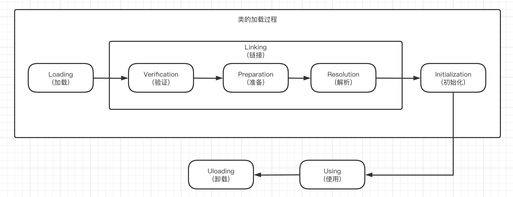
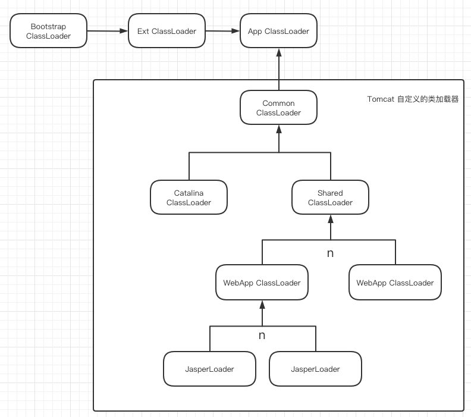

# JVM - 类加载与对象的创建

Java虚拟机把描述类的二进制数据从Class文件加载到内存，并对数据进行校验、转换解析和初始化，最终形成可以被虚拟机直接使用的Java类型，这个过程被称为虚拟机的类加载机制。

> 以下所有源码均基于jdk8，hotspot jvm

##### 类的生命周期



其中类加载的过程包括了加载、验证、准备、解析、初始化五个阶段。在这五个阶段中，加载、验证、准备和初始化这四个阶段发生的顺序是确定的，而解析阶段则不一定，它在某些情况下可以在初始化阶段之后开始，这是为了支持Java语言的运行时绑定（也成为动态绑定或晚期绑定）。另外注意这里的几个阶段是按顺序开始，而不是按顺序进行或完成，因为这些阶段通常都是互相交叉地混合进行的，通常在一个阶段执行的过程中调用或激活另一个阶段。

##### Creation and Loading

[https://docs.oracle.com/javase/specs/jvms/se8/html/jvms-5.html#jvms-5.3](https://docs.oracle.com/javase/specs/jvms/se8/html/jvms-5.html#jvms-5.3)

> Creation of a class or interface C denoted by the name `N` consists of the construction in the method area of the Java Virtual Machine ([§2.5.4](https://docs.oracle.com/javase/specs/jvms/se8/html/jvms-2.html#jvms-2.5.4 "2.5.4. Method Area")) of an implementation-specific internal representation of C. Class or interface creation is triggered by another class or interface D, which references C through its run-time constant pool. Class or interface creation may also be triggered by D invoking methods in certain Java SE platform class libraries ([§2.12](https://docs.oracle.com/javase/specs/jvms/se8/html/jvms-2.html#jvms-2.12 "2.12. Class Libraries")) such as reflection.

类的加载的过程是当一个类被另外一个类在其`run-time constant pool`(运行时常量池)中引用或者直接调用Java反射API获取的时候，在JVM**方法区**构造其特定的内部结构（类的元数据信息，即**InstanceKlass**），并在**堆**中生成了该类的`Class`对象，作为这个类的各种数据的访问入口。

加载过程中完成以下工作：

- 通过一个类的全限定类名获取定义该类的二进制字节流，即找到`.class`文件

- 将该字节流所代表的静态数据结构转化成**方法区**里的动态存储结构(**InstanceKlass**)

- 在**堆内存**中生成一个代表这个类的`Class`对象（**instanceOopDesc**），作为这个类各种数据的访问入口（当在堆中初始化这个类的对象时，会将`InstanceKlass`的指针放到对象头部`_klass`中，而`Class`对象的指针放在了`InstanceKlass._java_mirror`中，所以当使用`obj.getClass()`获取`Class`对象时，其实际获取路径为：`obj._metadata._compressed_klass._java_mirror`）

类的加载流程：

1. 从source处加载`Class`的字节码，并调用`SystemDictionary::resolve_from_stream`进行解码

```cpp
// /src/share/vm/prims/jvm.cpp
JVM_ENTRY(jclass, JVM_DefineClassWithSource(JNIEnv *env, 
                                            const char *name, 
                                            jobject loader, 
                                            const jbyte *buf, 
                                            jsize len, 
                                            jobject pd, 
                                            const char *source))
  JVMWrapper2("JVM_DefineClassWithSource %s", name);

  return jvm_define_class_common(env, name, loader, buf, len, pd, source, true, THREAD);
JVM_END

static jclass jvm_define_class_common(JNIEnv *env, 
                                      const char *name, 
                                      jobject loader, 
                                      const jbyte *buf, 
                                      jsize len, 
                                      jobject pd, 
                                      const char *source, 
                                      jboolean verify, 
                                      TRAPS) {
    ...
    ClassFileStream st((u1*) buf, len, (char *)source);
    ...
    Klass* k = SystemDictionary::resolve_from_stream(class_name, class_loader, protection_domain, &st, verify != 0, CHECK_NULL);
    ...
}
```

2. `SystemDictionary::resolve_from_stream`解析字节流创建`InstanceKlass`，并开始`Linking`操作

```cpp
// /src/share/vm/classfile/systemDictionary.cpp
Klass* SystemDictionary::resolve_from_stream(Symbol* class_name,
                                             Handle class_loader,
                                             Handle protection_domain,
                                             ClassFileStream* st,
                                             bool verify,
                                             TRAPS) {
 // Lock以及一些其他操作
 ...
 // 解析出InstanceKlass
 instanceKlassHandle k = ClassFileParser(st)
     .parseClassFile(class_name,
                     loader_data,
                     protection_domain,
                     parsed_name,
                     verify,
                     THREAD);
 ...
 // Add class just loaded
 // If a class loader supports parallel classloading handle parallel define requests
 // find_or_define_instance_class may return a different InstanceKlass
 if (is_parallelCapable(class_loader)) {
     k = find_or_define_instance_class(class_name, class_loader, k, THREAD);
 } else {
     define_instance_class(k, THREAD);
 }
 ...
}
void SystemDictionary::define_instance_class(instanceKlassHandle k, TRAPS) {
 // 把新的Klass加入到systemDictionary
 Symbol* name_h = k->name();
 unsigned int d_hash = dictionary()->compute_hash(name_h, loader_data);
 int d_index = dictionary()->hash_to_index(d_hash);
 check_constraints(d_index, d_hash, k, class_loader_h, true, CHECK);
 ...
 // 链接并初始化klass
 k->eager_initialize(THREAD);
 ...
}
```

- 调用`ClassFileParser::parseClassFile`创建`InstanceKlass`以及其`_java_mirror`(`Class对象`)，验证字节码格式（`Linking-Verification`），并且为`static`变量分配内存准备初始值（`Linking-Preparation`）

```cpp
// /src/share/vm/classfile/classFileParser.cpp
instanceKlassHandle ClassFileParser::parseClassFile(
                Symbol* name,
                ClassLoaderData*
                loader_data,
                Handle protection_domain,
                KlassHandle host_klass,
                GrowableArray<Handle>* cp_patches,
                TempNewSymbol& parsed_name,
                bool verify,
                TRAPS) {
    ...
    // Figure out whether we can skip format checking (matching classic VM behavior)
  _need_verify = Verifier::should_verify_for(class_loader(), verify);

  // Set the verify flag in stream
  cfs->set_verify(_need_verify);
  ...
  // Constant pool
  constantPoolHandle cp = parse_constant_pool(CHECK_(nullHandle));

  int cp_size = cp->length();
  ...
  check_property(
    valid_cp_range(this_class_index, cp_size) &&
      cp->tag_at(this_class_index).is_unresolved_klass(),
    "Invalid this class index %u in constant pool in class file %s",
    this_class_index, CHECK_(nullHandle));
   ... // 各种属性的获取，如Methods
   // Methods
    bool has_final_method = false;
    AccessFlags promoted_flags;
    promoted_flags.set_flags(0);
    Array<Method*>* methods = parse_methods(access_flags.is_interface(),
                                            &promoted_flags,
                                            &has_final_method,
                                            &has_default_methods,
                                            CHECK_(nullHandle));
    // We check super class after class file is parsed and format is checked
    if (super_class_index > 0 && super_klass.is_null()) {
      Symbol*  sk  = cp->klass_name_at(super_class_index);
      if (access_flags.is_interface()) {
        // Before attempting to resolve the superclass, check for class format
        // errors not checked yet.
        guarantee_property(sk == vmSymbols::java_lang_Object(),
                           "Interfaces must have java.lang.Object as superclass in class file %s",
                           CHECK_(nullHandle));
      }
      Klass* k = 
          SystemDictionary::resolve_super_or_fail(class_name, 
                                                  sk,
                                                  class_loader,                                                                                                              
                                                  protection_domain,
                                                  true,
                                                  CHECK_(nullHandle));
      KlassHandle kh (THREAD, k);
      super_klass = instanceKlassHandle(THREAD, kh());
    }
    ...
    // 计算vtable和itable的大小，是java多态实现的关键
    // Size of Java vtable (in words)
    int vtable_size = 0;
    int itable_size = 0;
    int num_miranda_methods = 0;

    GrowableArray<Method*> all_mirandas(20);

    klassVtable::compute_vtable_size_and_num_mirandas(
                                        &vtable_size,
                                        &num_miranda_methods,
                                        &all_mirandas, 
                                        super_klass(),
                                        methods,
                                        access_flags, 
                                        class_loader, 
                                        class_name, 
                                        local_interfaces,
                                        CHECK_(nullHandle));

    // Size of Java itable (in words)
    itable_size = 
      access_flags.is_interface() ? 0 :
      klassItable::compute_itable_size(_transitive_interfaces);
    ...
    // We can now create the basic Klass* for this klass
    // 分配InstanceKlass内存，这里传入了vtable_size和itable_size等，是因为vtable这些数据在内存中其实就是直接跟在InstanceKlass后面的
    _klass = InstanceKlass::allocate_instance_klass(
                                 loader_data,
                                 vtable_size,
                                 itable_size,  
                                 info.static_field_size,
                                 total_oop_map_size2,
                                 rt,
                                 access_flags,
                                 name,
                                 super_klass(),
                                 !host_klass.is_null(),
                                 CHECK_(nullHandle));
    instanceKlassHandle this_klass (THREAD, _klass);
    ... // 设置klass的各种值
    // Allocate mirror and initialize static fields
    // create_mirror操作包含了准备阶段（Preparation）
    java_lang_Class::create_mirror(
                this_klass, 
                protection_domain, 
                CHECK_(nullHandle));
    ...
    return this_klass;
}                        
```

- 其中通过分配`InstanceKlass`内存的操作，我们可以知道 **`InstanceKlass`在内存中的`Metaspace`区域**

```cpp
// /src/share/vm/oops/instanceKlass.cpp
InstanceKlass* InstanceKlass::allocate_instance_klass(
                                              ClassLoaderData* loader_data,
                                              int vtable_len,
                                              int itable_len,
                                              int static_field_size,
                                              int nonstatic_oop_map_size,
                                              ReferenceType rt,
                                              AccessFlags access_flags,
                                              Symbol* name,
                                              Klass* super_klass,
                                              bool is_anonymous,
                                              TRAPS) {

  int size = InstanceKlass::size(vtable_len, itable_len, nonstatic_oop_map_size,
                                 access_flags.is_interface(), is_anonymous);

  // Allocation
  InstanceKlass* ik;
  if (rt == REF_NONE) {
    if (name == vmSymbols::java_lang_Class()) {
      ik = new (loader_data, size, THREAD) InstanceMirrorKlass(
        vtable_len, itable_len, static_field_size, nonstatic_oop_map_size, rt,
        access_flags, is_anonymous);
    } else if (name == vmSymbols::java_lang_ClassLoader() ||
          (SystemDictionary::ClassLoader_klass_loaded() &&
          super_klass != NULL &&
          super_klass->is_subtype_of(SystemDictionary::ClassLoader_klass()))) {
      ik = new (loader_data, size, THREAD) InstanceClassLoaderKlass(
        vtable_len, itable_len, static_field_size, nonstatic_oop_map_size, rt,
        access_flags, is_anonymous);
    } else {
      // normal class
      ik = new (loader_data, size, THREAD) InstanceKlass(
        vtable_len, itable_len, static_field_size, nonstatic_oop_map_size, rt,
        access_flags, is_anonymous);
    }
  } else {
    // reference klass
    ik = new (loader_data, size, THREAD) InstanceRefKlass(
        vtable_len, itable_len, static_field_size, nonstatic_oop_map_size, rt,
        access_flags, is_anonymous);
  }

  // Check for pending exception before adding to the loader data and incrementing
  // class count.  Can get OOM here.
  if (HAS_PENDING_EXCEPTION) {
    return NULL;
  }

  // Add all classes to our internal class loader list here,
  // including classes in the bootstrap (NULL) class loader.
  loader_data->add_class(ik);

  Atomic::inc(&_total_instanceKlass_count);
  return ik;
}

// InstanceKlass继承于Klass，而Klass重写了new操作符
// /src/share/vm/oops/klass.cpp
void* Klass::operator new(size_t size, ClassLoaderData* loader_data, size_t word_size, TRAPS) throw() {
  return Metaspace::allocate(loader_data, word_size, /*read_only*/false,
                             MetaspaceObj::ClassType, CHECK_NULL);
}
```

3. 调用`eager_initialize`初始化`InstanceKlass`，其中最重要的操作就是对`class`进行链接（`link_class_impl`），`link_class_impl`中会进行**字节码重写**以及初始化`vtable`和`itable`

```cpp
// /src/share/vm/oops/instanceKlass.cpp
void InstanceKlass::eager_initialize_impl(instanceKlassHandle this_oop) {
  EXCEPTION_MARK;
  oop init_lock = this_oop->init_lock();
  ObjectLocker ol(init_lock, THREAD, init_lock != NULL);

  // abort if someone beat us to the initialization
  if (!this_oop->is_not_initialized()) return;  // note: not equivalent to is_initialized()

  ClassState old_state = this_oop->init_state();
  // 对class进行链接
  link_class_impl(this_oop, true, THREAD);
  if (HAS_PENDING_EXCEPTION) {
    CLEAR_PENDING_EXCEPTION;
    // Abort if linking the class throws an exception.

    // Use a test to avoid redundantly resetting the state if there's
    // no change.  Set_init_state() asserts that state changes make
    // progress, whereas here we might just be spinning in place.
    if( old_state != this_oop->_init_state )
      this_oop->set_init_state (old_state);
  } else {
    // linking successfull, mark class as initialized
    this_oop->set_init_state (fully_initialized);
    this_oop->fence_and_clear_init_lock();
    // trace
    if (TraceClassInitialization) {
      ResourceMark rm(THREAD);
      tty->print_cr("[Initialized %s without side effects]", this_oop->external_name());
    }
  }
}

bool InstanceKlass::link_class_impl(
    instanceKlassHandle this_oop, bool throw_verifyerror, TRAPS) {
  ...
  // return if already verified
  if (this_oop->is_linked()) {
    return true;
  }
  ...
  // 做父类以及接口的链接
  ...
  // verification & rewriting
  {
    oop init_lock = this_oop->init_lock();
    ObjectLocker ol(init_lock, THREAD, init_lock != NULL);
    // rewritten will have been set if loader constraint error found
    // on an earlier link attempt
    // don't verify or rewrite if already rewritten
    if (!this_oop->is_linked()) {
      if (!this_oop->is_rewritten()) {
          ...
          // also sets rewritten
          // 重写字节码
          this_oop->rewrite_class(CHECK_false);
      }
      // relocate jsrs and link methods after they are all rewritten
      this_oop->link_methods(CHECK_false);
      // Initialize the vtable and interface table after
      // methods have been rewritten since rewrite may
      // fabricate new Method*s.
      // also does loader constraint checking
      // 初始化vtable和itable，会保证子类重写的方法和父类的方法，在table中的索引一致，是多态实现原理以及方法调用时避免重复解析的关键，在解析阶段会详细看到是如何工作的
      if (!this_oop()->is_shared()) {
        ResourceMark rm(THREAD);
        this_oop->vtable()->initialize_vtable(true, CHECK_false);
        this_oop->itable()->initialize_itable(true, CHECK_false);
      }
      ...
    }
}
```

- **重写字节码**，这里有一个很重要的操作即是创建`make_constant_pool_cache`，并将方法调用的字节码操作数改成cpc的索引（具体内容会在`Linking-Resolution`阶段详细说明）

```c++
// /src/share/vm/interpreter/rewriter.hpp

// 添加一个常量池缓存entry
int add_map_entry(int cp_index, intArray* cp_map, intStack* cp_cache_map) {
  assert(cp_map->at(cp_index) == -1, "not twice on same cp_index");
  int cache_index = cp_cache_map->append(cp_index);
  cp_map->at_put(cp_index, cache_index);
  return cache_index;
}

int add_cp_cache_entry(int cp_index) {
  assert(_pool->tag_at(cp_index).value() != JVM_CONSTANT_InvokeDynamic, "use indy version");
  assert(_first_iteration_cp_cache_limit == -1, "do not add cache entries after first iteration");
  int cache_index = add_map_entry(cp_index, &_cp_map, &_cp_cache_map);
  assert(cp_entry_to_cp_cache(cp_index) == cache_index, "");
  assert(cp_cache_entry_pool_index(cache_index) == cp_index, "");
  return cache_index;
}

// /src/share/vm/interpreter/rewriter.cpp

// Computes a CPC map (new_index -> original_index) for constant pool entries
// that are referred to by the interpreter at runtime via the constant pool cache.
// Also computes a CP map (original_index -> new_index).
// Marks entries in CP which require additional processing.
// 确定常量池缓存index
void Rewriter::compute_index_maps() {
  const int length  = _pool->length();
  init_maps(length);
  bool saw_mh_symbol = false;
  for (int i = 0; i < length; i++) {
    int tag = _pool->tag_at(i).value();
    switch (tag) {
      case JVM_CONSTANT_InterfaceMethodref:
      case JVM_CONSTANT_Fieldref          : // fall through
      case JVM_CONSTANT_Methodref         : // fall through
        add_cp_cache_entry(i);
        break;
      case JVM_CONSTANT_String:
      case JVM_CONSTANT_MethodHandle      : // fall through
      case JVM_CONSTANT_MethodType        : // fall through
        add_resolved_references_entry(i);
        break;
      case JVM_CONSTANT_Utf8:
        if (_pool->symbol_at(i) == vmSymbols::java_lang_invoke_MethodHandle())
          saw_mh_symbol = true;
        break;
    }
  }

  // Record limits of resolved reference map for constant pool cache indices
  record_map_limits();

  guarantee((int)_cp_cache_map.length()-1 <= (int)((u2)-1),
            "all cp cache indexes fit in a u2");

  if (saw_mh_symbol)
    _method_handle_invokers.initialize(length, (int)0);
}

Rewriter::Rewriter(instanceKlassHandle klass, constantPoolHandle cpool, Array<Method*>* methods, TRAPS)
  : _klass(klass),
    _pool(cpool),
    _methods(methods)
{
  assert(_pool->cache() == NULL, "constant pool cache must not be set yet");

  // determine index maps for Method* rewriting
  compute_index_maps();
	...
  // rewrite methods, in two passes
  int len = _methods->length();
  bool invokespecial_error = false;

  for (int i = len-1; i >= 0; i--) {
    Method* method = _methods->at(i);
    // 会调用rewrite_member_reference方法，重写其操作数为常量池缓存索引
    scan_method(method, false, &invokespecial_error);
    if (invokespecial_error) {
      // If you get an error here, there is no reversing bytecodes
      // This exception is stored for this class and no further attempt is
      // made at verifying or rewriting.
      THROW_MSG(vmSymbols::java_lang_InternalError(),
                "This classfile overflows invokespecial for interfaces "
                "and cannot be loaded");
      return;
     }
  }
  ...
  // allocate constant pool cache, now that we've seen all the bytecodes
  // 真正创建常量池缓存
  make_constant_pool_cache(THREAD);
	...
}

// Rewrite a classfile-order CP index into a native-order CPC index.
void Rewriter::rewrite_member_reference(address bcp, int offset, bool reverse) {
  address p = bcp + offset;
  if (!reverse) {
    int  cp_index    = Bytes::get_Java_u2(p);
    int  cache_index = cp_entry_to_cp_cache(cp_index);
    Bytes::put_native_u2(p, cache_index);
    if (!_method_handle_invokers.is_empty())
      maybe_rewrite_invokehandle(p - 1, cp_index, cache_index, reverse);
  } else {
    int cache_index = Bytes::get_native_u2(p);
    int pool_index = cp_cache_entry_pool_index(cache_index);
    Bytes::put_Java_u2(p, pool_index);
    if (!_method_handle_invokers.is_empty())
      maybe_rewrite_invokehandle(p - 1, pool_index, cache_index, reverse);
  }
}

// Creates a constant pool cache given a CPC map
void Rewriter::make_constant_pool_cache(TRAPS) {
  ClassLoaderData* loader_data = _pool->pool_holder()->class_loader_data();
  ConstantPoolCache* cache =
      ConstantPoolCache::allocate(loader_data, _cp_cache_map,
                                  _invokedynamic_cp_cache_map,
                                  _invokedynamic_references_map, CHECK);

  // initialize object cache in constant pool
  _pool->initialize_resolved_references(loader_data, _resolved_references_map,
                                        _resolved_reference_limit,
                                        CHECK);
  _pool->set_cache(cache);
  cache->set_constant_pool(_pool());
}
```

- 上文中`ClassFileParser::parseClassFile`源码里，已经注明是在创建`InstanceKlass.Class`对象的时候`initialize static fields`，同时在jdk8的版本里，这些常量在内存中的位置其实是在`InstanceKlass.Class`对象的后面，所以`initialize_static_field`的操作放在了`java_lang_Class`里。

```cpp
// /src/share/vm/classfile/javaClasses.cpp
oop java_lang_Class::create_mirror(KlassHandle k, 
                                   Handle protection_domain, 
                                   TRAPS) {
  ...
  // Class_klass has to be loaded because it is used to allocate
  // the mirror.
  if (SystemDictionary::Class_klass_loaded()) {
    // Allocate mirror (java.lang.Class instance)
    // 分配其Class对象的内存
    Handle mirror = InstanceMirrorKlass::cast(
        SystemDictionary::Class_klass())->allocate_instance(k, CHECK_0);
    InstanceMirrorKlass* mk = InstanceMirrorKlass::cast(mirror->klass());
    // 计算static变量的数量
    java_lang_Class::set_static_oop_field_count(
            mirror(), mk->compute_static_oop_field_count(mirror()));
    // It might also have a component mirror.  This mirror must already exist.
    if (k->oop_is_array()) {
        ...
    } else {
       assert(k->oop_is_instance(), "Must be");

      // Allocate a simple java object for a lock.
      // This needs to be a java object because during class initialization
      // it can be held across a java call.
      typeArrayOop r = oopFactory::new_typeArray(T_INT, 0, CHECK_NULL);
      set_init_lock(mirror(), r);

      // Set protection domain also
      set_protection_domain(mirror(), protection_domain());

      // Initialize static fields
      InstanceKlass::cast(k())->
          do_local_static_fields(&initialize_static_field, CHECK_NULL);
    }
    return mirror();
  } else {
      ...
      return NULL;
  }
}

// 具体怎样给静态变量赋值初始值
static void initialize_static_field(fieldDescriptor* fd, TRAPS) {
  Handle mirror (THREAD, fd->field_holder()->java_mirror());
  assert(mirror.not_null() && fd->is_static(), "just checking");
  if (fd->has_initial_value()) {
    BasicType t = fd->field_type();
    switch (t) {
      case T_BYTE:
        mirror()->byte_field_put(fd->offset(), fd->int_initial_value());
              break;
      case T_BOOLEAN:
        mirror()->bool_field_put(fd->offset(), fd->int_initial_value());
              break;
      case T_CHAR:
        mirror()->char_field_put(fd->offset(), fd->int_initial_value());
              break;
      case T_SHORT:
        mirror()->short_field_put(fd->offset(), fd->int_initial_value());
              break;
      case T_INT:
        mirror()->int_field_put(fd->offset(), fd->int_initial_value());
        break;
      case T_FLOAT:
        mirror()->float_field_put(fd->offset(), fd->float_initial_value());
        break;
      case T_DOUBLE:
        mirror()->double_field_put(fd->offset(), fd->double_initial_value());
        break;
      case T_LONG:
        mirror()->long_field_put(fd->offset(), fd->long_initial_value());
        break;
      case T_OBJECT:
        {
          #ifdef ASSERT
          TempNewSymbol sym = SymbolTable::new_symbol("Ljava/lang/String;", CHECK);
          assert(fd->signature() == sym, "just checking");
          #endif
          oop string = fd->string_initial_value(CHECK);
          mirror()->obj_field_put(fd->offset(), string);
        }
        break;
      default:
        THROW_MSG(vmSymbols::java_lang_ClassFormatError(),
                  "Illegal ConstantValue attribute in class file");
    }
  }
}

// /src/share/vm/oops/instanceMirrorKlass.cpp
int InstanceMirrorKlass::instance_size(KlassHandle k) {
  if (k() != NULL && k->oop_is_instance()) {
    return align_object_size(size_helper() + InstanceKlass::cast(k())->static_field_size());
  }
  return size_helper();
}

instanceOop InstanceMirrorKlass::allocate_instance(KlassHandle k, TRAPS) {
  // Query before forming handle.
  int size = instance_size(k);
  KlassHandle h_k(THREAD, this);
  // 堆内存中
  instanceOop i = (instanceOop) CollectedHeap::Class_obj_allocate(h_k, size, k, CHECK_NULL);
  return i;
}
```

##### Linking

> Linking a class or interface involves verifying and preparing that class or interface, its direct superclass, its direct superinterfaces, and its element type (if it is an array type), if necessary. Resolution of symbolic references in the class or interface is an optional part of linking. 

链接阶段包括以下3个具体动作：验证、准备、解析，其中解析阶段是非必须的，可以由虚拟机自行决定在合适的时机去解析。

**Verification**

> *Verification* ([§4.10](https://docs.oracle.com/javase/specs/jvms/se8/html/jvms-4.html#jvms-4.10)) ensures that the binary representation of a class or interface is structurally correct ([§4.9](https://docs.oracle.com/javase/specs/jvms/se8/html/jvms-4.html#jvms-4.9)). Verification may cause additional classes and interfaces to be loaded ([§5.3](https://docs.oracle.com/javase/specs/jvms/se8/html/jvms-5.html#jvms-5.3)) but need not cause them to be verified or prepared. 

验证阶段包含4个验证工作：**文件格式、元数据、字节码、符号引用**。验证阶段可能是和加载阶段交叉进行的，比如对一部分字节码文件格式进行验证，同时验证阶段也不是必须要执行的阶段，因为如果程序运行的全部代码都已经被反复使用和验证过，在生成环境的实施阶段就可以考虑使用-Xverify:none参数来关闭大部分的类验证措施，来缩短类加载的时间。 符号引用验证阶段主要包含一下内容：

 - **符号引用**中通过字符串描述的全限定名是否能找到对应的类。
 - 在指定类中是否存在符合方法的字段描述符及简单名称所描述的方法和字段。
 - 符合引用中的类、字段、方法的可访问性，是否可被当前类访问。 这也是为什么说验证阶段可能会导致`additional classes and interfaces`被加载。 

**Preparation**

> *Preparation* involves creating the static fields for a class or interface and initializing such fields to their default values ([§2.3](https://docs.oracle.com/javase/specs/jvms/se8/html/jvms-2.html#jvms-2.3), [§2.4](https://docs.oracle.com/javase/specs/jvms/se8/html/jvms-2.html#jvms-2.4)). This does not require the execution of any Java Virtual Machine code; explicit initializers for static fields are executed as part of initialization ([§5.5](https://docs.oracle.com/javase/specs/jvms/se8/html/jvms-5.html#jvms-5.5)), not preparation. 

**准备阶段是正式为类变量(static 成员变量)分配内存并设置类变量初始值（零值）的阶段，这些变量所使用的内存都将在方法区中进行分配。**具体实现可以查看上文`java_lang_Class::create_mirror`过程，但是用`final`修饰的变量（常量）例外，该变量会在该阶段被直接初始化为指定的值。 以一个具体的例子说明（结合类初始化`<clinit>`过程说明）：

```java
public class Preparation {
  
  // 在Preparation阶段，INSTANCE会被赋值null，在调用<clinit>时（类初始化阶段），就会执行new操作
  public static Preparation INSTANCE = new Preparation();
  // 在Preparation阶段，a会被赋值0，所以在#1处会输出a = 1，而在#4处a++ = 1
  public static int a;
  // b只会在调用<clinit>时，被赋值10，所以#2处会输出b = 0，而#5处b = 10
  public static int b = 10;
  // final修饰的常量，会在Preparation阶段直接赋值指定的值
  public static final int c = 30;

  private Preparation() {
    // #1 a = 0
    System.out.println("constructor a = " + a);
    // #2 b = 0
    System.out.println("constructor b = " + b);
    // #3 c = 30
    System.out.println("constructor c = " + c);
  }

  static {
    // #4 a++ = 1;
    a++;
    System.out.println("static code block a = " + a);
    // #5 <clinit>中已经为b赋值10，所以这时b = 10
    System.out.println("static code block b = " + b);
  }

  public static void main(String... args) {
    System.out.println(Preparation.a);
  }
}
```

**Resolution**

> The Java Virtual Machine instructions *anewarray*, *checkcast*, *getfield*, *getstatic*, *instanceof*, *invokedynamic*, *invokeinterface*, *invokespecial*, *invokestatic*, *invokevirtual*, *ldc*, *ldc_w*, *multianewarray*, *new*, *putfield*, and *putstatic* make symbolic references to the run-time constant pool. Execution of any of these instructions requires resolution of its symbolic reference.
> 
> *Resolution* is the process of dynamically determining concrete values from symbolic references in the run-time constant pool.

解析阶段是虚拟机将常量池内的**符号引用**替换为**直接引用**的过程，**符号引用**用文本形式来表示引用关系（比如在将java文件编译成class文件周，`invokevirtual`指令后面跟着的操作数，是这个方法所在类名、方法名称、方法签名，这些都是以字符串形式表示，），而**直接引用**是JVM能直接使用的形式，它即可以表现为直接指针，也可能是其他形式（比如`vtable`的下标）。

通过`javap -verbose Child > Child.txt`对`class`二进制文件反编译，可以查看具体的字节码。如`11: invokevirtual #5`，对应的二进制码为`B6 00 05`，其中`B6`为字节指令`_invokevirtual = 182, // 0xb6`，`00 05`为尚未解析过的操作数，代表常量池索引，指向` // Method org/huang/jvm/resolution/ResoFoo.action:()Ljava/lang/String;`，即该指令操作数的**符号引用**。

对于一个方法而言，光是**符号引用**是没有办法直接执行的，需要的是方法的实际代码，或者说叫做一个方法在内存中的地址。那么在**解析**的时候，通过方法所在类名，可以找到这个类`InstanceKlass`数据，再根据方法名、方法签名，就能在这个`InstanceKlass`的方法表里找到对应的方法数据，这个方法数据地址，即 **直接引用**。

而且，不能每次调用方法时都要进行解析一遍，那样的话效率太低了，那么可以在初次解析之后，将解析结果放在**缓存**里，之后的调用，就可以直接找到具体的方法了。如果是`final`的方法（对应指令`_invokespecial`、`_invokestatic`），缓存中就直接放方法地址。如果是`virtual`或者`interface`的（对应指令`_invokevirtual`，`_invokeinterface`），缓存中就放`vtable`或者`itable`的索引，因为子类重写的方法和父类的方法，在table中的索引一致，所以只需要根据其索引以及`方法的接收者`（执行时栈中实际的对象）就可以确定正常的方法调用。

字节码文件加载进来后，就对 **字节码重写**，使操作数变为常量池缓存索引，并开辟好常量池缓存（`Rewriter::Rewriter`中`make_constant_pool_cache`）。此时，指令操作数为常量池缓存索引，因为尚未解析，还是需要常量池索引，那就在常量池缓存条目中增加一个字段，低16位保存常量池索引。解析过后，在这个字段的高16位保存下对应的字节码指令，执行时判断其是否等于字节码指令即可，因为没解析过时，高16位未赋值，必然不等。

以下以`invokevirtual`为例，说明jvm是如何进行解析的：

- 解析`invokevirtual`指令，其中**操作数**指向的是`ConstantPoolCache`中的索引，这里是在`InstanceKlass::link_class_impl`调用`this_oop->rewrite_class(CHECK_false);`**重写字节码**时将操作数改成了`ConstantPoolCache`的索引。

```c++
// /src/share/vm/interpreter/bytecodeInterpreter.cpp
CASE(_invokevirtual):
CASE(_invokespecial):
CASE(_invokestatic): {
  // 取指令的操作数，即指令后两位字节的值
  u2 index = Bytes::get_native_u2(pc+1);
	// 操作数指向的是ConstantPoolCacheEntry在ConstantPoolCache中的索引
  ConstantPoolCacheEntry* cache = cp->entry_at(index);
  // QQQ Need to make this as inlined as possible. Probably need to split all the bytecode cases
  // out so c++ compiler has a chance for constant prop to fold everything possible away.

  // 判断是否已经解析过了
  if (!cache->is_resolved((Bytecodes::Code)opcode)) {
    CALL_VM(InterpreterRuntime::resolve_invoke(THREAD, (Bytecodes::Code)opcode),
            handle_exception);
    cache = cp->entry_at(index);
  }

  istate->set_msg(call_method);
```

- 如果没有解析过，则调用`InterpreterRuntime::resolve_invoke`进行解析

```c++
// /src/share/vm/interpreter/interpreterRuntime.cpp
IRT_ENTRY(void, InterpreterRuntime::resolve_invoke(JavaThread* thread, Bytecodes::Code bytecode)) {
  // extract receiver from the outgoing argument list if necessary
  ...
  // resolve method
  CallInfo info;
  constantPoolHandle pool(thread, method(thread)->constants());
  {
    JvmtiHideSingleStepping jhss(thread);
    // 没有解析过，调用LinkResolver::resolve_invoke进行解析
    LinkResolver::resolve_invoke(info, receiver, pool,
                                 get_index_u2_cpcache(thread, bytecode), bytecode, CHECK);
    if (JvmtiExport::can_hotswap_or_post_breakpoint()) {
      int retry_count = 0;
      while (info.resolved_method()->is_old()) {
        // It is very unlikely that method is redefined more than 100 times
        // in the middle of resolve. If it is looping here more than 100 times
        // means then there could be a bug here.
        guarantee((retry_count++ < 100),
                  "Could not resolve to latest version of redefined method");
        // method is redefined in the middle of resolve so re-try.
        LinkResolver::resolve_invoke(info, receiver, pool,
                                     get_index_u2_cpcache(thread, bytecode), bytecode, CHECK);
      }
    }
  } // end JvmtiHideSingleStepping
  ...
  // 解析完成，更新cache中的值
  switch (info.call_kind()) {
  case CallInfo::direct_call:
    cache_entry(thread)->set_direct_call(
      bytecode,
      info.resolved_method());
    break;
  case CallInfo::vtable_call:
    cache_entry(thread)->set_vtable_call(
      bytecode,
      info.resolved_method(),
      info.vtable_index());
    break;
  case CallInfo::itable_call:
    cache_entry(thread)->set_itable_call(
      bytecode,
      info.resolved_method(),
      info.itable_index());
    break;
  default:  ShouldNotReachHere();
  }
}
IRT_END
  
// /src/share/vm/interpreter/linkResolver.cpp
void LinkResolver::resolve_invoke(CallInfo& result, Handle recv, constantPoolHandle pool, int index, Bytecodes::Code byte, TRAPS) {
  switch (byte) {
    case Bytecodes::_invokestatic   : resolve_invokestatic   (result,       pool, index, CHECK); break;
    case Bytecodes::_invokespecial  : resolve_invokespecial  (result,       pool, index, CHECK); break;
    case Bytecodes::_invokevirtual  : resolve_invokevirtual  (result, recv, pool, index, CHECK); break;
    case Bytecodes::_invokehandle   : resolve_invokehandle   (result,       pool, index, CHECK); break;
    case Bytecodes::_invokedynamic  : resolve_invokedynamic  (result,       pool, index, CHECK); break;
    case Bytecodes::_invokeinterface: resolve_invokeinterface(result, recv, pool, index, CHECK); break;
  }
  return;
}
```

- 以`resolve_invokevirtual`为例看下具体是如何进行解析的
```c++
// /src/share/vm/interpreter/linkResolver.cpp
void LinkResolver::resolve_invokevirtual(CallInfo& result, Handle recv,
                                          constantPoolHandle pool, int index,
                                          TRAPS) {

  KlassHandle  resolved_klass;
  Symbol* method_name = NULL;
  Symbol* method_signature = NULL;
  KlassHandle  current_klass;
  // 解析出方法所在类、方法名称、方法签名（参数和范围值类型）等
  resolve_pool(resolved_klass, method_name,  method_signature, current_klass, pool, index, CHECK);
  KlassHandle recvrKlass (THREAD, recv.is_null() ? (Klass*)NULL : recv->klass());
  resolve_virtual_call(result, recv, recvrKlass, resolved_klass, method_name, method_signature, current_klass, true, true, CHECK);
}
```
- 解析符号引用
```c++
// /src/share/vm/interpreter/linkResolver.cpp
void LinkResolver::resolve_pool(KlassHandle& resolved_klass, Symbol*& method_name, Symbol*& method_signature,
                                KlassHandle& current_klass, constantPoolHandle pool, int index, TRAPS) {
   // resolve klass
  resolve_klass(resolved_klass, pool, index, CHECK);

  // Get name, signature, and static klass
  method_name      = pool->name_ref_at(index);
  method_signature = pool->signature_ref_at(index);
  current_klass    = KlassHandle(THREAD, pool->pool_holder());
}

void LinkResolver::resolve_klass(KlassHandle& result, constantPoolHandle pool, int index, TRAPS) {
  Klass* result_oop = pool->klass_ref_at(index, CHECK);
  result = KlassHandle(THREAD, result_oop);
}

// /src/share/vm/oops/constantPool.cpp
Klass* ConstantPool::klass_ref_at(int which, TRAPS) {
  return klass_at(klass_ref_index_at(which), CHECK_NULL);
}

// 先获取类引用索引
int klass_ref_index_at(int which) { 
  return impl_klass_ref_index_at(which, false); 
}

int ConstantPool::impl_klass_ref_index_at(int which, bool uncached) {
  guarantee(!ConstantPool::is_invokedynamic_index(which),
            "an invokedynamic instruction does not have a klass");
  int i = which;
  if (!uncached && cache() != NULL) {
    // change byte-ordering and go via cache
    // 索引在 常量池缓存 中，缓存条目的 _indices 字段低 2 位
    i = remap_instruction_operand_from_cache(which);
  }
  assert(tag_at(i).is_field_or_method(), "Corrupted constant pool");
  jint ref_index = *int_at_addr(i);
  return extract_low_short_from_int(ref_index);
}
// 索引在 常量池缓存 中，缓存条目的 _indices 字段低 2 位
int ConstantPool::remap_instruction_operand_from_cache(int operand) {
  int cpc_index = operand;
  DEBUG_ONLY(cpc_index -= CPCACHE_INDEX_TAG);
  assert((int)(u2)cpc_index == cpc_index, "clean u2");
  int member_index = cache()->entry_at(cpc_index)->constant_pool_index();
  return member_index;
}

// 再通过索引获取类信息
Klass* klass_at(int which, TRAPS) {
  constantPoolHandle h_this(THREAD, this);
  // 如果该类已被解析过，就直接返回类信息，否则尝试解析该类并放到常量池中，并返回类信息
  return klass_at_impl(h_this, which, CHECK_NULL);
}

```

- 由符号引用解析出直接引用

```c++
// /src/share/vm/interpreter/linkResolver.cpp
void LinkResolver::resolve_virtual_call(CallInfo& result, Handle recv, KlassHandle receiver_klass, KlassHandle resolved_klass,
                                        Symbol* method_name, Symbol* method_signature, KlassHandle current_klass,
                                        bool check_access, bool check_null_and_abstract, TRAPS) {
  methodHandle resolved_method;
  linktime_resolve_virtual_method(resolved_method, resolved_klass, method_name, method_signature, current_klass, check_access, CHECK);
  runtime_resolve_virtual_method(result, resolved_method, resolved_klass, recv, receiver_klass, check_null_and_abstract, CHECK);
}
```

- 链接时解析

```c++
// /src/share/vm/interpreter/linkResolver.cpp
void LinkResolver::linktime_resolve_virtual_method(methodHandle &resolved_method, KlassHandle resolved_klass,
                                                   Symbol* method_name, Symbol* method_signature,
                                                   KlassHandle current_klass, bool check_access, TRAPS) {
  // normal method resolution
  // 解析处方法句柄
  resolve_method(resolved_method, resolved_klass, method_name, method_signature, current_klass, check_access, true, CHECK);
  
  // 一些检查
   assert(resolved_method->name() != vmSymbols::object_initializer_name(), "should have been checked in verifier");
  assert(resolved_method->name() != vmSymbols::class_initializer_name (), "should have been checked in verifier");

  // check if private interface method
  if (resolved_klass->is_interface() && resolved_method->is_private()) {
    ResourceMark rm(THREAD);
    char buf[200];
    jio_snprintf(buf, sizeof(buf), "private interface method requires invokespecial, not invokevirtual: method %s, caller-class:%s",
                 Method::name_and_sig_as_C_string(resolved_klass(),
                                                  resolved_method->name(),
                                                  resolved_method->signature()),
                   (current_klass.is_null() ? "<NULL>" : current_klass->internal_name()));
    THROW_MSG(vmSymbols::java_lang_IncompatibleClassChangeError(), buf);
  }
  ...
}

void LinkResolver::resolve_method(methodHandle& resolved_method, KlassHandle resolved_klass,
                                  Symbol* method_name, Symbol* method_signature,
                                  KlassHandle current_klass, bool check_access,
                                  bool require_methodref, TRAPS) {

  Handle nested_exception;

  // 1. check if methodref required, that resolved_klass is not interfacemethodref
  ...

  // 2. lookup method in resolved klass and its super klasses
  // 从klass数据中查找方法
  lookup_method_in_klasses(resolved_method, resolved_klass, method_name, method_signature, true, false, CHECK);
  if (resolved_method.is_null()) { // not found in the class hierarchy
    // 3. lookup method in all the interfaces implemented by the resolved klass
    lookup_method_in_interfaces(resolved_method, resolved_klass, method_name, method_signature, CHECK);
    ...
    if (resolved_method.is_null()) {
      // 4. method lookup failed
      ...
  }
  // 5. check if method is concrete
  ...
  // 6. access checks, access checking may be turned off when calling from within the VM.
  ...
}
  
// Look up method in klasses, including static methods
// Then look up local default methods
void LinkResolver::lookup_method_in_klasses(methodHandle& result, KlassHandle klass, Symbol* name, Symbol* signature, bool checkpolymorphism, bool in_imethod_resolve, TRAPS) {
  
  Method* result_oop = klass->uncached_lookup_method(name, signature);
  ...
  result = methodHandle(THREAD, result_oop);
}

// /src/share/vm/oops/instanceKlass.cpp
  
// uncached_lookup_method searches both the local class methods array and all
// superclasses methods arrays, skipping any overpass methods in superclasses.
Method* InstanceKlass::uncached_lookup_method(Symbol* name, Symbol* signature) const {
  Klass* klass = const_cast<InstanceKlass*>(this);
  bool dont_ignore_overpasses = true;  // For the class being searched, find its overpasses.
  // 先在当前类查找，找不到就去基类查找，直到找到或到达顶层
  while (klass != NULL) {
    Method* method = InstanceKlass::cast(klass)->find_method(name, signature);
    if ((method != NULL) && (dont_ignore_overpasses || !method->is_overpass())) {
      return method;
    }
    klass = InstanceKlass::cast(klass)->super();
    dont_ignore_overpasses = false;  // Ignore overpass methods in all superclasses.
  }
  return NULL;
}
  
// find_method looks up the name/signature in the local methods array
Method* InstanceKlass::find_method(
    Array<Method*>* methods, Symbol* name, Symbol* signature) {
  // 最后都会用到该方法
  int hit = find_method_index(methods, name, signature);
  return hit >= 0 ? methods->at(hit): NULL;
}
  
// 遍历方法列表，进行条件匹配
// Used directly for default_methods to find the index into the
// default_vtable_indices, and indirectly by find_method
// find_method_index looks in the local methods array to return the index
// of the matching name/signature
int InstanceKlass::find_method_index(
    Array<Method*>* methods, Symbol* name, Symbol* signature) {
  int hit = binary_search(methods, name);
  if (hit != -1) {
    Method* m = methods->at(hit);
    // Do linear search to find matching signature.  First, quick check
    // for common case
    if (m->signature() == signature) return hit;
    // search downwards through overloaded methods
    int i;
    for (i = hit - 1; i >= 0; --i) {
        Method* m = methods->at(i);
        assert(m->is_method(), "must be method");
        if (m->name() != name) break;
        if (m->signature() == signature) return i;
    }
    // search upwards
    for (i = hit + 1; i < methods->length(); ++i) {
        Method* m = methods->at(i);
        assert(m->is_method(), "must be method");
        if (m->name() != name) break;
        if (m->signature() == signature) return i;
    }
    // not found
#ifdef ASSERT
    int index = linear_search(methods, name, signature);
    assert(index == -1, err_msg("binary search should have found entry %d", index));
#endif
  }
  return -1;
}
```

- 运行时解析，即解析出`vtable`索引或者`itable`索引，重写的方法的实际地址只能在运行时根据方法接收者确定。这就是 **动态分派**，因为这种分派只看 **实际类型** 一个因素，所以 **重写** 属于 **动态单分派**。

```c++
// /src/share/vm/interpreter/linkResolver.cpp
void LinkResolver::runtime_resolve_virtual_method(CallInfo& result,
                                                  methodHandle resolved_method,
                                                  KlassHandle resolved_klass,
                                                  Handle recv,
                                                  KlassHandle recv_klass,
                                                  bool check_null_and_abstract,
                                                  TRAPS) {

  // setup default return values
  int vtable_index = Method::invalid_vtable_index;
  methodHandle selected_method;

  assert(recv.is_null() || recv->is_oop(), "receiver is not an oop");

  // runtime method resolution
  if (check_null_and_abstract && recv.is_null()) { // check if receiver exists
    THROW(vmSymbols::java_lang_NullPointerException());
  }

  // Virtual methods cannot be resolved before its klass has been linked, for otherwise the Method*'s
  // has not been rewritten, and the vtable initialized. Make sure to do this after the nullcheck, since
  // a missing receiver might result in a bogus lookup.
  assert(resolved_method->method_holder()->is_linked(), "must be linked");

  // do lookup based on receiver klass using the vtable index
  if (resolved_method->method_holder()->is_interface()) { // miranda method
    vtable_index = vtable_index_of_interface_method(resolved_klass,
                           resolved_method);
    assert(vtable_index >= 0 , "we should have valid vtable index at this point");

    InstanceKlass* inst = InstanceKlass::cast(recv_klass());
    selected_method = methodHandle(THREAD, inst->method_at_vtable(vtable_index));
  } else {
    // at this point we are sure that resolved_method is virtual and not
    // a miranda method; therefore, it must have a valid vtable index.
    assert(!resolved_method->has_itable_index(), "");
    vtable_index = resolved_method->vtable_index();
    // We could get a negative vtable_index for final methods,
    // because as an optimization they are they are never put in the vtable,
    // unless they override an existing method.
    // If we do get a negative, it means the resolved method is the the selected
    // method, and it can never be changed by an override.
    if (vtable_index == Method::nonvirtual_vtable_index) {
      assert(resolved_method->can_be_statically_bound(), "cannot override this method");
      selected_method = resolved_method;
    } else {
      // recv_klass might be an arrayKlassOop but all vtables start at
      // the same place. The cast is to avoid virtual call and assertion.
      InstanceKlass* inst = (InstanceKlass*)recv_klass();
      selected_method = methodHandle(THREAD, inst->method_at_vtable(vtable_index));
    }
  }

  // check if method exists
  if (selected_method.is_null()) {
    ResourceMark rm(THREAD);
    THROW_MSG(vmSymbols::java_lang_AbstractMethodError(),
              Method::name_and_sig_as_C_string(resolved_klass(),
                                                      resolved_method->name(),
                                                      resolved_method->signature()));
  }
  // check if abstract
  ...
  // setup result
  result.set_virtual(resolved_klass, recv_klass, resolved_method, selected_method, vtable_index, CHECK);
}
```

##### Initialization

> *Initialization* of a class or interface consists of executing its class or interface initialization method ([§2.9](https://docs.oracle.com/javase/specs/jvms/se8/html/jvms-2.html#jvms-2.9)).

> A class or interface has at most one *class or interface initialization method* and is initialized ([§5.5](https://docs.oracle.com/javase/specs/jvms/se8/html/jvms-5.html#jvms-5.5)) by invoking that method. The initialization method of a class or interface has the special name `<clinit>`, takes no arguments, and is void ([§4.3.3](https://docs.oracle.com/javase/specs/jvms/se8/html/jvms-4.html#jvms-4.3.3)).

即执行类或者接口的`<clinit>`方法，`<clinit>`方法是由编译器自动收集类中的所有类变量的赋值动作和静态语句块(static{}块)中的语句合并产生的，编译器收集的顺序是由语句在源文件中出现的的顺序决定的（**即执行顺序是由其在源文件中出现的顺序决定的**），静态语句块中只能访问到定义在静态语句块之前的变量，定义在它之后的变量，在前面的静态语句块可以赋值，但是不能访问。Java虚拟机必须保证一个类的`<clinit>`方法在多线程环境中被正确地加锁同步，若同时多个线程区初始化一个类，那么只会有其中一个线程去执行这个类的`<clinit>`方法，其他线程都需要阻塞等待，直到活动线程执行完毕`<clinit>`方法。

`clinit`方法对于一个类来说并不是必须的，如果该类没有任何静态变量和静态代码块，那么jvm并不会为这个类生成`clinit`方法。并且父类或者接口的`<clinit>`方法一定是先于子类开始执行的。

类初始化时机：

1. 遇到`new`、`getstatic`、`putstatic`或`invokestatic`这四条字节码指令时，如果类型没有进行过初始化，则需要先触发其初始化阶段。 涉及到这四条指令的典型场景有：

- 使用new关键字实例化对的时候。
- 读取或设置一个类型的静态字段（被final修饰、已在编译期把结果放入常量池的静态字段除外）的时候。
- 调用一个类型的静态方法的时候。

2. 使用 `java.lang.reflect` 包的方法对类型进行反射调用的时候，如果类型没有进行过初始化，则需要先触发其初始化。

3. 当初始化类型的时候，如果发现其父类还没有进行过初始化，则需要先触发其父类的初始化。

4. 当虚拟机启动时，用户需要指定一个要执行的主类（包含main()方法的那个类），虚拟机会先初始化这个主类。

5. 当使用JDK7新加入的动态语言支持时，如果一个`java.lang.invoke.MethodHandle`实例最后的解析结果为REF_getStatic、REF_putStatic、REF_invokeStatic、REF_newInvokeSpecial四种类型的方法句柄，并且这个方法句柄对应的类没有进行过初始化，则需要先触发其初始化。

6. 当一个接口中定义了JDK8新加入的默认方法（被`default`关键字修饰的接口方法）时，如果这个接口的实现类发生了初始化，那该接口要在其之前被初始化。 

除了以上的这个六种场景外，所有引用类型的方式都不会触发初始化，称为被动引用

```c++
// /src/share/vm/interpreter/interpreterRuntime.cpp
IRT_ENTRY(void, InterpreterRuntime::_new(JavaThread* thread, ConstantPool* pool, int index))
  Klass* k_oop = pool->klass_at(index, CHECK);
  instanceKlassHandle klass (THREAD, k_oop);

  // Make sure we are not instantiating an abstract klass
  klass->check_valid_for_instantiation(true, CHECK);

  // Make sure klass is initialized
  klass->initialize(CHECK);

  // At this point the class may not be fully initialized
  // because of recursive initialization. If it is fully
  // initialized & has_finalized is not set, we rewrite
  // it into its fast version (Note: no locking is needed
  // here since this is an atomic byte write and can be
  // done more than once).
  //
  // Note: In case of classes with has_finalized we don't
  //       rewrite since that saves us an extra check in
  //       the fast version which then would call the
  //       slow version anyway (and do a call back into
  //       Java).
  //       If we have a breakpoint, then we don't rewrite
  //       because the _breakpoint bytecode would be lost.
  oop obj = klass->allocate_instance(CHECK);
  thread->set_vm_result(obj);
IRT_END

// /src/share/vm/oops/instanceKlass.cpp
// See "The Virtual Machine Specification" section 2.16.5 for a detailed explanation of the class initialization
// process. The step comments refers to the procedure described in that section.
// Note: implementation moved to static method to expose the this pointer.
void InstanceKlass::initialize(TRAPS) {
  if (this->should_be_initialized()) {
    HandleMark hm(THREAD);
    instanceKlassHandle this_oop(THREAD, this);
    initialize_impl(this_oop, CHECK);
    // Note: at this point the class may be initialized
    //       OR it may be in the state of being initialized
    //       in case of recursive initialization!
  } else {
    assert(is_initialized(), "sanity check");
  }
}

void InstanceKlass::initialize_impl(instanceKlassHandle this_oop, TRAPS) {
  // Make sure klass is linked (verified) before initialization
  // A class could already be verified, since it has been reflected upon.
  this_oop->link_class(CHECK);

  DTRACE_CLASSINIT_PROBE(required, InstanceKlass::cast(this_oop()), -1);

  bool wait = false;

  // refer to the JVM book page 47 for description of steps
  // Step 1
  {
    // 加锁
    oop init_lock = this_oop->init_lock();
    ObjectLocker ol(init_lock, THREAD, init_lock != NULL);
    ...
  }
  // Step 7
  // 初始化父类klass
  Klass* super_klass = this_oop->super();
  if (super_klass != NULL && !this_oop->is_interface() && super_klass->should_be_initialized()) {
    super_klass->initialize(THREAD);

    if (HAS_PENDING_EXCEPTION) {
      Handle e(THREAD, PENDING_EXCEPTION);
      CLEAR_PENDING_EXCEPTION;
      {
        EXCEPTION_MARK;
        this_oop->set_initialization_state_and_notify(initialization_error, THREAD); // Locks object, set state, and notify all waiting threads
        CLEAR_PENDING_EXCEPTION;   // ignore any exception thrown, superclass initialization error is thrown below
      }
      DTRACE_CLASSINIT_PROBE_WAIT(super__failed, InstanceKlass::cast(this_oop()), -1,wait);
      THROW_OOP(e());
    }
  }
  ...
  
  // Step 8
  {
    assert(THREAD->is_Java_thread(), "non-JavaThread in initialize_impl");
    JavaThread* jt = (JavaThread*)THREAD;
    DTRACE_CLASSINIT_PROBE_WAIT(clinit, InstanceKlass::cast(this_oop()), -1,wait);
    // Timer includes any side effects of class initialization (resolution,
    // etc), but not recursive entry into call_class_initializer().
    PerfClassTraceTime timer(ClassLoader::perf_class_init_time(),
                             ClassLoader::perf_class_init_selftime(),
                             ClassLoader::perf_classes_inited(),
                             jt->get_thread_stat()->perf_recursion_counts_addr(),
                             jt->get_thread_stat()->perf_timers_addr(),
                             PerfClassTraceTime::CLASS_CLINIT);
    this_oop->call_class_initializer(THREAD);
  }
  ...
}

void InstanceKlass::call_class_initializer_impl(instanceKlassHandle this_oop, TRAPS) {
  if (ReplayCompiles &&
      (ReplaySuppressInitializers == 1 ||
       ReplaySuppressInitializers >= 2 && this_oop->class_loader() != NULL)) {
    // Hide the existence of the initializer for the purpose of replaying the compile
    return;
  }

  // 获取<clinit>方法
  methodHandle h_method(THREAD, this_oop->class_initializer());
  assert(!this_oop->is_initialized(), "we cannot initialize twice");
  if (TraceClassInitialization) {
    tty->print("%d Initializing ", call_class_initializer_impl_counter++);
    this_oop->name()->print_value();
    tty->print_cr("%s (" INTPTR_FORMAT ")", h_method() == NULL ? "(no method)" : "", (address)this_oop());
  }
  if (h_method() != NULL) {
    JavaCallArguments args; // No arguments
    JavaValue result(T_VOID);
    // 调用<clinit>方法
    JavaCalls::call(&result, h_method, &args, CHECK); // Static call (no args)
  }
}

Method* InstanceKlass::class_initializer() {
  Method* clinit = find_method(
      vmSymbols::class_initializer_name(), vmSymbols::void_method_signature());
  if (clinit != NULL && clinit->has_valid_initializer_flags()) {
    return clinit;
  }
  return NULL;
}
```

##### 类创建

当在Java中new一个对象时，本质是在堆内存创建一个instanceOopDesc对象。`A a = new A()`这段代码编译成字节码之后，实际上会被拆成两步执行：

```
// new指令，在堆上分配对象内存
0: new           #14                 // class org/huang/jvm/resolution/Child
3: dup
// 调用实例初始化方法<init>
4: invokespecial #15                 // Method "<init>":()V
```

解析`new`指令为对象分配内存时，有**快速分配**和**慢速分配**两种实现：

```c++
// src/share/vm/interpreter/bytecodeInterpreter.cpp
CASE(_new): {
  // 获取操作数栈中目标类的符号引用在常量池的索引
  u2 index = Bytes::get_Java_u2(pc+1);
  ConstantPool* constants = istate->method()->constants();
  // 如果目标类已经解析
  if (!constants->tag_at(index).is_unresolved_klass()) {
    // Make sure klass is initialized and doesn't have a finalizer
    Klass* entry = constants->slot_at(index).get_klass();
    assert(entry->is_klass(), "Should be resolved klass");
    Klass* k_entry = (Klass*) entry;
    assert(k_entry->oop_is_instance(), "Should be InstanceKlass");
    InstanceKlass* ik = (InstanceKlass*) k_entry;
    // 如果klass已经初始化，并且可以使用快速分配，那么就使用快速分配的方式创建
    if ( ik->is_initialized() && ik->can_be_fastpath_allocated() ) {
      size_t obj_size = ik->size_helper();
      oop result = NULL;
      // If the TLAB isn't pre-zeroed then we'll have to do it
      // 如果tlab没有预先初始化，必须先初始化
      bool need_zero = !ZeroTLAB;
      if (UseTLAB) {
        result = (oop) THREAD->tlab().allocate(obj_size);
      }
      if (result == NULL) {
        // tlab分配不成功
        // 1. tlab本身空间不足
        // 2. 
        need_zero = true;
        // Try allocate in shared eden
    retry:
        // 尝试在共享的eden区分配，这里top_addr() -> _gens[0]->top_addr();
        HeapWord* compare_to = *Universe::heap()->top_addr();
        HeapWord* new_top = compare_to + obj_size;
        if (new_top <= *Universe::heap()->end_addr()) {
          //如果没有超过则通过原子CAS的方式尝试分配，分配失败就一直尝试直到不能分配为止
          //cmpxchg_ptr函数是比较top_addr的地址和compare_to的地址是否一样，如果一样则将new_top的地址写入top_addr中并返回compare_to
          //如果不相等，即此时eden区分配了新对象，则返回top_addr新的地址，即返回结果不等于compare_to
          if (Atomic::cmpxchg_ptr(new_top, Universe::heap()->top_addr(), compare_to) != compare_to) {
            goto retry;
          }
          result = (oop) compare_to;
        }
      }
      if (result != NULL) {
        // Initialize object (if nonzero size and need) and then the header
        if (need_zero ) {
          HeapWord* to_zero = (HeapWord*) result + sizeof(oopDesc) / oopSize;
          obj_size -= sizeof(oopDesc) / oopSize;
          if (obj_size > 0 ) {
            memset(to_zero, 0, obj_size * HeapWordSize);
          }
        }
        // 设置对象头
        if (UseBiasedLocking) {
          // 如果使用偏向锁
          result->set_mark(ik->prototype_header());
        } else {
          result->set_mark(markOopDesc::prototype());
        }
        result->set_klass_gap(0);
        result->set_klass(k_entry);
        // 将对象放到操作数栈顶部
        SET_STACK_OBJECT(result, 0);
        // 更新PC指令计数器，即告诉解释器此条new指令执行完毕，new指令总共3个字节，计数器加3
        UPDATE_PC_AND_TOS_AND_CONTINUE(3, 1);
      }
    }
  }
  // Slow case allocation
  // 调用InterpreterRuntime::_new执行慢速分配
  CALL_VM(InterpreterRuntime::_new(THREAD, METHOD->constants(), index),
          handle_exception);
  SET_STACK_OBJECT(THREAD->vm_result(), 0);
  THREAD->set_vm_result(NULL);
  UPDATE_PC_AND_TOS_AND_CONTINUE(3, 1);
}
```

- new指令，在堆上分配对象内存，**慢速分配**（抽象类，重写了`finalizer`方法，目标类大于`FastAllocateSizeLimit`参数 - 默认128k，`java.lang.class`不能直接分配）

```c++
// /src/share/vm/interpreter/interpreterRuntime.cpp
IRT_ENTRY(void, InterpreterRuntime::_new(JavaThread* thread, ConstantPool* pool, int index))
  // 获取操作数代表的klass
  Klass* k_oop = pool->klass_at(index, CHECK);
  instanceKlassHandle klass (THREAD, k_oop);

  // Make sure we are not instantiating an abstract klass
  klass->check_valid_for_instantiation(true, CHECK);

  // Make sure klass is initialized
	// 进行klass的初始化
  klass->initialize(CHECK);

  // At this point the class may not be fully initialized
  // because of recursive initialization. If it is fully
  // initialized & has_finalized is not set, we rewrite
  // it into its fast version (Note: no locking is needed
  // here since this is an atomic byte write and can be
  // done more than once).
  //
  // Note: In case of classes with has_finalized we don't
  //       rewrite since that saves us an extra check in
  //       the fast version which then would call the
  //       slow version anyway (and do a call back into
  //       Java).
  //       If we have a breakpoint, then we don't rewrite
  //       because the _breakpoint bytecode would be lost.
	// 分配对象的内存
  oop obj = klass->allocate_instance(CHECK);
  thread->set_vm_result(obj);
IRT_END
 
// /src/share/vm/oops/instanceKlass.cpp
instanceOop InstanceKlass::allocate_instance(TRAPS) {
  bool has_finalizer_flag = has_finalizer(); // Query before possible GC
  int size = size_helper();  // Query before forming handle.

  KlassHandle h_k(THREAD, this);

  instanceOop i;
	
  // 在堆上分配具体的内存
  i = (instanceOop)CollectedHeap::obj_allocate(h_k, size, CHECK_NULL);
  if (has_finalizer_flag && !RegisterFinalizersAtInit) {
    i = register_finalizer(i, CHECK_NULL);
  }
  return i;
}
```

- 源代码被编译成`class`二进制字节码文件时，编译器会自动收集类中的所有类变量的赋值动作和实例代码块中的语句，再根据类的构造函数，生成对于的`<init>`方法，编译器收集的顺序是由语句在源文件中出现的的顺序决定的（**即执行顺序是由其在源文件中出现的顺序决定的**），比如：

```java
public class Child {
		// 实例代码块 #1
    {
        b = 10;
    }

    private int a;
    private int b = 20;


    public Child() {
        a = 1;
    }

    public Child(int a) {
        this.a = a;
    }
}

public org.huang.jvm.initialization.Child();
    descriptor: ()V
    flags: ACC_PUBLIC
    Code:
      stack=2, locals=1, args_size=1
         0: aload_0
         // 调用父类<init>方法
         1: invokespecial #1                  // Method java/lang/Object."<init>":()V
         4: aload_0
         // 实例代码块 #1
         5: bipush        10
         7: putfield      #2                  // Field b:I
        10: aload_0
         // int b = 20 
        11: bipush        20
        13: putfield      #2                  // Field b:I
        16: aload_0
         // 构造函数Child()的语句块
        17: iconst_1
        18: putfield      #3                  // Field a:I
        21: return

  public org.huang.jvm.initialization.Child(int);
    descriptor: (I)V
    flags: ACC_PUBLIC
    Code:
      stack=2, locals=2, args_size=2
         0: aload_0
         // 调用父类<init>方法
         1: invokespecial #1                  // Method java/lang/Object."<init>":()V
         4: aload_0
         // 实例代码块 #1
         5: bipush        10
         7: putfield      #2                  // Field b:I
        10: aload_0
         // int b = 20 
        11: bipush        20
        13: putfield      #2                  // Field b:I
        16: aload_0
         // 构造函数Child(int a)的语句块
        17: iload_1
        18: putfield      #3                  // Field a:I
        21: return
```

- 在调用不同构造函数时，字节码：

```
4: invokespecial #5                  // Method "<init>":()V
...
14: invokespecial #6                  // Method "<init>":(I)V
```

##### ClassLoader

从JVM的角度来看，只存在以下两种不同的类加载器：

- **启动类加载器（Bootstrap ClassLoader），这个类加载器用 C++ 实现，是虚拟机自身的一部分**
- **所有其他类的加载器，这些类由 Java 实现，独立于虚拟机外部，并且全都继承自抽象类 java.lang.ClassLoader**

从Java程序的角度来看，可以划分的更细一些：

- 启动类加载器（`Bootstrap ClassLoader`） 此类加载器负责将存放在 `\lib` 目录中的，或者被` -Xbootclasspath` 参数所指定的路径中的，并且是虚拟机识别的（仅按照文件名识别，如` rt.jar`，名字不符合的类库即使放在 `lib` 目录中也不会被加载）类库加载到虚拟机内存中
- 扩展类加载器（`Extension ClassLoader`） 这个类加载器是由 ` ExtClassLoader（sun.misc.Launcher$ExtClassLoader）`实现的。它负责将` /lib/ext `或者被 `java.ext.dir` 系统变量所指定路径中的所有类库（如`javax.`开头的类）加载到内存中，开发者可以直接使用扩展类加载器。
- 应用程序类加载器（`Application ClassLoader`） 这个类加载器是由  `AppClassLoader（sun.misc.Launcher$AppClassLoader`实现的。由于这个类加载器是 `ClassLoader` 中的 `getSystemClassLoader()`  方法的返回值，因此一般称为系统类加载器。它负责加载用户类路径（`ClassPath`，或者`java.class.path`环境变量所指定的）上所指定的类库，开发者可以直接使用这个类加载器，如果应用程序中没有自定义过自己的类加载器，一般情况下这个就是程序中默认的类加载器。

JVM类加载机制：

- **全盘负责**，当一个类加载器负责加载某个Class时，该Class所依赖的和引用的其他Class也将由该类加载器负责载入，除非显示使用另外一个类加载器来载入（`Class<?> ClassLoader.loadClass(String name)`或者`Class<?> Class.forName(String className)`）
- **父类委托**，先让父类加载器试图加载该类，只有在父类加载器无法加载该类时才尝试从自己的类路径中加载该类，即**双亲委派模型**
- **缓存机制**，缓存机制将会保证所有加载过的Class都会被缓存，当程序中需要使用某个Class时，类加载器先从缓存区寻找该Class，只有缓存区不存在，系统才会读取该类对应的二进制数据，并将其转换成Class对象，存入缓存区。这就是为什么修改了Class后，必须重启JVM，程序的修改才会生效

**JVM中，一个类用其全名 和 一个ClassLoader的实例作为唯一标识，不同类加载器加载的类将被置于不同的命名空间。**所以用不同的类加载器去加载同一个class文件的话，系统中会存在两个独立的类，做类型检查时并不相等。

同样，这也就是为什么要使用**双亲委派模型**的原因：**确保rt.jar包内的代码只由BootstrapClassLoader加载的**，防止内存中出现多分同样的代码，保证Java程序安全稳定运行。这样可以保证 Java 类随着它的类加载器一起具备了一种带有优先级的层次关系。例如类 java.lang.Object，它存放在 rt.jar  中，无论哪个类加载器要加载这个类，最终都是委派给处于模型最顶端的启动类加载器进行加载，因此 Object  类在程序的各种类加载器环境中都是同一个类。

**双亲委派模型**

```java
// java.lang.ClassLoader
public Class<?> loadClass(String name) throws ClassNotFoundException {
  return loadClass(name, false);
}

protected Class<?> loadClass(String name, boolean resolve)
  throws ClassNotFoundException
{
  synchronized (getClassLoadingLock(name)) {
    // First, check if the class has already been loaded
    Class<?> c = findLoadedClass(name);
    if (c == null) {
      long t0 = System.nanoTime();
      try {
        if (parent != null) {
          // 如果存在父类加载器，就委派给父类加载器加载  
          c = parent.loadClass(name, false);
        } else {
          // 由于启动类加载器无法被Java程序直接引用，因此默认用 null 替代
          // parent == null就意味着由启动类加载器尝试加载该类，  
          // 即通过调用 private native Class<?> findBootstrapClass(String name); 加载  
          c = findBootstrapClassOrNull(name);
        }
      } catch (ClassNotFoundException e) {
        // ClassNotFoundException thrown if class not found
        // from the non-null parent class loader
      }

      if (c == null) {
        // If still not found, then invoke findClass in order
        // to find the class.
        long t1 = System.nanoTime();
        // 如果父类加载器不能完成加载请求时，再调用自身的findClass方法进行类加载，
        // 若加载成功，findClass方法返回的是defineClass方法的返回值。
        // 如果自身也加载不了，会产生ClassNotFoundException异常并向上抛出
        c = findClass(name);

        // this is the defining class loader; record the stats
        sun.misc.PerfCounter.getParentDelegationTime().addTime(t1 - t0);
        sun.misc.PerfCounter.getFindClassTime().addElapsedTimeFrom(t1);
        sun.misc.PerfCounter.getFindClasses().increment();
      }
    }
    if (resolve) {
      resolveClass(c);
    }
    return c;
  }
}

// 这里findClass直接抛出ClassNotFoundException，这是需要ClassLoader子类自己实现的方法
protected Class<?> findClass(String name) throws ClassNotFoundException {
  throw new ClassNotFoundException(name);
}

// JVM已经实现了解析对应的字节码具体功能，产生对应的内部数据结构，所以无需覆写，直接调用就可以了
// 最终会调用private native Class<?> defineClass1(String name, byte[] b, int off, int len, ProtectionDomain pd, // String source);
// 即走到JVM内部类加载流程
// 自定义ClassLoader的话，只需要重写findClass方法，并在读取到字节码数据之后，调用defineClass方法
protected final Class<?> defineClass(String name, byte[] b, int off, int len)
  throws ClassFormatError
{
  return defineClass(name, b, off, len, null);
}
```

**ContextClassLoader**

**双亲委派模型**有一个很严重的问题，所以就存在一些违背**双亲委派模型**的场景，比如：

- Java SPI机制：当服务的提供者提供了服务接口的一种实现之后，在jar包的`META-INF/services/`目录里同时创建一个以服务接口命名的文件，该文件里就是实现该服务接口的具体实现类。而当外部程序装配这个模块的时候，就能通过该jar包`META-INF/services/`里的配置文件找到具体的实现类名，并装载实例化，完成模块的注入。基于这样一个约定就能很好的找到服务接口的实现类，而不需要再代码里制定。jdk提供服务实现查找的一个工具类：`java.util.ServiceLoader`。该场景下，**SPI的接口是Java核心库的一部分，是由启动类加载器来加载的；而SPI的实现类是由系统类加载器来加载的。启动类加载器是无法找到 SPI 的实现类的(因为它只加载 Java 的核心库)，按照双亲委派模型，启动类加载器无法委派系统类加载器去加载类。**(`JDBC`中`Driver`的注册)
- 代码热替换、模块热部署
  - `tomcat`的`JSP`文件`HotSwap`功能（当服务器检测到 JSP 文件被修改时，会替换掉目前的 `JasperLoader` 的实例，并通过再建立一个新的 Jsp 类加载器来实现 JSP 文件的 HotSwap 功能，每个`JasperLoader` 只会加载自己负责的`JSP`，不会传递给上级加载器）
  - web容器部署多个`WebApp`（web应用程序的Java类应该不能相互影响，其各自的类库需要相互隔离，每个`WebAppClassLoader`加载自己的目录下的class文件，不会传递给上级加载器）
  - 多个基于`Spring`的web应用，在共享`Spring` jar包的情况下，`Spring`是如何管理每个应用程序的`bean` ？

说的简单点就是**基础类调用会用户的代码**，而加载基础类的`ClassLoader`不能实现调用其下一级`ClassLoader`去加载实现类，由此产生了**线程上下文类加载器（Thread Context ClassLoader）**，即`java.lang.Thread.getContextClassLoader()`方法获取到的`ClassLoader`。

**Thread Context ClassLoader**

```java
// 在java.lang.Thread init方法中，实现了ClassLoader传播
private void init(ThreadGroup g, Runnable target, String name,
                  long stackSize, AccessControlContext acc) {
  if (name == null) {
    throw new NullPointerException("name cannot be null");
  }
  ...

  // 获取new Thread所在的线程
  Thread parent = currentThread();
  ...
  // 把当前线程的ContextClassLoader设置到新thread的ContextClassLoader中
  if (security == null || isCCLOverridden(parent.getClass()))
    this.contextClassLoader = parent.getContextClassLoader();
  else
    this.contextClassLoader = parent.contextClassLoader;
  ...
}

// 通过java.lang.Thread setContextClassLoader方法，修改ContextClassLoader
public void setContextClassLoader(ClassLoader cl) {
  SecurityManager sm = System.getSecurityManager();
  if (sm != null) {
    sm.checkPermission(new RuntimePermission("setContextClassLoader"));
  }
  contextClassLoader = cl;
}

// java启动类sun.misc.Launcher中，设置初始Thread的ClassLoader
public Launcher() {
  Launcher.ExtClassLoader var1;
  try {
    // 初始化ExtClassLoader
    var1 = Launcher.ExtClassLoader.getExtClassLoader();
  } catch (IOException var10) {
    throw new InternalError("Could not create extension class loader", var10);
  }

  try {
    // 初始化AppClassLoader
    this.loader = Launcher.AppClassLoader.getAppClassLoader(var1);
  } catch (IOException var9) {
    throw new InternalError("Could not create application class loader", var9);
  }

  // 设置Thread的ContextClassLoader为AppClassLoader
  Thread.currentThread().setContextClassLoader(this.loader);
  ...
}
```

**JDBC案例**

JDBC规范中明确要求Driver(数据库驱动)类必须向DriverManager注册自己，所以在与数据库交互前必须完成驱动注册

```java
// com.mysql.cj.jdbc.Driver
//
// Register ourselves with the DriverManager
//
// 在类初始化的时候(<clinit>)，向DriverManager注册自己
static {
  try {
    java.sql.DriverManager.registerDriver(new Driver());
  } catch (SQLException E) {
    throw new RuntimeException("Can't register driver!");
  }
}
```

那么`com.mysql.cj.jdbc.Driver`是如何加载的：

1. `Class.forName(com.mysql.cj.jdbc.Driver)`

   在这里，`Class.forName`调用的是`caller`的`classLoader`去加载的`com.mysql.cj.jdbc.Driver`类，具体可以查看`Class.forName`的实现

2. `System.setProperty("jdbc.drivers", "com.mysql.cj.jdbc.Driver");`

3. **SPI服务加载机制注册驱动**，即我们不需要进行任何设置，只要引入了Driver的Jar包，且Jar包中包含`META-INF/services/java.sql.Driver`，文件中内容为`com.mysql.cj.jdbc.Driver`

   [浅析JDK中ServiceLoader的源码](http://throwable.club/2018/11/30/java-service-loader/)
   
   ```java
   // java.sql.DriverManager
   /**
    * Load the initial JDBC drivers by checking the System property
    * jdbc.properties and then use the {@code ServiceLoader} mechanism
    */
   static {
     loadInitialDrivers();
     println("JDBC DriverManager initialized");
   }
   
   private static void loadInitialDrivers() {
     String drivers;
     try {
       // 获取jdbc.drivers配置的值
       drivers = AccessController.doPrivileged(new PrivilegedAction<String>() {
         public String run() {
           return System.getProperty("jdbc.drivers");
         }
       });
     } catch (Exception ex) {
       drivers = null;
     }
     // If the driver is packaged as a Service Provider, load it.
     // Get all the drivers through the classloader
     // exposed as a java.sql.Driver.class service.
     // ServiceLoader.load() replaces the sun.misc.Providers()
     
     // 通过SPI加载驱动类，即读取 META-INF/services下对应文件中的类名
     AccessController.doPrivileged(new PrivilegedAction<Void>() {
       public Void run() {
         // 获取ServiceLoader
         ServiceLoader<Driver> loadedDrivers = ServiceLoader.load(Driver.class);
         Iterator<Driver> driversIterator = loadedDrivers.iterator();
         /* Load these drivers, so that they can be instantiated.
                    * It may be the case that the driver class may not be there
                    * i.e. there may be a packaged driver with the service class
                    * as implementation of java.sql.Driver but the actual class
                    * may be missing. In that case a java.util.ServiceConfigurationError
                    * will be thrown at runtime by the VM trying to locate
                    * and load the service.
                    *
                    * Adding a try catch block to catch those runtime errors
                    * if driver not available in classpath but it's
                    * packaged as service and that service is there in classpath.
                    */
         try{
           while(driversIterator.hasNext()) {
             // 加载对应的驱动类
             driversIterator.next();
           }
         } catch(Throwable t) {
           // Do nothing
         }
         return null;
       }
     });
   
     println("DriverManager.initialize: jdbc.drivers = " + drivers);
   
     if (drivers == null || drivers.equals("")) {
       return;
     }
     String[] driversList = drivers.split(":");
     println("number of Drivers:" + driversList.length);
     // 加载系统属性中的驱动类，即System.setProperty("jdbc.drivers", "com.mysql.cj.jdbc.Driver");
     for (String aDriver : driversList) {
       try {
         println("DriverManager.Initialize: loading " + aDriver);
         Class.forName(aDriver, true,
                       ClassLoader.getSystemClassLoader());
       } catch (Exception ex) {
         println("DriverManager.Initialize: load failed: " + ex);
       }
     }
   }
   
   // java.lang.ClassLoader.getSystemClassLoader()
   @CallerSensitive
   public static ClassLoader getSystemClassLoader() {
     initSystemClassLoader();
     if (scl == null) {
       return null;
     }
     SecurityManager sm = System.getSecurityManager();
     if (sm != null) {
       checkClassLoaderPermission(scl, Reflection.getCallerClass());
     }
     return scl;
   }
   
   private static synchronized void initSystemClassLoader() {
     if (!sclSet) {
       if (scl != null)
         throw new IllegalStateException("recursive invocation");
       sun.misc.Launcher l = sun.misc.Launcher.getLauncher();
       if (l != null) {
         Throwable oops = null;
         // sun.misc.Launcher中的ClassLoader，即AppClassLoader
         scl = l.getClassLoader();
         try {
           scl = AccessController.doPrivileged(
             new SystemClassLoaderAction(scl));
         } catch (PrivilegedActionException pae) {
           oops = pae.getCause();
           if (oops instanceof InvocationTargetException) {
             oops = oops.getCause();
           }
         }
         if (oops != null) {
           if (oops instanceof Error) {
             throw (Error) oops;
           } else {
             // wrap the exception
             throw new Error(oops);
           }
         }
       }
       sclSet = true;
     }
   }
   
   // java.util.ServiceLoader$LazyIterator
   public S next() {
     if (acc == null) {
       return nextService();
     } else {
       PrivilegedAction<S> action = new PrivilegedAction<S>() {
         public S run() { return nextService(); }
       };
       return AccessController.doPrivileged(action, acc);
     }
   }
   
   private S nextService() {
     if (!hasNextService())
       throw new NoSuchElementException();
     String cn = nextName;
     nextName = null;
     Class<?> c = null;
     try {
       // 这里的loader，即是java.util.ServiceLoader.LazyIterator#loader
       c = Class.forName(cn, false, loader);
     } catch (ClassNotFoundException x) {
       fail(service,
            "Provider " + cn + " not found");
     }
     if (!service.isAssignableFrom(c)) {
       fail(service,
            "Provider " + cn  + " not a subtype");
     }
     try {
       S p = service.cast(c.newInstance());
       providers.put(cn, p);
       return p;
     } catch (Throwable x) {
       fail(service,
            "Provider " + cn + " could not be instantiated",
            x);
     }
     throw new Error();          // This cannot happen
   }
   
   public void reload() {
     providers.clear();
     // 设置java.util.ServiceLoader.LazyIterator#loader
     lookupIterator = new LazyIterator(service, loader);
   }
   
   private ServiceLoader(Class<S> svc, ClassLoader cl) {
     service = Objects.requireNonNull(svc, "Service interface cannot be null");
     loader = (cl == null) ? ClassLoader.getSystemClassLoader() : cl;
     acc = (System.getSecurityManager() != null) ? AccessController.getContext() : null;
     reload();
   }
   
   // java.util.ServiceLoader#load
   public static <S> ServiceLoader<S> load(Class<S> service,
                                           ClassLoader loader)
   {
     return new ServiceLoader<>(service, loader);
   }
   
   // java.util.ServiceLoader#load
   public static <S> ServiceLoader<S> load(Class<S> service) {
     // 获取ContextClassLoader
     ClassLoader cl = Thread.currentThread().getContextClassLoader();
     return ServiceLoader.load(service, cl);
   }
   ```

**web多应用共享Spring Jar包处理**

tomcat为了实现隔离而实现了自己的类加载机制：

- `commonLoader `：Tomcat最基本的类加载器，加载路径中(`/common/`)的class可以被Tomcat容器本身以及各个Webapp访问；
- `catalinaLoader`：Tomcat容器私有的类加载器，加载路径中(`/server/`)的class对于Webapp不可见；
- `sharedLoader`：各个Webapp共享的类加载器，加载路径中(`/shared/`)的class对于所有Webapp可见，但是对于Tomcat容器不可见；
- `WebappClassLoader`：各个Webapp私有的类加载器，加载路径中(`/WebApp/WEB-INF/`)的class只对当前Webapp可见；
- `JasperLoader`：对应每一个JSP文件



如果有 10 个 Web 应用程序都用到了Spring的话，可以把Spring的jar包放到` common` 或 `shared `目录下让这些程序共享。Spring 的作用是管理每个web应用程序的`bean`，`getBean`时自然要能访问到应用程序的类，而用户的程序显然是放在 `/WebApp/WEB-INF` 目录中的（由 `WebAppClassLoader `加载），那么在 `CommonClassLoader` 或 `SharedClassLoader` 中的 Spring 容器如何去加载并不在其加载范围的用户程序（`/WebApp/WEB-INF/`）中的Class呢？

解决办法就是使用`ContextClassLoader`，`Spring`不管自己放在哪里，都使用`ContextClassLoad`来加载`bean`，而`ContextClassLoad`默认设置为了`WebAppClassLoader`。也就是说，哪个`WebApp`应用调用了`Spring`，`Spring`就去取该应用自己的`WebAppClassLoader`来加载`bean`：

```java
// org.springframework.web.context.ContextLoaderListener#contextInitialized
// org.springframework.web.context.ContextLoader#initWebApplicationContext
public WebApplicationContext initWebApplicationContext(ServletContext servletContext) {
  if (servletContext.getAttribute(WebApplicationContext.ROOT_WEB_APPLICATION_CONTEXT_ATTRIBUTE) != null) {
    throw new IllegalStateException(
      "Cannot initialize context because there is already a root application context present - " +
      "check whether you have multiple ContextLoader* definitions in your web.xml!");
  }

  servletContext.log("Initializing Spring root WebApplicationContext");
  Log logger = LogFactory.getLog(ContextLoader.class);
  if (logger.isInfoEnabled()) {
    logger.info("Root WebApplicationContext: initialization started");
  }
  long startTime = System.currentTimeMillis();

  try {
    // Store context in local instance variable, to guarantee that
    // it is available on ServletContext shutdown.
    if (this.context == null) {
      this.context = createWebApplicationContext(servletContext);
    }
    if (this.context instanceof ConfigurableWebApplicationContext) {
      ConfigurableWebApplicationContext cwac = (ConfigurableWebApplicationContext) this.context;
      if (!cwac.isActive()) {
        // The context has not yet been refreshed -> provide services such as
        // setting the parent context, setting the application context id, etc
        if (cwac.getParent() == null) {
          // The context instance was injected without an explicit parent ->
          // determine parent for root web application context, if any.
          ApplicationContext parent = loadParentContext(servletContext);
          cwac.setParent(parent);
        }
        configureAndRefreshWebApplicationContext(cwac, servletContext);
      }
    }
    servletContext.setAttribute(WebApplicationContext.ROOT_WEB_APPLICATION_CONTEXT_ATTRIBUTE, this.context);

    // 获取ContextClassLoader
    ClassLoader ccl = Thread.currentThread().getContextClassLoader();
    if (ccl == ContextLoader.class.getClassLoader()) {
      // 如果ContextClassLoader和本类的ClassLoader 相等，那么说明Spring的jar包是和webapp放在一起的
      currentContext = this.context;
    }
    else if (ccl != null) {
      // 如果ContextClassLoader和本类的ClassLoader 不相等，那么就是上面说的情况
      // 那么用一个map把刚才创建的WebApplicationContext及对应的WebAppClassLoader存下来
			// 一个webapp对应一个记录，后续调用时直接根据WebAppClassLoader来取出
      currentContextPerThread.put(ccl, this.context);
    }

    if (logger.isInfoEnabled()) {
      long elapsedTime = System.currentTimeMillis() - startTime;
      logger.info("Root WebApplicationContext initialized in " + elapsedTime + " ms");
    }

    return this.context;
  }
  catch (RuntimeException | Error ex) {
    logger.error("Context initialization failed", ex);
    servletContext.setAttribute(WebApplicationContext.ROOT_WEB_APPLICATION_CONTEXT_ATTRIBUTE, ex);
    throw ex;
  }
}

/**
 * Obtain the Spring root web application context for the current thread
 * (i.e. for the current thread's context ClassLoader, which needs to be
 * the web application's ClassLoader).
 * @return the current root web application context, or {@code null}
 * if none found
 * @see org.springframework.web.context.support.SpringBeanAutowiringSupport
 */
@Nullable
public static WebApplicationContext getCurrentWebApplicationContext() {
  // 根据ContextClassLoader来获取WebApplicationContext
  ClassLoader ccl = Thread.currentThread().getContextClassLoader();
  if (ccl != null) {
    WebApplicationContext ccpt = currentContextPerThread.get(ccl);
    if (ccpt != null) {
      return ccpt;
    }
  }
  return currentContext;
}
```


#### 参考

- http://hg.openjdk.java.net/jdk8/jdk8/hotspot/file/87ee5ee27509/src/share/vm
- [HotSpot JVM源码分析 - 方法调用与解释执行（3）：由invoke指令看如何将符号引用解析成直接引用](https://qilu.me/2019/09/03/2019-09-03/)
- [Java类是如何被加载的](https://zhuanlan.zhihu.com/p/60328095)
- [JVM 方法到底如何执行](https://juejin.im/post/6844904197981208584)
- [从jvm虚拟机角度看Java多态](https://bbs.pediy.com/thread-225413.htm)
- [JVM源码分析之Java对象的创建过程](https://zhuanlan.zhihu.com/p/48165015)
- [JVM里的符号引用如何存储 - RednaxelaFX的回答](https://www.zhihu.com/question/30300585)
- [使用HSDB查看cpc中的数据](https://hllvm-group.iteye.com/group/topic/26412#post-187861)
- [使用HSDB查看字节码](https://www.zhihu.com/question/51423993)
- [借HSDB来探索HotSpot VM的运行时数据](https://www.iteye.com/blog/rednaxelafx-1847971)
- [细说Class的装载、链接和初始化](https://hunterzhao.io/post/2018/05/17/hotspot-explore-class-loading-linking-and-initializing/)
- [类加载与Java主类加载机制解析](http://www.broadview.com.cn/article/377)
- [Tomcat 类加载器之为何违背双亲委派模型](https://juejin.im/post/6844903550300979214)
- [线程上下文类加载器ContextClassLoader内存泄漏隐患](http://throwable.club/2020/01/19/java-thread-context-class-loader-memory-leak-risk/)
- [Java类加载原理解析](https://blog.csdn.net/justloveyou_/article/details/72217806)
- [双亲委派模型与线程上下文类加载器](https://blog.csdn.net/justloveyou_/article/details/72231425)

