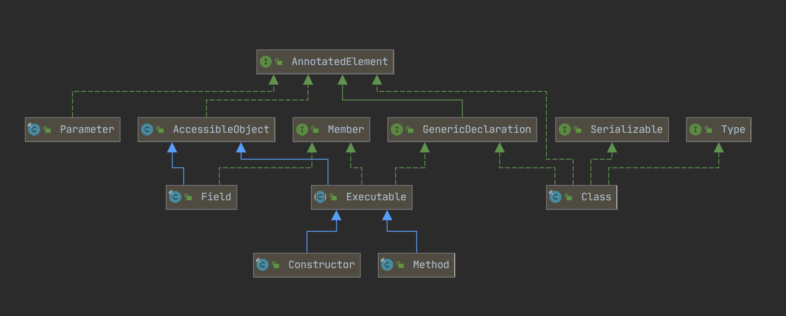

# Java反射(一) - 核心类库和方法

**什么是Java反射？**

> Reflection is commonly used by programs which require the ability to examine or modify the runtime behavior of applications running in the Java virtual machine.
> 
> [https://docs.oracle.com/javase/tutorial/reflect/index.html](https://docs.oracle.com/javase/tutorial/reflect/index.html)

反射(Reflection)是一种可以在运行时检查和动态调用类、构造、方法、属性的机制。是Java框架能够提供的一些自动化机制的基础依据，比如Spring IOC容器、各种ORM框架(Hibernate、MyBatis)等。

JDK中与反射相关的API集中在`java.lang`和`java.lang.reflect`包中，是面向我们开发者使用的API。部分`java.lang.reflect`包中接口的实现类放在了`sun.reflect`包中，一般情况下`sun.reflect`包中的API有可能会随着平台的升级发生改变，导致使用到的代码无法运行，所以尽量少用。

**Java反射的实现原理？**

Java**类加载**的最终结果可以理解为就是生成了JVM的**堆内存**中的`Class`对象，**类加载器**将`.class`文件中的二进制数据(`Matedata`)读入内存，并放在了**运行时数据区**的**方法区**中，而`Class`对象就是封装了该类在方法区中的数据结构，并提供了一系列访问该数据结构的接口。

那么我们能通过反射访问到的一个类的属性信息等，就是其`.class`文件中所包含的信息（[.class文件结构](./Java class文件结构)）。如此想来的话，能明白很多反射做不到的事情是为什么（比如只有在特定的情况下，才能通过反射获取到对象准确的泛型信息，这是受限于泛型在编译时写入`.class`中的信息，详见[Java反射 - 泛型](./Java反射 二 - 泛型)。

#### 核心体系

反射核心类`Class`、`Constructor`、`Method`、`Field`、`Parameter`:



##### Type接口

`java.lang.reflect.Type`是Java中所有类型的共同父类，这些类型包括原始类型、泛型类型、数组类型、类型变量和基本类型，接口定义如下：

```java
public interface Type {
    default String getTypeName() {
        return toString();
    }
}
```

##### AnnotatedElement接口

[https://docs.oracle.com/javase/8/docs/api/java/lang/reflect/AnnotatedElement.html](https://docs.oracle.com/javase/8/docs/api/java/lang/reflect/AnnotatedElement.html)

`AnnotatedElement`接口主要定义了与注解有关的操作，我们可以看到以上几个核心类都实现了`AnnotatedElement`接口，所以他们都拥有操作注解的功能。

##### Member接口

[https://docs.oracle.com/javase/8/docs/api/java/lang/reflect/Member.html](https://docs.oracle.com/javase/8/docs/api/java/lang/reflect/Member.html)

`Member`接口主要提供成员属性的一些描述，类成员变量`Constructor`、`Method`、`Field`都实现了该接口，其中`getModifiers()`需配合`Modifier`使用，通常会在`setAccessible`之前通过该方式判断是否需要进行访问修饰符抑制：

```java
Field field = ...;
int modifiers = field.getModifiers();
boolean isPublic = Modifier.isPublic(modifiers);
```

##### AccessibleObject接口

[https://docs.oracle.com/javase/8/docs/api/java/lang/reflect/AccessibleObject.html](https://docs.oracle.com/javase/8/docs/api/java/lang/reflect/AccessibleObject.html)

`AccessibleObject`接口封装了对成员属性可访问性的操作，也就是我们会经常会在`Field.set`、`Method.invoker`等操作之前使用`setAccessible`操作抑制访问修饰符，避免产生无权限访问这种异常。

##### GenericDeclaration接口

```java
public interface GenericDeclaration extends AnnotatedElement {
    public TypeVariable<?>[] getTypeParameters();
}
```

`GenericDeclaration`接口定义了获取声明的泛型变量的接口，而返回值`TypeVariable`是4种泛型类型中的**类型变量类型**，表示的是带有上界的泛型参数信息，常见的`TypeVariable`的表示形式是`<T extends KnownType-1 & KnownType-2>`，对泛型的详细操作与分析会在[Java反射 - 泛型](./Java反射 二 - 泛型)展开。

##### Executable接口

[https://docs.oracle.com/javase/8/docs/api/java/lang/reflect/Executable.html](https://docs.oracle.com/javase/8/docs/api/java/lang/reflect/Executable.html)

`Executable`接口主要功能是从`Method`和`Constructor`抽取出两者可以共用的一些方法例如注解的操作，参数的操作等。

##### Modifier类

[https://docs.oracle.com/javase/8/docs/api/java/lang/reflect/Modifier.html](https://docs.oracle.com/javase/8/docs/api/java/lang/reflect/Modifier.html)

`Modifier`类提供了一系列的静态方法，用于判断基于int类型的修饰符参数的具体类型，这个修饰符参数来源于`Class`、`Constructor`、`Method`、`Field`、`Parameter`的`getModifiers()`方法。

##### 需要注意的规律

`getX()`和`getDeclearedX`的区别，这里的X指代`Field`、`Method`、`Constructor`：

- `getDeclearedX`：获取的是类声明的所有该属性，即所有修饰符(`public`、`default`、`private`、`protected`)修饰的属性，但是不包含继承而来的属性；

- `getX`：获取的是类`public`修饰的属性，同时还包括继承而来的属性；

而`Annotation`有所区别，因为所有的Annotation一定是用`public`修饰的：

- `getDeclaredAnnotation`：获取的是该属性上的所有注解，但是会忽略继承的注解，即会忽略`@Inherited`注解的作用；

- `getAnnotation`：获取该属性上所有的注解，包括继承的注解

##### Class类

[https://docs.oracle.com/javase/8/docs/api/java/lang/Class.html](https://docs.oracle.com/javase/8/docs/api/java/lang/Class.html)

`Class`类是所有反射相关操作的根入口，获取一个`Class`对象有3种方法：

- `类名.class`，这种方法是最简单也相对高效的方式。因为在编译时就会受到编译器的检查，且根除了对耗时较多的方法`forName()`的调用。
- `Class.forName()`，只能获取到`public`修饰的类。
- `对象.getClass()`

其中`xxx.getClass()`的原理是：在对象初始化的时候，JVM会在对象头部，放入一个指向`Class`对象的指针。

而`类名.class`则直接是常量池中指向`Class`对象的指针。

由此，在存在继承的情况下，`类名.class`与`对象.getClass()`得到的结果是不一样的：

```java
// 这里的Class是Super类的
Class superClass = Super.class;

// 而这里的Class实际上是Child类的
Super o = new Child();
Class childClass = o.getClass();
```

`Class.newInstance()`方法实际上就是使用反射调用了类初始化过程中的<init>方法。

##### Constructor类

[https://docs.oracle.com/javase/8/docs/api/java/lang/reflect/Constructor.html](https://docs.oracle.com/javase/8/docs/api/java/lang/reflect/Constructor.html)

`Constructor`除了能获取到相关的信息之外，还有一个很重要的作用是可以抑制修饰符进行实例化，而Class的实例化方法`newInstance`只能实例化修饰符为public的类，这就是为什么一些IOC容器的实现框架中实例化类的时候优先依赖于无参数构造的原因。

##### Method、Field类

[https://docs.oracle.com/javase/8/docs/api/java/lang/reflect/Field.html](https://docs.oracle.com/javase/8/docs/api/java/lang/reflect/Field.html)

[https://docs.oracle.com/javase/8/docs/api/java/lang/reflect/Method.html](https://docs.oracle.com/javase/8/docs/api/java/lang/reflect/Method.html)

##### 参考：

[http://www.throwable.club/2018/12/02/java-reflection-lib/](http://www.throwable.club/2018/12/02/java-reflection-lib/)
