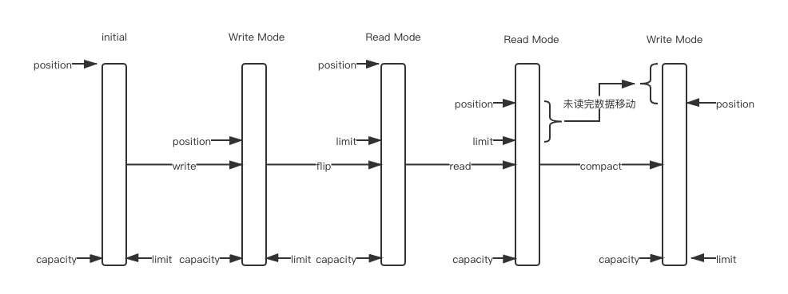
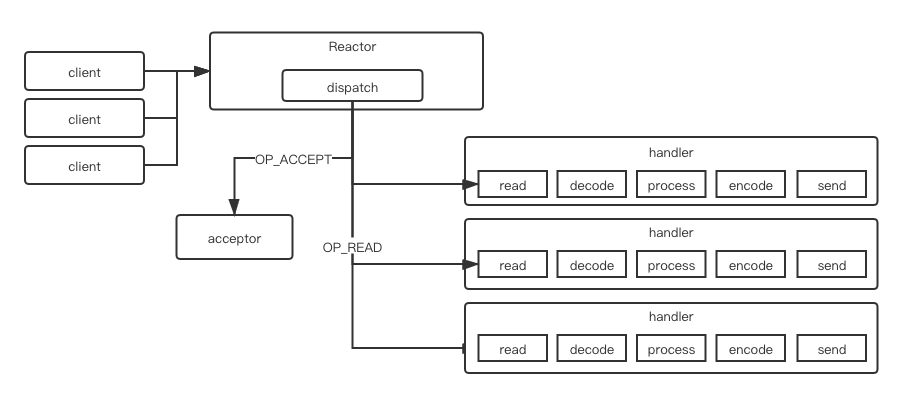

# Why NIO


#### 传统BIO编程模型

`socket.accept()`、`socket.read()`、`socket.write()`三个主要函数都是同步阻塞的，当一个连接在处理I/O的时候，系统是阻塞的，如果是单线程的话必然就挂死在那里；但是阻塞的时候，CPU是释放出来的，这样我们可以开启多个线程，就可以处理多个链接（1. 利用多核；2. 当I/O阻塞系统时，利用多线程使用CPU资源）。

这个模型严重的依赖线程，但线程是很贵的资源：

1. 创建销毁成本很高；
2. 线程本身需要占用较大的内存；
3.  线程的切换成本很高，当线程切换的时候，需要保留线程的上下文，然后执行系统调用（用户态内核态的转换），如果线程数过高，可能执行线程切换的时间甚至会大于线程执行的时间，这时的表现往往是系统load偏高，CPU sy使用率特别高，导致系统陷入几乎不可用的状态；
4. 容易造成锯齿状的系统负载，一旦线程数量高但外部网络环境不是很稳定，就很容易造成大量请求的结果同时返回，激活大量阻塞线程从而使系统负载压力过大；

所以当面对十万甚至百万级链接的时候，传统的BIO模型是无能为力的，必然需要一种更高效的I/O处理模型。


#### NIO

所有的系统I/O都分为两个阶段：**等待就绪 - 操作**，比如读操作就分为**等待系统可读 - 真正的读**，写操作分为**等待网卡可以写 - 真正的写**；等待就绪的阻塞是不使用CPU的，是在空等；而真正的读写操作的阻塞是使用CPU的，而且这个过程非常快，属于memory copy，带宽通常在1GB/s级别以上。

NIO模型即使利用系统I/O这一特性，其读写函数可以立刻返回，如果一个链接（`channel`）不能读写（socket.read()或者socket.write()返回0），那么就可以把这个事件在`Selector`上注册标记位，然后切换到其他就绪的链接进行读写；socket主要的读、写、注册和接收函数，在等待就绪阶段都是非阻塞的，只有真正的I/O操作是同步阻塞的（消耗CPU但性能非常高）。

NIO模型是I/O多路复用的基础，结合**事件驱动模型**，可以有效的解决高

并发、大量链接、I/O处理问题。

NIO几个核心组件：

1. **Selector:** 事件选择器，NIO的主要事件有几个：读就绪、写就绪、有新连接到来，在合适的时机告诉`Selector`对某个事件感兴趣(`Channel.register`、`SelectionKey.interestOps(ops)`)，会在有事件就绪时结束阻塞`Selector.select()`，然后就可以对有事件就绪的`channel`进行处理；

2. **SelectionKey:** 

   ```java
   // 以位域的方式来枚举，
   // 多个事件做|运算的结果就可以表示注册了多个事件，(readyOps, interestOps)只需要用一个int值保存就可以了
   // 如果要判断是否是某个事件就绪，只需要做&运算的结果>0就可以判断了(readyOps & OP_READ > 0)
   // 注销某事件：interestOps & ~OP_READ
   OP_READ = 1 << 0;    // 00001
   OP_WRITE = 1 << 2;   // 00100
   OP_CONNECT = 1 << 3; // 01000
   OP_ACCEPT = 1 << 4;  // 10000
   ```

   `OP_WRITE`事件的就绪条件是发生在写缓冲区有空闲空间的情况下，而写缓冲区大部分时候都是有空闲空间的，如果注册了`OP_WRITE`事件，那么就会一直使得写事件处于就绪状态，`select()`方法就会一直空转，占用CPU资源，所以`OP_WRITE`只有当确实有数据需要写的时候才进行注册，并在写完后马上取消注册；

   其实大部分的情况下，我们直接调用`channel.write()`就可以了，没有必要注册`OP_WRITE`事件，注册之后一般都是马上就会被选中的；主要是在写缓冲区空间满的情况下使用，即`channel.write(buffer) == 0`的时候；

   ```java
   while(buffer.hasRemaining()) {
     if (channel.write(buffer) == 0) {
       selectionKey.interestOps(selectionKey.interestOps() | SelectionKey.OP_WRITE);
       selector.wakeup();
       break;
     }
   }
   
   if（!buffer.hasRemaining()) {
     // 注销OP_WRITE事件
     selectionKey.interestOps(selectionKey.interestOps() & ~SelectionKey.OP_WRITE);
   }
   ```

3. **Channel:** 

   NIO的强大功能部分来自于`Channel`的非阻塞特性，I/O的很多相关操作都是可能阻塞的，而且在调用一个方法前是无法知道其是否会阻塞的，所以`Channel`一个重要的特征就是可以配置它的阻塞行为，以实现非阻塞式的通道；

   配合`Selector`实现IO多路复用时需要设置 `channel.configureBlocking(false)`，非阻塞模式下的`channel`的`accept()`、`read()`、`write()`操作都是非阻塞的，返回值指示其所请求的操作的完成度，例如`accept()`在没有client连接的时候，就会返回null；

4. **Buffer:** 数据是从通道读入缓冲区，从缓冲区写入到通道中的；缓冲区本质上是一块可以写入数据，然后可以从中读取数据的内存

   - **position**: 读写数据时，position表示的都是开始时的位置
   - **limit**: 读写数据时，limit表示的都是读写的限制位置

   写数据到`Buffer`中有两种方式：`Channel.read(buffer)`、`Buffer.put(127)`，从`positon`开始写；`flip()`方法将`Buffer`从写模式切换到读模式，即将`position`置为0，`limit`设置为`position`的值；数据读取结束后，可以调用`clear()`/`compact()`方法设置`Buffer`以准备再次写入，不同的是：`clear()`是直接将`positon`置为0，`limit`置为`capacity`，如果有未读完的数据，将会被忽略；`compact`是将未读数据拷贝到`Buffer`起始处，将`position`置为最后一个未读元素的后面，`limit`也是置为`capacity`，不会覆盖未读数据；

   http://ifeve.com/buffers/



##### Reactor模型

http://www.dre.vanderbilt.edu/~schmidt/PDF/reactor-siemens.pdf


一个socket只能属于一个IoThread，而一个IoThread可以管理多个socket，在`select()`的线程里做`Channel`的读写操作？

http://gee.cs.oswego.edu/dl/cpjslides/nio.pdf

1. 随着负载的增加可以优雅的降级（Graceful degradation under increasiong loa(more clients)）
2. 随着硬件性能的提升，性能可以持续提升（Continuous improvement with increasiong resources(CPU, memory, disk, bandwidth)）
3. 满足可用性和性能指标（also meet availability and performance goals）
   1. 低延迟（Shot latencies）
   2. 满足高峰需求（Meeting peak demand）
   3. 可调节的服务质量（Tunable quality of service）

##### 单Reactor单线程模型



由原来的阻塞读写（占用线程）变成了单线程轮询（是否是轮询根据不同的实现方式不同）事件，找到可以进行读写的网络描述符进行读写，除了事件的轮询是阻塞的，剩余的I/O操作都是纯CPU操作的，没有必要开启多线程，也就没有线程切换，只是拼命的读、写、链接；

##### 单Reactor多线程模型


[美团 - Java NIO浅析](https://tech.meituan.com/2016/11/04/nio.html)

