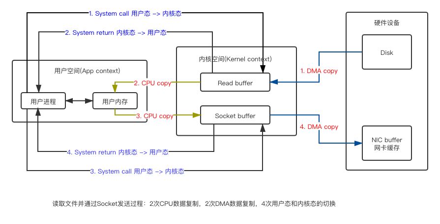
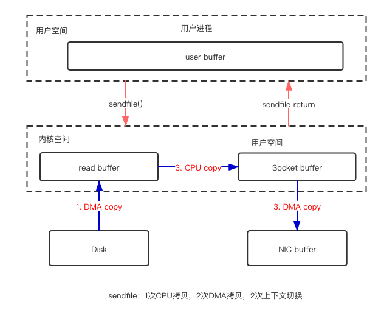
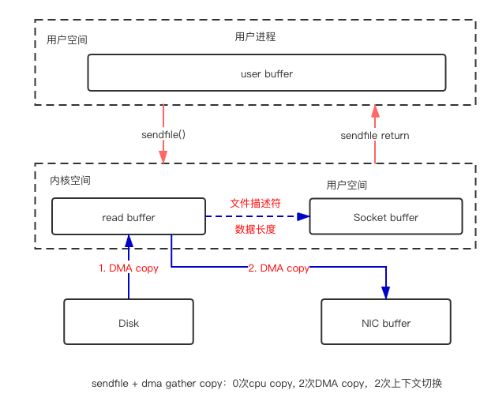

# 零拷贝

> `Zero-copy`是指在计算机执行操作时，CPU不需要将数据从一块内存拷贝到另一块内存，通过减少这次拷贝以提高性能；在操作系统层面来说就是指不需要将数据从**内核空间**复制到**用户空间**。

**内核**


**内核态 & 用户态**

用户进程不能直接操作硬件，只能通过内核提供的接口来操作；而为了确保内核正常、安全的运行，不会因为上层引用的异常而导致内核异常，就必须区分**内核代码的执行**和**用户定义代码的执行**，也就是**所谓的双重模式**：**内核态**和**用户态**；

所以进程在执行上有**内核态**和**用户态**之分，同样系统的内存也会因此会被分为**用户空间**和**内核空间**，当进程由用户态通过**系统调用**进入**内核态**时，就需要保存进程当前运行的上下文（进程的状态、计数器、全局变量、临时数据如函数参数、返回地址、局部变量等），处理完成之后再恢复其上下文；



**DMA** 

Direct Memory Access，直接存储器访问；DMA传输将数据从一个地址空间复制到另一个地址空间，提供在外设和存储器之间或者存储器和存储器之间的高速数据传输；CPU通知DMA控制器进行I/O后CPU就被解脱出来做别的事情了，数据的拷贝过程都是由DMA来操作完成，数据拷贝完成后DMA控制器以中断的方式通知CPU；（https://zhuanlan.zhihu.com/p/138573828）

> **Linux I/O读写方式**
>
> 轮询：基于死循环对I/O端口进行不断检测
>
> I/O中断：到数据到达时，I/O设备主动向CPU发起中断请求，由CPU自己负责数据从I/O设备到buffer的过程
>
> DMA传输：CPU只有数据传输开始和结束时做中断处理，传输过程由DMA控制器操作，这样CPU计算和I/O操作可以处于并行操作


**虚拟内存**

应用程序看到的其实都是虚拟内存，当进程执行一个程序时，需要先从内存中读取该进程的指令，然后执行，获取指令时用到的就是虚拟地址；为了获取到实际的数据，CPU 需要将虚拟地址转换成物理地址，CPU 转换地址时需要用到进程的页表（**Page Table**），而页表（Page Table）里面的数据由操作系统维护；页表里面的每个内存映射（Memory Mapping）都将一块虚拟地址映射到一个特定的地址空间（物理内存或者磁盘存储空间）；

- 地址空间：提供更大的地址空间，并且地址空间是连续的，使得程序编写、链接更加简单
- 进程隔离：不同进程的虚拟地址之间没有关系，所以一个进程的操作不会对其它进程造成影响
- 数据保护：每块虚拟内存都有相应的读写属性，这样就能保护程序的代码段不被修改，数据块不能被执行等，增加了系统的安全性
- **内存映射**：有了虚拟内存之后，可以直接映射磁盘上的文件（可执行文件或动态库）到虚拟地址空间。这样可以做到物理内存延时分配，只有在需要读相应的文件的时候，才将它真正的从磁盘上加载到内存中来，而在内存吃紧的时候又可以将这部分内存清空掉，提高物理内存利用效率，并且所有这些对应用程序是都透明的
- 共享内存：比如动态库只需要在内存中存储一份，然后将它映射到不同进程的虚拟地址空间中，让进程觉得自己独占了这个文件。进程间的内存共享也可以通过映射同一块物理内存到进程的不同虚拟地址空间来实现共享
- 物理内存管理：物理地址空间全部由操作系统管理，进程无法直接分配和回收，从而系统可以更好的利用内存，平衡进程间对内存的需求

图源：https://zhuanlan.zhihu.com/p/83398714?utm_source=qq&utm_medium=social&utm_oi=58097666097152


**零拷贝**

DMA数据复制过程（把数据从内存复制到I/O设备）是必不可少的，那么可以进行优化的点就是2次CPU数据复制和4次用户态内核态的切换，所有的零拷贝实现方案都是从这两个方面入手进行性能优化的；


##### Linux中的零拷贝实现

**用户态直接I/O**


**mmap内存映射**

`mmap + write`，`mmap`是Linux提供的一种内存映射文件的方法，即将一个进程的地址空间的一段虚拟内存映射到磁盘文件地址：

```
tmp_buf = mmap(file_fd, len);
write(socket_fd, tmp_buf, len);
```

将内核中`read buffer`的地址与用户空间的`user buffer`进行映射，实现`read buffer`和`user buffer`的共享，省去了从`read buffer`拷贝到`user buffer`的过程，但是写的时候，仍需要进行`user buffer`到`write buffer`的拷贝


mmap 主要的用处是提高 I/O 性能，特别是针对大文件，对于小文件，内存映射文件反而会导致碎片空间的浪费；内存映射总是要对齐页边界，最小单位是4K；

```java
// java中的mmap实现
// java.nio.channels.FileChannel#map
 public abstract MappedByteBuffer map(MapMode mode, long position, long size) throws IOException;
```

`MappedByteBuffer`相比与`ByteBuffer`增加了3个重要方法：

- `fore()`：对于处于 READ_WRITE 模式下的缓冲区，把对缓冲区内容的修改强制刷新到本地文件
- `load()`：将缓冲区的内容载入物理内存中，并返回这个缓冲区的引用
- `isLoaded()`：如果缓冲区的内容在物理内存中，则返回 true，否则返回 false

`MappedByteBuffer`的特点与不足：

- `MappedByteBuffer` 使用是堆外的虚拟内存，因此分配（map）的内存大小不受 JVM 的 -Xmx 参数限制，但是也是有大小限制的。
- 如果当文件超出 Integer.MAX_VALUE 字节限制时，可以通过 position 参数重新 map 文件后面的内容。
- MappedByteBuffer 在处理大文件时性能的确很高，但也存内存占用、文件关闭不确定等问题，被其打开的文件只有在垃圾回收的才会被关闭，而且这个时间点是不确定的。
- MappedByteBuffer 提供了文件映射内存的 mmap() 方法，也提供了释放映射内存的 unmap() 方法。然而 unmap() 是 FileChannelImpl 中的私有方法，无法直接显示调用。因此，用户程序需要通过 Java 反射的调用 sun.misc.Cleaner 类的 clean() 方法手动释放映射占用的内存区域。

`DirectByteBuffer` 是 `MappedByteBuffer` 的具体实现类；`Util.newMappedByteBuffer()` 方法通过反射机制获取 `DirectByteBuffer` 的构造器，然后创建一个 `DirectByteBuffer` 的实例，对应的是一个单独用于内存映射的构造方法；

**RocketMQ使用的就是`MappedByteBuffer`对文件进行读写操作（`mmap + write`），利用了NIO中的FileChannel模型将磁盘上的物理文件直接映射到用户态的内存地址中，将对文件的操作转化为直接对内存地址进行操作，从而极大地提高了文件的读写效率；所以RocketMQ适用于业务级消息这种小块文件的数据持久化和传输；**

**而Kafka只是索引文件使用的是`mmap + write`，数据文件使用的是`sendfile`，所以Kafka适用于系统日志消息、大数据这种高吞吐量的大块文件的数据持久化与传输；**


**sendfile方式**

sendfile 系统调用在不同的Linux内核版本中实现机制不同，相对于mmap + write的方式，用户程序不能对数据进行修改；

**Linux 2.1 ~ 2.4: sendfile**

```c
// 仍然会有一次cpu copy
ssize_t sendfile(int out_fd, int in_fd, off_t *offset, size_t count);
```



**Linux 2.4 ~ 2.6.17: send file + DMA gather copy**

```c
// 2.4对sendfile进行了优化，为DMA控制器引入了gather功能，就可以将cpu copy去掉了
// 就是在不拷贝数据到网络缓冲区，而是将待发送数据的内存地址和偏移量等描述信息存在网络缓冲区，DMA根据描述信息从内核的读缓冲区截取数据并发送
// 但是其有个致命的缺陷，in_fd不仅仅不能是socket，而且在2.6.33之前Sendfile的out_fd必须是socket，因此sendfile几乎成了专为网络传输而设计的，限制了其使用范围比较狭窄
// 2.6.33之后out_fd才可以是任何file
ssize_t sendfile(int out_fd, int in_fd, off_t *offset, size_t count);
```



**Linux 2.6.17 splice || tee**

```c
// fd_in和fd_out必须有一个是管道
ssize_t splice(int fd_in, loff_t *off_in, int fd_out, loff_t *off_out, size_t len, unsigned int flags);
// fd_in和fd_out都必须是管道
ssize_t tee(int fd_in, loff_t *off_in, int fd_out, loff_t *off_out, size_t len, unsigned int flags);
```


```java
// java中的sendfile实现
// java.nio.channels.FileChannel
// FileChannel、SocketChannel 和 DatagramChannel 等通道实现了 WritableByteChannel 和 ReadableByteChannel 接口，都是同时支持读写的双向通道
// 通过 FileChannel 把文件里面的源数据写入一个 WritableByteChannel 的目的通道
public abstract long transferTo(long position, long count, WritableByteChannel target) throws IOException;
// 把一个源通道 ReadableByteChannel 中的数据读取到当前 FileChannel 的文件里面
public abstract long transferFrom(ReadableByteChannel src, long position, long count) throws IOException;

// 在FileChannelImpl中，通过以下变量标识当前系统支持何种sendfile机制
private static volatile boolean transferSupported = true;
private static volatile boolean pipeSupported = true;
private static volatile boolean fileSupported = true;
```


[零拷贝技术](https://mp.weixin.qq.com/mp/appmsgalbum?__biz=MzIyODc2MDgxOA==&action=getalbum&album_id=1444232542185504769&scene=173&from_msgid=2247485905&from_itemidx=1&count=3#wechat_redirect)

[深入剖析Linux IO原理和几种零拷贝机制的实现](https://zhuanlan.zhihu.com/p/83398714?utm_source=qq&utm_medium=social&utm_oi=58097666097152)

[深入探秘 Netty、Kafka 中的零拷贝技术](https://mp.weixin.qq.com/s?__biz=MzU0OTk3ODQ3Ng==&mid=2247487157&idx=1&sn=1cf43621965875abc538fa02bf5b76ee&chksm=fba6e6b6ccd16fa071d662aa0ef834e4548f15b01c081de6777b5b72b71908452ab3a685447f&mpshare=1&scene=23&srcid&sharer_sharetime=1585045230298&sharer_shareid=5e9a66a8e88b75ba906c413be7d38579%23rd)

[浅析mmap和Direct Buffer](https://juejin.cn/post/6844903993102041102)