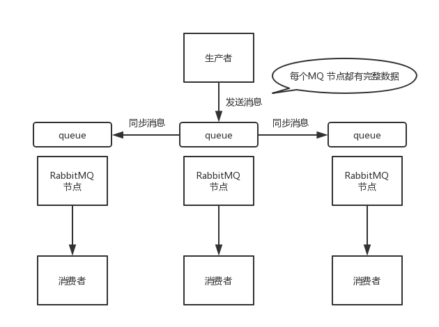

# Why MQ

#### 应用场景

**解耦**

**异步性能优化**

**消峰流控**

**最终一致性**

#### 缺陷

**系统可用性降低**

MQ必须保证是高可用的，否则MQ挂掉了之后，依赖MQ的服务都将不可用

**系统复杂性提高**

消息重复消费（如何保证幂等性）、消息丢失、消息顺序性、消息积压

**一致性问题**

生产者消息发送成功之后就直接返回成功了，如果某个消费者消费消息失败，那么数据就不一致了

#### 常用MQ对比

- 同等机器条件下，吞吐量多大？（几万QPS？）
- 性能如何？（发送一条消息到MQ耗时多少ms?）
- 是否高可用？**高可用如何设计**
- 会不会丢失数据？**消息数据落地磁盘如何设计，磁盘顺序写，零拷贝**
- 能否进行线性扩容？**可扩展性如何设计**
- MQ功能是否完备？（延迟消息，事务消息，消息堆积，消息回溯，死信队列....）

**RabbitMQ**

1. 单机性能万级（非分布式，同步性能开销很大；同步刷盘）
2. 可做到消息基本不丢失，可以使用**镜像集群模式实现高可用以及提高吞吐量**（或者放弃高可用，只使用普通集群模式，消息数据只放在一台机器上，其余机器只负责接收请求，然后通过`queue`元数据找到数据所在节点，去查询），每个节点都是`queue`的完整镜像，但是**并不是分布式的**；
3. 缺点1，所以**性能开销很大**，写消息的时候需要进行同步，网络带宽压力和消耗都很重；
4. 缺点2，**没有可扩展性而言，不能进行线性扩展**（非分布式的），增加机器也是需要同步所有的数据的；
5. `elang`开发，性能极好，消息时效性微妙级，延迟是几种MQ中最低的（即消息发送到`queue`到被消费的过程，在MQ中停留的时间）

**可靠消息：**

1. 生产者丢失消息：
   - 使用事务功能，即`channel.txSelect`、`channel.txCommit`、`channel.txRollback`，是一种同步机制，提交一个事务后会阻塞在哪里，**会降低吞吐量，太耗性能了**
   - 开启`confirm`模式，RabbitMQ会为每条消息分配一个唯一Id，如果成功写入MQ，会回传一个`ack`消息；如果MQ处理消息失败，会回调生产者`nack`接口，告诉生产者消息接收失败，可以重试；生产者可以结合这个机制，维护每个消息id的状态，如果超过一段时候还没有接收到这个消息的`ack`或者`nack`回调，就进行重发（消息可能重复）；是一个异步机制，发送之后可以马上发送下一条消息
2. RabbitMQ丢失消息：消息写入磁盘之前MQ挂掉了，所以必须**开启RabbitMQ的持久化**，需要和`confirm`机制结合起来，只有消息被持久化到磁盘后，才会通知生产者，如果MQ挂掉了，生产者也收不到`ack`，就可以进行重发
   - 创建queue时，将其设置为持久化
   - 发送消息时设置其为持久化
3. 消费者丢失消息：消息还未来得及消费，消费者就挂掉了；可以**关闭RabbitMQ的自动`ack`**

**消息的顺序性**

一个`queue`，多个`consumer`，生产者发送了3条数据，不同的消费者从同一个`queue`中消费数据，那么消费时的顺序其实就无法保证了；

解决方案：拆分多个queue，一个queue对应一个consumer，consumer内部使用内存队列做排队

**Kafka**

1. 单机性能10万级（分布式；默认异步刷盘），**高吞吐量**，一般配合大数据类的系统来进行实时数据计算、日志采集等场景；
2. 通过参数优化配置，可以做到**消息0丢失**，是分布式的架构，一个数据多个副本，可扩展性好；
3. 延迟ms级，高可用；
4. 功能简单，一般在大数据领域的实时计算以及日志采集被大规模使用；
5. topic数量增加的话，会导致其吞吐量大幅度下降，如果需要支撑大规模的topic，需要增加更多的机器资源；

Kafka 集群由多个 broker 组成，每个 broker 是一个节点；创建一个 topic，这个 topic 可以划分为多个 partition，每个 partition 可以存在于不同的 broker 上，每个 partition 就放一部分数据。

Kafka一般和`zookeeper`配合使用，比如broker的元数据、消费者的消费进度(`offset`)

**可扩展性：**broker + topic + partition，每个partition放一台机器(broker)，存放topic的一部分数据；扩展时只需增加topic的partition，然后做数据迁移，即可存放更多数据，提高吞吐量

**高可用：**多副本 + leader & follower + 重新选举leader

https://gitee.com/shishan100/Java-Interview-Advanced/blob/master/docs/high-concurrency/how-to-ensure-high-availability-of-message-queues.md

**选举机制：**基于Zookeeper

**同步机制：**

https://zhuanlan.zhihu.com/p/110069639

**可靠消息：**

https://gitee.com/shishan100/Java-Interview-Advanced/blob/master/docs/high-concurrency/how-to-ensure-the-reliable-transmission-of-messages.md

1. 消费者丢失消息：**关闭消费者自动提交`offset`**，另外如果使用内存`queue`做消费缓冲，也可能会丢失消息的；
2. Kafka丢失消息：持久化消息，leader挂掉，同时数据还没来得及同步到follower
   - 给 topic 设置 `replication.factor` 参数：这个值必须大于 1，要求每个 partition 必须有至少 2 个副本
   - 在 Kafka 服务端设置 `min.insync.replicas` 参数：这个值必须大于 1，这个是要求一个 leader 至少感知到有至少一个 follower ，确保 leader 挂了还有一个 follower 
   - 在 producer 端设置 `acks=all`：这个是要求每条数据，必须是**写入所有 replica 之后，才能认为是写成功了**
   - 在 producer 端设置 `retries=MAX`（很大很大很大的一个值，无限次重试的意思）：这个是**要求一旦写入失败，就无限重试**
3. 生产者丢失消息：`acks=all`

**消息顺序性：**

https://gitee.com/shishan100/Java-Interview-Advanced/blob/master/docs/high-concurrency/how-to-ensure-the-order-of-messages.md

Kafka一个topic可以有多个partition，如果生产者发送消息的时候没有指定key，那么这些消息就可能会分发到不同的partition中去，那么就无法保证消费者消费消息的时候的顺序性；如果指定了一个key，消费者**多个线程并发处理**，也会乱序；

解决方案：

1. 一个topic，只对应一个partition，一个consumer，consumer内部单线程消费，但是这样吞吐量太低
2. 生产者发送消息时指定key，让消息发送到同一partition中去，一个partition中的数据一定是有序的，消费者内部创建N个内存队列，相同key的数据都到同一队列中去（hash算法进行分发），每个线程分别消费一个内存队列，保证顺序性

**消息消费幂等性**

https://gitee.com/shishan100/Java-Interview-Advanced/blob/master/docs/high-concurrency/how-to-ensure-that-messages-are-not-repeatedly-consumed.md

消息不重复和消息可靠性是相互冲突的，所有的MQ都会优先保证消息可靠性，并不会保证消息不会重复，所以业务逻辑上一定要自己保证消息消费的幂等性；

除了消息重发，还有比如Kafka的offset提交失败，都会造成消息重复；

#### 设计一个消息队列

https://gitee.com/shishan100/Java-Interview-Advanced/blob/master/docs/high-concurrency/mq-design.md

[消息队列设计精要](https://tech.meituan.com/2016/07/01/mq-design.html)

- 可扩展性设计
- 性能设计，数据是否需要落地磁盘，顺序写？零拷贝？
- 高可用设计
- 消息0丢失
- 消费关系：点对点、组间广播、组内广播
- 高级特性：最终一致性、