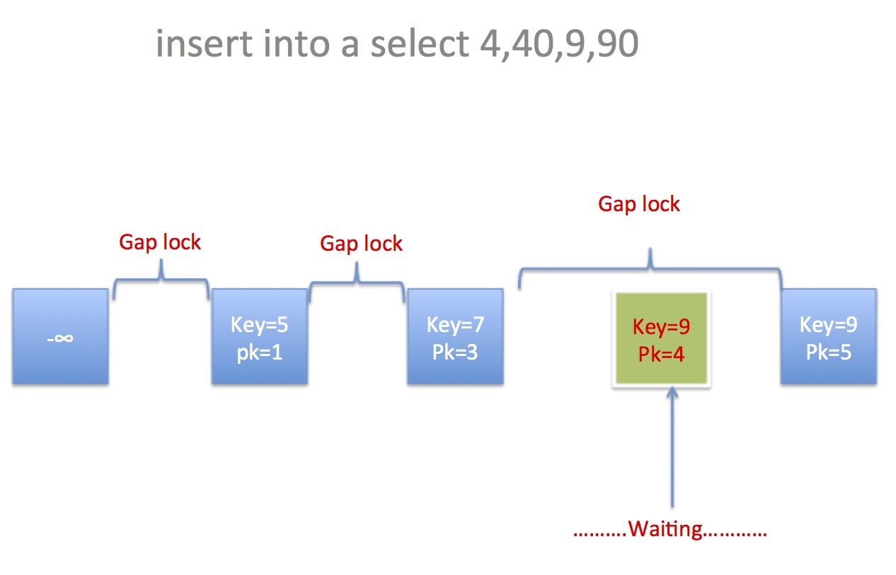
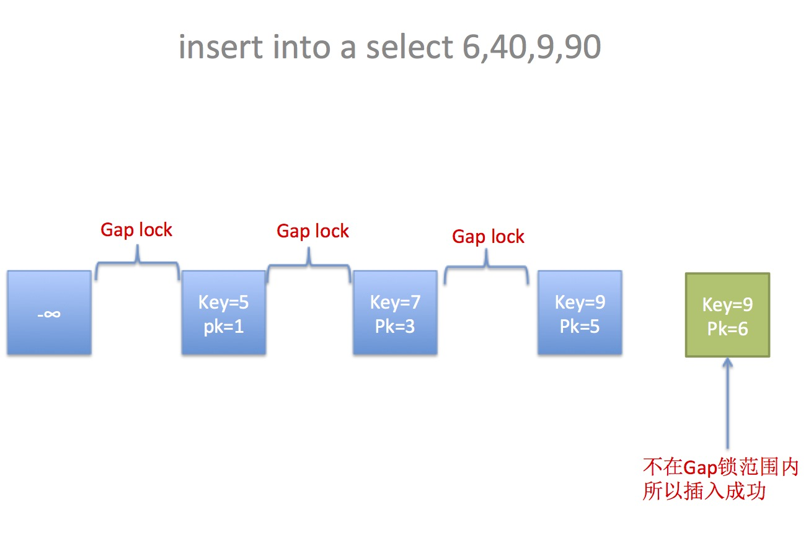

# InnoDB Locking

**如何查看当前加锁情况**

[Enabling InnoDB Monitors](https://dev.mysql.com/doc/refman/8.0/en/innodb-enabling-monitors.html)

```
SET GLOBAL innodb_status_output=ON;
SET GLOBAL innodb_status_output_locks=ON;

SHOW ENGINE INNODB STATUS;
```

#### Lock Types

https://dev.mysql.com/doc/refman/8.0/en/innodb-locking.html

**Shared and Exclusive Locks**

**Intention Locks**

**Record Locks**

`rec but not gap`

**Gap Locks**

`gap before rec `

**Next-key Locks**


**Insert Intention Locks**

>An insert intention lock is a type of gap lock set by [`INSERT`](https://dev.mysql.com/doc/refman/8.0/en/insert.html) operations prior to row insertion.

插入意向锁是一种**gap lock(`gap before rec insert intention`)**，且是**隐式锁(implicit locks)**；其只与`gap lock`冲突

`INSERT`语句会先判断在**大于插入值(所有有索引的字段 - N)的第一条记录(M)上**是否存在与`insert intention lock`冲突的锁，即`next-key lock`或者`gap lock`；

- 如果存在，则**插入`insert intention lock`**，进入锁等待；
- 如果不存在，写数据，并**插入一个隐式的`X record lock`**，如果有其他事务想要对该条数据进行加锁，会检查对应的`trx_id`是否活跃，如果活跃，就帮其加上锁，自己进入锁等待；

尝试在加上插入意向锁，插入成功后才开始检查以及写数据；如果M上存在则**隐**进入锁等待；

**`insert`操作时会在大于插入值的第一条记录上加`insert intention lock`，没有`gap lock`的冲突的话，就可以插入成功，锁冲突考虑的是锁的值（非聚簇索引 + 主键索引）**

如下（[图源](http://keithlan.github.io/2017/06/21/innodb_locks_algorithms/)）：






**显示锁 & 隐式锁**


#### 不同语句下加锁方式

**UPDATE**

> - [`UPDATE ... WHERE ...`](https://dev.mysql.com/doc/refman/8.0/en/update.html) sets an exclusive next-key lock on every record the search encounters. However, only an index record lock is required for statements that lock rows using a unique index to search for a unique row.
> - When [`UPDATE`](https://dev.mysql.com/doc/refman/8.0/en/update.html) modifies a clustered index record, implicit locks are taken on affected secondary index records. The [`UPDATE`](https://dev.mysql.com/doc/refman/8.0/en/update.html) operation also takes shared locks on affected secondary index records when performing duplicate check scans prior to inserting new secondary index records, and when inserting new secondary index records.

**如果更新的是聚簇索引的值，会在其他非唯一索引上加隐式锁，如果是唯一索引，则加显示锁，锁的类型依据当前事务隔离级别来决定**

**INSERT**

> [`INSERT`](https://dev.mysql.com/doc/refman/8.0/en/insert.html) sets an exclusive lock on the inserted row. This lock is an index-record lock, not a next-key lock (that is, there is no gap lock) and does not prevent other sessions from inserting into the gap before the inserted row.
>
> If a duplicate-key error occurs, a shared lock on the duplicate index record is set. This use of a shared lock can result in deadlock should there be multiple sessions trying to insert the same row if another session already has an exclusive lock. This can occur if another session deletes the row. 

`INSERT`操作成功后，会在插入

1. 没有唯一索引的情况，insert N
   1. 找到大于N的第一条记录M
   2. 如果M上面没有`gap lock` 、`next-key lock`的话，可以插入，否则等待  (对其`next-rec`加`insert intension lock`，由于冲突，所以等待)
2. 有唯一索引的情况，insert N
   1. 找到大于N的第一条记录M，以及前一条记录P
   2. 如果M上面没有`gap lock` 、`next-key lock`的话，可以插入，否则等待  (对其`next-rec`加`insert intension lock`，由于冲突，所以等待)
   3. 判断P是否等于N
      - 如果不等，写入数据
      - 如果相等，再判断P是否有锁
        - 如果没有锁，报`duplicate key error`，加`S record lock`（说明该记录已经被标记为删除，事务已提交，但是还没来得及`purge`）
        - 如果有锁，加`S record lock`（说明该记录已经被标记为删除，事务已提交，但是还没来得及`purge`）

如果发生`duplicate-key error`，则插入一个`S record lock`，如果存在多个事务同时`insert`同一条记录，很有可能发生死锁：

1. 新记录：tx2、tx3会因为tx1已经写入数据，发生唯一键冲突，会在加上`S record lock`，而当tx1回滚之后，tx2和tx3都会尝试加上`X record lock`，但是都因为对方的`S record lock`而等待

```sql
-- transaction1
begin;
insert into t select 1;

-- transaction2
begin;
insert into t select 1;

-- transaction3
begin;
insert into t select 1;

-- transaction1
rollback;
```

2. 记录已存在：tx2和tx3因为发生唯一键冲突，会在加上`S record lock`，而当tx1提交之后，tx2和tx3都会尝试加上`X record lock`，但是都因为对方的`S record lock`而等待

```sql
-- transaction1
begin;
delete from t where id = 1;

-- transaction2
begin;
insert into t select 1;

-- transaction3
begin;
insert into t select 1;

-- transaction1
commit;
```


RR级别加的锁都是`next-key lock`，用于解决**一致性锁定读（当前读）**下的幻读问题，但是会根据不同的情况做一些优化：

1.  降级为`record lock`，唯一索引且结果只有一条的情况下
2. 如果查询未命中，或者不存在 `=` 的比较时（比如`>`、`<`），**即对应索引值不包含在结果内的**，则会加`gap lock`
3. `UPDATE`聚簇索引的情况，对唯一索引加的锁会拆分为`X record lock`和`S gap lock`，方便做`duplicate check`

> When [`UPDATE`](https://dev.mysql.com/doc/refman/8.0/en/update.html) modifies a clustered index record, implicit locks are taken on affected secondary index records. The [`UPDATE`](https://dev.mysql.com/doc/refman/8.0/en/update.html) operation also takes shared locks on affected secondary index records when performing duplicate check scans prior to inserting new secondary index records, and when inserting new secondary index records.

RC级别加的锁都是`record lock`，但是也有例外的情况

1. purge + unique key，也会有`gap lock`（http://keithlan.github.io/2017/06/21/innodb_locks_algorithms/）

RU级别**写操作也会加`X lock`，但是读的时候不会加任何锁，不加锁也就不存在锁冲突了，也就不会阻塞了，所以RU级别加了锁的，但是还是可以脏读**


**参考：**

[MVCC Read View实现机制](https://blog.csdn.net/Waves___/article/details/105295060#1.2%E3%80%81Read%20View%20%E7%BB%93%E6%9E%84)

[**MySQL数据库InnoDB存储引擎中的锁机制**](http://www.uml.org.cn/sjjm/201205302.asp)

[MySQL · 引擎特性 · InnoDB隐式锁功能解析](http://mysql.taobao.org/monthly/2020/09/06/)

[InnoDB的加锁分析 - 转自何登成](https://juejin.cn/post/6844903576293081096)

[InnoDB锁算法详解](http://keithlan.github.io/2017/06/21/innodb_locks_algorithms/)

[死锁](http://keithlan.github.io/2017/08/17/innodb_locks_deadlock/)

[MySQL加锁分析](http://www.fanyilun.me/2017/04/20/MySQL%E5%8A%A0%E9%94%81%E5%88%86%E6%9E%90/)

[常见的锁类型](https://www.aneasystone.com/archives/2017/11/solving-dead-locks-two.html)

[常见 SQL 语句的加锁分析](https://www.aneasystone.com/archives/2017/12/solving-dead-locks-three.html)

[InnoDB 的 Redo Log 分析](https://leviathan.vip/2018/12/15/InnoDB%E7%9A%84Redo-Log%E5%88%86%E6%9E%90/)

