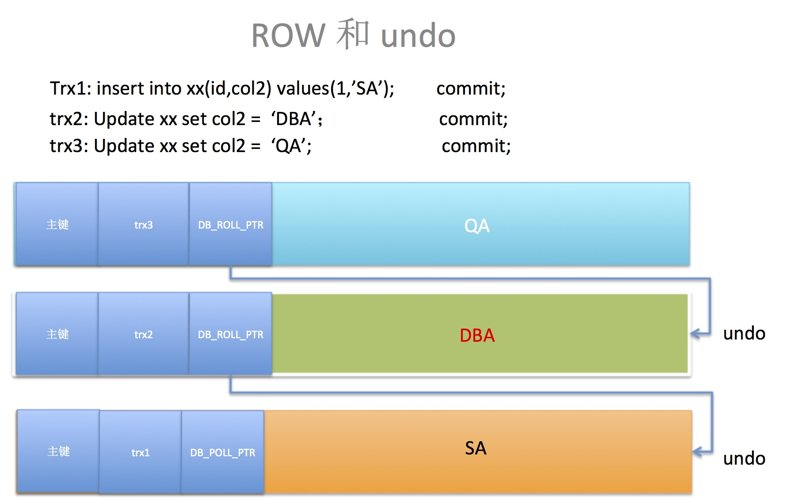

# InnoDB Transaction

> Transactions are atomic units of work that can be **committed** or **rolled back**. When a transaction makes multiple changes to the database, either all the changes succeed when the transaction is committed, or all the changes are undone when the transaction is rolled back.

#### ACID

- **原子性(atomicity)**：一个事务必须要一个原子性的工作单元，事务内的操作要不全部执行成功，要不就全部不成功回滚，不应出现只有一部分操作成功的情况；

  > Transactions are **atomic** units of work that can be **committed** or **rolled back**. When a transaction makes multiple changes to the database, either all the changes succeed when the transaction is committed, or all the changes are undone when the transaction is rolled back.

  redo log/undo log保证

- **一致性(consistency)**：数据库总是从一个一致性状态转换到另一个一致性状态，事务开始之前和事务结束之后，数据间的一致性状态不应该被破坏；即事务结束后，一组相关的数据只能读取到它们都是旧值或者新值，而不应该是新旧值的混合；

  >The database remains in a consistent state at all times — after each commit or rollback, and while transactions are in progress. If related data is being updated across multiple tables, queries see either all old values or all new values, not a mix of old and new values.

- **隔离性(isolation)**：事务在处理工程中，其未提交的数据对于其他事务来说应该是不可见的；但是通常我们会在隔离性与性能、并发能力间做平衡选择(trade off)，通过不同的隔离级别来实现；

  > Transactions are protected (isolated) from each other while they are in progress; they cannot interfere with each other or see each other's uncommitted data. This isolation is achieved through the **locking** mechanism. Experienced users can adjust the **isolation level**, trading off less protection in favor of increased performance and **concurrency**, when they can be sure that the transactions really do not interfere with each other.

- **持久性(durability)**：只要事务成功提交了，那么相应的修改就应该持久化下来，无论当前系统因为何种情况崩溃；(对于mysql而言，不同的redo log刷新策略对应着不同的持久化安全级别)；

  > The results of transactions are durable: once a commit operation succeeds, the changes made by that transaction are safe from power failures, system crashes, race conditions, or other potential dangers that many non-database applications are vulnerable to. Durability typically involves writing to disk storage, with a certain amount of redundancy to protect against power failures or software crashes during write operations. (In `InnoDB`, the **doublewrite buffer** assists with durability.)

**undo log**

> An undo log is a collection of undo log records associated with a single read-write transaction. An undo log record contains information about how to undo the latest change by a transaction to a [clustered index](https://dev.mysql.com/doc/refman/8.0/en/glossary.html#glos_clustered_index) record. 

**redo log**

> The redo log is a disk-based data structure used during crash recovery to correct data written by incomplete transactions. During normal operations, the redo log encodes requests to change table data that result from SQL statements or low-level API calls. 

##### 事务并发性问题

- **丢失更新(lost updates)**：
  - **第一类丢失更新**：回滚丢失，A、B两个事务对同一数据进行修改，后提交的事务回滚，导致先提交的事务所做的修改丢失；**标准定义的所有隔离级别都不允许该类丢失更新发生**（通过锁机制来解决的）；
  - **第二类丢失更新**：覆盖丢失，A、B两个事务依据同一初始值进行修改，后提交的事务就会覆盖先提交事务的的数据；通过加锁的方式进行避免，悲观锁或者乐观锁都可以；
- **脏读(dirty reads)**：读取到其他事务未提交的修改，和这些未提交的修改数据产生了依赖关系，其他事务可能在之后回滚了，那么这次读取到的数据就是脏数据；
- **不可重复读(unrepeatable reads)**：在一次事务范围内，先后读取同一条记录，期间有其他事务对记录进行了修改，两次读取到的数据不一致，事务之间相互干扰了；
- **幻读(phantom reads)**：在一次事务范围内，先后读取同一范围的记录集，期间有其他事务进行该范围内的记录删除或新增，两次读取到的结果集不一致；

##### 事务隔离级别

- **Read Uncommitted：**最低事务隔离级别，允许**脏读**、**不可重复读**、**幻读**；通过写操作加`X lock`，读操作不加任何锁的方式避免第一类更新丢失
- **Read committed：**允许**不可重复读**、**幻读**，设置该事务隔离级别的话，binglog必须使用**Row 模式**，而不能是statement；通过**MVCC（快照读） + locks（当前读）**解决脏读问题，
- **Repeatable read：**数据库事务规范中的RR隔离级别是允许**幻读**的，**但是`MySql`通过`gap lock`解决了当前读的幻读问题，通过`MVCC`解决了快照读幻读问题**
- **Serializable：**可串行化，最高隔离级别，所有并发性问题都不允许发生；读默认加`S lock`

##### MySql四大隔离级别解决策略

[MySQL锁系列（六）之 MVCC](http://keithlan.github.io/2017/06/16/innodb_locks_MVCC/)

**row的记录格式**

`DB_TRX_ID`: 表示这条记录最后一次被更改的事务ID

`DB_ROLL_PTR`: 回滚指针，指向undo，使得该行记录形成一条undo log链表

**Read View**

其实就是活跃事务列表

`trx_ids`: 创建视图时的活跃事务列表，不包含当前事务自己

`low_limit_id`: **当前最大的事务号 + 1，即下一个将被分配的事务ID**，有可能存在创建Read View之后才开启的事务，这样的事务也应该是不可见的

`up_limit_id`: **trx_ids中最小的事务ID，如果trx_ids为空，那么up_limit_id = low_limit_id**，可以理解为创建Read View时，已经提交的事务ID + 1

**RC级别，每次`consistent read`都创建一次Read View；RR级别，事务开始时第一次`consistent read`时创建一次Read View，且仅创建这一次**

**可见性判断**

1. `row.DB_TRX_ID < up_limit_id`: 表明修改该行的事务已经提交，那么该次修改的值对当前事务可见
2. `row.DB_TRX_ID >= low_limit_id`: 表明修改该行的事务是在创建Read View之后开始的，那么该行记录的值不可见，需要根据`DB_ROLL_PTR`找到对应的undo log，取出旧事务的`DB_TRX_ID`，再次回到1开始判断
3. `up_limit_id <= row.DB_TRX_ID < low_limit_id`
   - 如果`row.DB_TRX_ID`在`trx_ids`中存在（二分查找），那么该行记录不可见，处理方式同第二步
   - 如果`row.DB_TRX_ID`在`trx_ids`中不存在，那么该行记录可见，是在创建Read View之前提交的

https://blog.csdn.net/Waves___/article/details/105295060#1.2%E3%80%81Read%20View%20%E7%BB%93%E6%9E%84