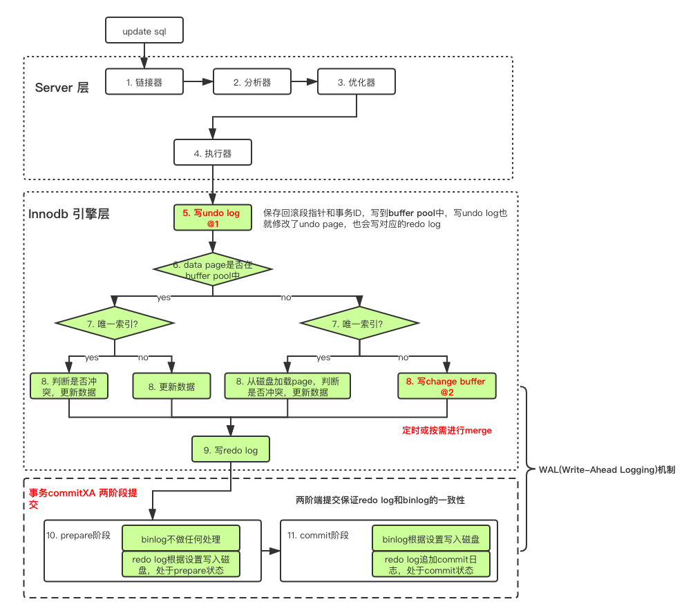

# MySql Innodb Transaction And Locks

##### 更新语句执行流程

**buffer pool LRU**

解决两个问题：

- 预读失效：局部性原理，提前读取的数据可能并不会用到

  让预读失败的页，停留在缓冲池LRU里的时间尽可能短；让真正被读取的页，才挪到缓冲池LRU的头部；

  所以把LRU链表分为两部分(new & old)，新读取的页先放入`Old Sublist Head`，如果数据真正的被读取了，才放入`New Sublist head`

- 缓冲池污染：当某个sql需要扫描大量数据的时候，可能会导致缓冲区里的所有页都被替换出去了

  老生代停留时间窗口机制，即使加入`Old Sublist`中的数据被访问了，也并不会立刻放入`New Sublist`，而是在`Old Sublist`中停留了一段时间`innodb_old_blocks_time`后，才会进入`New Sublist`

https://juejin.cn/post/6844903874172551181

**参考：**

- [一条更新语句在MySQL是怎么执行的](https://gsmtoday.github.io/2019/02/08/how-update-executes-in-mysql/)
- [MySQL · 原理介绍 · 再议MySQL的故障恢复](http://mysql.taobao.org/monthly/2018/12/04/)
- [数据库故障恢复机制的前世今生](http://catkang.github.io/2019/01/16/crash-recovery.html)
- [MySQL · 引擎特性 · InnoDB 崩溃恢复过程](http://mysql.taobao.org/monthly/2015/06/01/)
- [缓冲池(buffer pool)](https://juejin.im/post/6844903874172551181)
- [写缓冲(change buffer)](https://juejin.im/post/6844903875271475213)
- [MySQL · 引擎特性 · Innodb change buffer介绍](http://mysql.taobao.org/monthly/2015/07/01/)
- [MySQL 中 6 个常见的日志问题](https://www.infoq.cn/article/M6g1yjZqK6HiTIl_9bex)
- [InnoDB的磁盘文件及落盘机制](https://cloud.tencent.com/developer/article/1331786)
- [MySQL · 引擎特性 · 庖丁解InnoDB之REDO LOG](http://mysql.taobao.org/monthly/2020/02/01/)
- [MySQL · 引擎特性 · InnoDB undo log 漫游](http://mysql.taobao.org/monthly/2015/04/01/#)
- [详细分析MySQL事务日志 undo log](https://cloud.tencent.com/developer/article/1497335)
- [MySQL · 引擎特性 · InnoDB redo log漫游](http://mysql.taobao.org/monthly/2015/05/01/)
- [MySQL · 引擎特性 · InnoDB redo log 之 write ahead](http://mysql.taobao.org/monthly/2020/01/05/#)
- [详细分析MySQL事务日志redo log](https://cloud.tencent.com/developer/article/1497297)
- [MySQL 事务日志](https://mp.weixin.qq.com/s/4BKz49yMd3rLp06crHR2_g)
- [浅析MySQL事务中的redo与undo](https://segmentfault.com/a/1190000017888478)
- [MySQL 的 crash-safe 原理解析](https://juejin.im/post/6844904167782236167)
- [深入浅出MySQL crash safe](https://tech.youzan.com/shen-ru-qian-chu-mysql-crash-safe/)
- [MySQL Crash-Safe 复制](https://gohalo.me/post/mysql-crash-safe-replication.html)
- [MySQL 2PC & Group Commit](https://segmentfault.com/a/1190000014810628)

