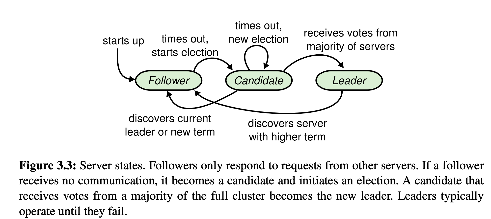
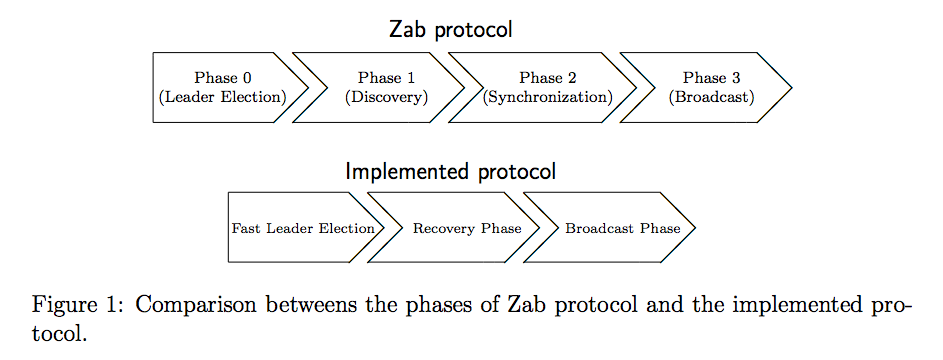

# Paxos & Raft & ZAB

#### 共识问题

对于高可用性，基本上都是使用**多副本**的方式实现，即多个节点拥有状态的多份拷贝，能在一些节点故障的时候不中断的提供服务，在[Raft的论文](https://raft.github.io/raft.pdf)中将其称为**Replicated state machines(多副本状态机)**；

这些拷贝需要保证具有**一致**的状态，才能在其中某一节点出现故障时，切换到其他节点后也能得到正确的结果；那么每次状态的改变，都需要相关节点共同决定，在各种情况下（网络延迟、分区、丢包、重复和重排序），这些节点最终能**协商**出一个**一致的、正确的**的结果，保证这些节点上的状态都能保持很好的**一致性**（因为分布式系统下，**时钟问题**极其难以解决，就算能够解决，付出的成本也是很昂贵的，所以不奢求能够达到**线性一致性**，能够达到**顺序一致性**也是足够的）；

最终这些节点看起来就是一个单独的、高可用的系统，对于Client来说，所做的请求都是正常工作的（要么执行成功，要么执行失败），不会出现整个服务不可用或者数据不一致的情况；


如何写入数据，才能保证复杂的并发写入操作是**安全的（持久化的、满足一致性的）**，又能满足**高性能的**：

- **先写log**
- **多数写**
- **共识协议/算法**

如果都接受第一个值，那么可能无法完成多数写，造成算法无法终止，违反了**活性原则（liveness）**；

如果运行接受不同的值，每个值都接受，那么可能就无法做到一致性了，违反了**安全性原则（safety）**；

基于此，就需要一个**两阶段（2-phase）协议**：

1. 第一阶段，确定可以被接受的请求（即**Proposal**），那么就需要一个优先级判断依据，而且由于分布式系统的**时钟问题**，我们不能使用时间来作为判断依据，其实就需要一个**逻辑时钟**
2. 第二阶段，写入具体的值，并且在写入阶段需要保证不会被新的请求发起的第一阶段干扰，保证算法可以快速收敛，并且所有节点最终只会写入一个一致的值

在[Raft的论文](https://raft.github.io/raft.pdf)中总结了**共识算法**一般都具有一下特性：

>- They ensure safety (never returning an incorrect result) under all non-Byzantine conditions, including network delays, partitions, and packet loss, duplication, and reordering. 
>- They are fully functional (available) as long as any majority of the servers are operational and can communicate with each other and with clients. Thus, a typical cluster of five servers can tolerate the failure of any two servers. Servers are assumed to fail by stopping; they may later recover from state on stable storage and rejoin the cluster. 
>- They do not depend on timing to ensure the consistency of the logs: faulty clocks and extreme message delays can, at worst, cause availability problems.
>- In the common case, a command can complete as soon as a majority of the cluster has responded to a single round of remote procedure calls; a minority of slow servers need not impact overall system performance.

- 确保安全性（从来不会返回一个错误的结果），即使在所有的非拜占庭（Non-Byzantine）情况下，包括网络延迟、分区、丢包、冗余和乱序的情况下。
- 高可用性，只要集群中的大部分机器都能运行，可以互相通信并且可以和客户端通信，这个集群就可用。因此，一般来说，一个拥有 5 台机器的集群可以容忍其中的 2 台的失败（fail）。服务器停止工作了我们就认为它失败（fail）了，没准一会当它们拥有稳定的存储时就能从中恢复过来，重新加入到集群中。
- 不依赖时序保证一致性，时钟错误和极端情况下的消息延迟在最坏的情况下才会引起可用性问题。
- 通常情况下，一条命令能够尽可能快的在大多数节点对一轮远程调用作出相应时完成，一少部分慢的机器不会影响系统的整体性能。

[分布式系统的核心：共识问题](https://zhuanlan.zhihu.com/p/220311761)


#### Paxos

Paxos使用**Proposal Number(提案编号)** 做为逻辑时钟，接收者选择接受编号最大的提案；

并且需要满足规则**对于已经选择了的值，第二阶段的提案也要使用相同的值**，用来避免其他尚处于第一阶段的**Proposal**的干扰，让算法可以快速收敛；

Paxos第一阶段为**准备（prepare）**阶段，第二阶段为**接受（accept）**阶段，分别对于两轮RPC：

**Prepare RPCs**

1. `Proposer`选择一个`Proposal Number`，向所有`Acceptor`发送`Prepare(n)`请求，并不包含提案的值

2. `Acceptor`接受到`Prepare(n)`请求，做如下处理

   ```
   if (n > max_n)
    // 如果接受到的n大于之前接受到的所有Prepare请求的编号，就返回Promise响应
    // 该Promise的意思是接受该次Prepare，可以开始Accept阶段，并承诺不会接受编号小于n的提案
    max_n = n  // save highest n we've seen so far
    if (proposal_accepted == true) // was a proposal already accepted?
    	// 如果有提案已经被accepted的话，同时返回以接受的提案编号和值
     respond: PROMISE(n, accepted_N, accepted_VALUE)
    else
     respond: PROMISE(n)
   else
    // 否则不做响应或者响应错误
    do not respond (or respond with a "fail" message)
   ```

**Accept RPCs**

1. 当`Proposer`收到半数以上`Acceptor`的`Promise()`响应后，`Proposer`就向所有的`Acceptor`发送`Accept(n, value)`请求，此时包含提案的值，提案的值的选择规则如下

   ```
   did I receive PROMISE responses from a majority of acceptors?
   if yes
    do any responses contain accepted values (from other proposals)?
    if yes
    	// 如果有任意一个Promise响应了已accepted的值，就使用accepted_VALUE，
    	// 如果有多个Promise都响应了accepted_VALUE，选择最大accepted_N对应的accepted_VALUE
     val = accepted_VALUE // value from PROMISE message with the highest accepted ID
    if no
    	// 如果所有的Promise都没有accepted_VALUE，就使用自己的值
     val = VALUE  // we can use our proposed value
     send Accept(ID, val) to at least a majority of acceptors
   ```

2. `Acceptor`收到`Accept(n, value)`请求，做如下处理

   ```
   if (n >= max_n) // is the n the largest I have seen so far?
    // 如果在等待accept请求期间，没有对更大的编号另行promise，就接受该提案
    proposal_accepted = true  // note that we accepted a proposal
    accepted_N = n  // save the accepted proposal number
    accepted_VALUE = VALUE  // save the accepted proposal data
    respond: Accepted(N, VALUE) to the proposer and all learners
   else
    // 否则不做响应，或者返回错误
    do not respond (or respond with a "fail" message)
   ```

可以看到，整个运行流程中会存在一个博弈过程：当`Proposal`得到半数以上的`Promise`后，此时可能会有另一个编号更大的`Proposal`进行`Prepare`，这两个`Proposal`之间就看谁的进展更快了；但是最终一定会有一个确定的领导者，先得到半数以上的`Accept`，那么他的值就成功的被写入了；

但是可能会出现一种活锁的情况，不断的有更大编号的`Proposal`加入进来，算法就会无休止的执行下去，解决方案就是加入**随机等待时间**，让某个`Proposal`可以先进行，减少一直抢占的可能；

Paxos算法在选择一个确定的值的过程中，需要重复运行Paxos来创建复制状态机，如果每个命令都这样来达到一致，会造成巨大的开销；其实只要Leader稳定不变，那么就可以在处理每个命令的时候去掉`Prepare`阶段，直接使用同一个确定的Leader进行提案；

[理解 Paxos（含伪代码）](https://zhuanlan.zhihu.com/p/260204158)


**leader-based consensus algorithm:** Raft、ZAB


#### Raft

https://raft.github.io/raft.pdf

Raft算法可以保证在任何时刻系统都具有一下特性：

> **Election Safety:** at most one leader can be elected in a given term. §5.2 
>
> **Leader Append-Only:** a leader never overwrites or deletes entries in its log; it only appends new entries. §5.3 
>
> **Log Matching:** if two logs contain an entry with the same index and term, then the logs are identical in all entries up through the given index. §5.3 
>
> **Leader Completeness:** if a log entry is committed in a given term, then that entry will be present in the logs of the leaders for all higher-numbered terms. §5.4 
>
> **State Machine Safety:** if a server has applied a log entry at a given index to its state machine, no other server will ever apply a different log entry for the same index. §5.4.3

- **Leader Completeness(Leader完全原则)**保证了所有已经commited的log不会丢，这里commited的意思并不是log的状态，raft算法并不需要维护一个log的状态，只要一条log被半数以上的节点写入了，那么他就算是commited的了，Raft算法可以保证这部分log是一定不会丢的，实现原理基于：**Election restriction(选举限制，新选举出来的Leader至少包含之前全部commited logs)**、**如何提交之前term的log entries(Committing entries from previous terms)**；有可能在这部分commited logs对应的Client请求是响应失败的，那么Client进行重试的时候，就需要注意**幂等性**了

  并且对于un-commited logs来说，在崩溃恢复的时候Raft会认为它们也是commited了的，只要它们存在于新选举出来的Leader上，如果不在新选举出来的Leader上的un-commited logs就做忽略处理；

  所以对于Client而言，响应失败的请求需要考虑一种情况：失败是因为Leader崩溃造成的，但是对于的command可能在崩溃恢复之后执行成功了，对于特殊的需求（如分布式锁）需要做响应的保护措施（ZAB算法也有同样的问题）；

- 使用Raft算法实现的多副本状态机而言，至少是保证**顺序一致性**的，写请求是能保证**线性一致性**的；实现原理基于：**Log index**、**Log replication**

Raft协议中，每个server遵守以下规则：


Raft协议中，每个server都需保存以下信息：


`nextIndex[]`中保存了之后要发送给每个Follower的下一logIndex，初始为`leader.lastLogIndex + 1`，会在`AppendEntries RPC`返回失败的时候根据情况修改，直到Leader和Follower之间的日志统一；

`matchIndex[]`中保存了每个Follower与Leader统一的`lastLogIndex`，可以以此来判断是否过半写入了，会在`AppendEntries RPC`返回成功的时候修改成`follower.lastLogIndex`，过半写入之后，就修改commiteIndex（Rules of Servers中`If there exists an N such that N > commitIndex, a majority of matchIndex[i] ≥ N, and log[N].term == currentTerm: set commitIndex = N`）

Raft协议中，定义了每个副本都会处于三种状态之一：Leader、Follower、Candidate

**Leader:** 所有数据的处理者，本地处理后再同步至其他副本

**Follower:** 数据的被动更新者（可以根据不同场景做不同的实现：1. 接收到client的写操作后，会直接将写操作转发给Leader处理，只处理client的读请求；2. 不接受client的写请求，client只能连接Leader，但是就会造成整个系统并发能力的大幅降低）

**Candidate:** 如果Follower在一定时间内（election timeout），没有接收到Leader的心跳，则判断Leader可能已经故障，就会变成Candidate状态，开启一次选举过程



Raft协议中几个重要的变量：election timeout、heartbeat timeout、term

**election timeout:** 处于Follower状态的副本，等待election timeout时间后（一个一定范围的随机值，比如150ms ~ 300ms），没有收到来自leader或者candidate的**有效RPC请求**时，变成Candidate开启一次选举

**heartbeat timeout:** Leader发送heartbeat timeout的间隔

**term:** 选举任期，每轮选举单调递增，term在Raft中起到了逻辑时钟的作用，它可以帮助server检测过期信息（比如过期的leader）


**Leader election**

Raft使用心跳机制来触发leader选举。无论是集群刚启动，还是Leader挂掉，除Leader外的所有节点都会处于Follower状态，如果在**election timeout**时间内没有收到Leader或者Candidate的**有效RPC请求**时，就会假定Leader失效并开启新的选举；如果是因为某种（如网络丢包）原因导致Follower未接收到Leader的RPC请求，那么也会开启下一轮选举，当Follower进入candidate状态后，发送新的term给各个节点，Leader收到新的term就会更新自己的term，然后转为Follower(`If RPC request or response contains term T > currentTerm: set currentTerm = T, convert to follower `)

1. Follower先将自己的`term`提高，并转为Candidate状态，并重置自己的`election timeout`

2. 节点先给自己投票，然后发送`RequestVote RPC`给其他Server，等待其他Server的响应

   

   3. 其他Server收到`RequestVote RPC`后，根据以下规则决定是否vote（一个server在一个term内，只能投一次票）

      - 如果`request.term < currentTerm`，直接响应false

      - `voteFor is null or candidatedId`，即要么是未投过票，要么是已经投票给当前请求的candidate（**first-come-first-served**，这里并不是是指收到第一个`RequestVote RPC`就投票，还需要进行**voting process(即判断谁更适合作为leader，谁的日志更新)**），否则响应false；**保证了一轮选举中只会选出一个Leader(Election Safety)**

        但是这样可能会造成**splite vote**，存在多个candidate都没有得到超过半数的vote；那么这些candidate就会等待`election timeout`，然后开启下一轮选举，因为`election timeout`是一定区间的随机值(比如150 ~ 300ms)，这使得大部分情况下只有一个server会超时，它将在其他节点超时前赢得选举，Raft使用这种随机选举超时来确保选票被瓜分的情况很少出现，即使出现也能很快被解决

      - 上述两个条件都满足，则进行**voting process**，即判断谁更有资格成为Leader，尽量选出一个包含最新log的节点（当然也有可能选出一个并没有包含最新log的节点），判断条件就是`candidate's log is at least as up-to-date as receiver's log`(`If the logs have last entries with different terms, then the log with the later term is more up-to-date. If the logs end with the same term, then whichever log is longer is more up-to-date.`)：

        - 先比较`lastLogTerm`，如果`request.lastLogTerm > currentLastLogTerm`，request candidate胜出，获得vote；如果`request.lastLogTerm > currentLastLogTerm`，响应false；
        - 如果`request.lastLogTerm == currentLastLogTerm`，则比较`lastLogIndex`，如果 `request.lastLogIndex >= currentLastLogIndex)`，获得vote；

        这样就可以最大限度保证选举出来的Leader包含最新的日志，那么就一定也包含**全部的commited日志**（只要log被多数节点写入了，那么选举出来的leader一定是这些写入了的节点中的一个，可能这个log还并未实际applied；如果log只是被少数节点写入了，那么确实也可能出现选举出来的leader不是这些已写入的节点中的一个，那么这个log在之后的**log replicationg**中就会被丢掉，但是这样也是没有问题的，这个log本来就不会算是commited）

   4. 如果candidate收到半数以上的vote，则胜出成为leader；如果其在等待vote期间，收到其他Leader的`AppendEntries RPC`，如果`request.term < currentTerm`，则拒绝这次request，并保持等待vote状态，如果`request.term > currentTerm`，则转换为Follower状态；

      这里需要和**Rules for Servers**中的`If RPC request or response contains term T > currentTerm: set currentTerm = T, convert to follower`结合起来看，意思就是如果一个follower因为某种原因，没有收到leader的心跳包而进入candidate状态，但是此时其实其余节点都是正常工作的，那么他一定也会开启一轮新的选举（但是因为log不够新，所以可能并不能成为leader），同时Leader可能收到他的`RequestVote RPC`，从而将自己的term修改为新的，转变为follower，如果之前的candidate没有成功的竞选为Leader，那么其余的节点就会在`election timeout`超时后，进入candidate状态，开启新的一轮选举；

   5. Raft协议规定一定不能有类似与ZAB协议中的**Recovery Phase**（即恢复阶段，将所有节点的log统一），因为在Raft协议中，**日志和选举是共用一个term**，导致就算某一节点日志不是最新的，但是如果它先进入candidate状态的话，**term会递增，就很有可能选举成功**，之后其再次崩溃，之前的leader也有可能会选举成功的，基于这样的原因，如果leader选举成功后进行日志同步的话的话，是有可能出现已提交日志被覆盖的情况，Raft论文中举了如下例子：

   

   所以**Leader只能推进commit index来提交当前term的已经复制半数节点的日志，即旧term日志的提交要等待当前term的日志而间接提交**；

   

   **Log replication**

   Raft协议中日志存储的是**一条命令**以及收到该命令时的term序号，并且每条日志也拥有一个index用于定位，当收到client的命令后，leader会将这些信息转化成`entry`，添加到自己的Log中，然后发送RPC同步Log到followers，如果超过半数的follower返回成功了，Leader就将该`entry`应用到自己的**状态机**中(commit)，并响应client请求成功；无论什么原因造成leader没有收到follower响应成功，会一直进行重试；

   Leader commit之后，并不会马上告诉follower进行commit，而是在下次`AppendEntries RPC`中告诉follower进行commit，通过在RPC请求中的`leaderCommit`字段，follower会知道自己应该commit哪些log；

   **Log Matching Property**

   - `If two entries in different logs have the same index and term, then they store the same command.`（实现基于：每个entry都包含index和term，且其在Log中的index一定不会变，如果存在相同index上保存的命令不相同，那么只可能是新的选举伦次产生的新Leader写入的，这样的log会在Log replication时修正）
   - `If two entries in different logs have the same index and term, then the logs are identical in all preceding entries.`（实现基于：**AppendEntries RPC的一致性检查机制**，只要AppendEntries RPC请求响应成功了，那么leader和follower之间的日志一定就是一致的）

   为了实现leader和follower之间的日志一致，**首先需要找到Leader和Follower最近的一致日志，然后将follower一致点之后的日志删除，并将在Leader上一致点之后的日志同步给Follower**

   具体的Log replication流程如下：

   1. client请求到达leader，leader先将请求转化成`entry`，然后添加到自己的log中，得到该`entry`的index信息，`entry`中包含了当前leader的term信息和`logIndex`

   2. leader通过`AppendEntries RPC`将该`entry`复制给所有的follower

      组装数据，其中`prevLogIndex = nextIndex[follower] - 1`，`prevLogTerm = logs[prevLogIndex].term`，`entries[] = logs[nextIndex, lastLogIndex]`

   

   3. follower接受到请求后，会重置`election timeout`（也算是心跳包，其实心跳包用的也是`AppendEntries RPC`，只是entries[]参数是空的），会根据如下规则决定是否接受该次请求：

      - `Reply false if term < currentTerm`，有可能是旧的Leader发送过来的心跳包，返回false，更新旧Leader的状态

      - `Reply false if log doesn't contain an entry at prevLogIndex whose term matches prevLogTerm`，检查prevLogTerm和当前follower prevLogIndex位置的log的**term**是否一致，如果不一致，那么就返回false；（如果index相同，且term也相同，那么其保存的命令也是相同的（Log Matching Property -1），且该index之前的log肯定也是一致的，只有可能该index之后会有多出来的log，多的log会根据下一条规则进行删除）

        Leader收到Follower返回的false后，会递减自己保存的对应Follower的nextIndex，然后重新组装数据发送，直到通过该验证；

        **优化方案：**Follower返回失败的时候，将不一致的`log.term`以及对应term的`firstLogIndex`一起返回，Leader收到该结果后，直接设置`nextIndex = firstLogIndex`；其实就是悲观一点的策略，减少RPC请求交互，直接整个term替换，里面可能是包含一致的log的，但是直接替换也不会出现错误；但是这样的优化其实可能并没有必要，一致性检查很少失败，且也不太可能出现大量的日志条目不一致的情况

        

      - `If an existing entry conflicts with a new one(same index but different terms), delete the exsisting entry and all that follow it`，如果存在`entries[]`对应的Index位置，存在和`entry.term`不一致的log（会存在有可能一致的，比如先发的RPC后到，该index的log已经被后发的RPC填上了，或者是重试的请求会发现已经写入了，其实就是幂等性），就将该日志以及其之后的所有日志都删除

      - 然后将新日志追加到logs后面

      - 如果`leaderCommit > commitIndex`，`set commitIndex = min(leaderCommit, index of last new enty)`，其实就是应用到状态机中去（在Rules for Servers中规定了，`If commitIndex > lastApplied: increment lastApplied, apply log[lastApplied] to state machine`）

   4. Leader收到Follower的ok响应之后，更新对应Follower的`nextLogIndex、matchLogIndex`（`If successful: update nextIndex and matchIndex for follower `），然后根据`matchIndex[]`统计是否过半写入了，如果过半写入了，就更新自己的`commitIndex`（`If there exists an N such that N > commitIndex, a majority of matchIndex[i] ≥ N, and log[N].term == currentTerm: set commitIndex = N `），然后应用到自己的状态机中去（`If commitIndex > lastApplied: increment lastApplied, apply log[lastApplied] to state machine`），同时给client回复ok；**然后在下一次`AppendEntries RPC`（可能是heatBeat，也有可能是处理下一条命令）的时候，Follower就可以根据`leaderCommit`参数将其可以commit的logs应用到自己的状态机中；**


#### ZAB

http://www.tcs.hut.fi/Studies/T-79.5001/reports/2012-deSouzaMedeiros.pdf

ZAB适用于**primary backup system**

ZAB协议保证以下特性（pe表示一个epoch周期内的Leader，<v, z>表示一次**事务(Transactions are state changes that the primary propagates (“broadcasts”) to the ensemble)**，v表示**新的状态(new state)**，z表示zxid）：

> - **Integrity:** If some process delivers *<v, z>*, then some process has broadcast *<v, z>*. 
> - **Total order:** If some process delivers *<v, z>* before *<v' , z'>*, then any process that delivers *<v' , z'>* must also deliver *<v, z>* before *<v' , z'>*. 
> - **Agreement:** If some process *pi* delivers *<v, z>* and some process *pj* delivers *<v' , z'>*, then either *pi* delivers *<v' , z'>* or *pj* delivers *<v, z>*. 
> - **Local primary order:** If a primary broadcasts *<v, z>* before it broadcasts *<v', z'>*, then a process that delivers *<v', z'>* must have delivered *<v, z>* before *<v', z'>*. 
> - **Global primary order:** Suppose a primary *ρi* broadcasts *<v, z>*, and a primary *ρj > ρi* broadcasts *<v', z'>*. If a process delivers both *<v, z>* and*<v', z'>*, then it must deliver *<v, z>* before *<v', z'>*. 
> - **Primary integrity:** If a primary *ρe* broadcasts *<v, z>* and some process delivers *<v', z'>* which was broadcast by *ρe' ≺ ρe*, then *ρe* must have delivered *<v', z'>* before broadcasting *<v, z>*.

其实和Raft协议所保证的内容差不多一致，不过这里的log指的是`<v, z>`，比较重要的点如下：

1. 保证了所有已经commited的log不会丢，只要一条log被半数以上的节点写入了，那么他就不会丢，实现原理基于：**Leader Election(选举限制，新选举出来的Leader至少包含之前全部commited logs)**、**Recovery Phase**；有可能在这部分commited logs对应的Client请求是响应失败的，一般来说都是Client进行重试的时候，而**Zookeeper本身就是幂等性**的，但是同样要注意一个特殊的情况

   对于un-commited logs来说，在**Recovery Phase**的时候会将其重新进行**broadcast**以及**commit**，只要它们存在于新选举出来的Leader上，如果不在新选举出来的Leader上的un-commited logs就做忽略处理；所以同样对于Client而言，响应失败的请求需要考虑一种情况：失败是因为Leader崩溃造成的，但是对于的command可能在崩溃恢复之后执行成功了，对于特殊的需求（如分布式锁）需要做响应的保护措施；

2. 使用ZAB算法实现的主备系统而言，至少是保证**顺序一致性**的，写请求是能保证**线性一致性**的；实现原理基于：**zxid**、**Recovery Phase**

3. ZAB会在选出Leader后进行一次日志同步(**Recovery Phase**)，在于其**区分了election epoch和peer epoch，选举阶段的epoch和broadcast阶段的epoch区分开，所以不会出现类似Raft中的已提交日志可能被覆盖的情况**

具体的ZAB协议与Zookeeper中的实际实现有一定的区别，**ZAB协议中的Phase1(Discovery)和Phase2(Synchronization)在具体实现中是紧紧耦合的，称为Recovery Phase**：



以下都基于ZAB的具体实现（**Fast Leader election**）分析，首先同样的，每个节点(`peer`)都会处于三种状态（还有第四种**OBSERVING**，处于该状态的节点不参与选举内任何阶段，所以先忽略）：

- **LOOKING: **节点处于Leader选举状态，直到新Leader确认
- **FOLLOWING: **节点角色为Follower，接受Leader的proposal
- **LEADING: **节点角色Leader，接受Client的请求，并进行broadcast，同时与Follower间维持心跳，保证自己的Leader地位

在Zookeeper实现中，`org/apache/zookeeper/server/quorum/QuorumPeer.java`代表了集群中的一个节点，负责维护节点的运行状态，同时根据情况发起Leader选举；启动时默认状态即为`private ServerState state = ServerState.LOOKING;`；

Zookeeper采用的是**双向心跳检测**，leader 向follower 发送心跳, 如果超过半数的follower 没有应答, 那么leader 会进入到Looking状态；同时follower 也会向leader 发送心跳, 如果leader 没有回应, 那么这个follower 节点同样会进入到Looking状态；

peer间选举过程中网络I/O的管理是通过**QuorumCnxManager**进行的，为了避免两台机器间重复的创建链接，**只运行SID大的peer主动与其他peer建立链接**，**QuorumCnxManager**只负责与其他peer之间的信息传输，信息的生成和处理是交给具体的选举算法进行的；


**Fast Leader Election**

具体的选举算法在peer启动的时候就已初始化完成了的，通过**QuorumCnxManager**接受发送选举过程中的信息，处于Looking状态的peer会调用`FastLeaderElection#lookForLeader`方法开始选举过程；

`FastLeaerElection`维护了三个变量，表示了当前peer所推选的选票信息：

```java
long proposedLeader;
// 这里的zxid是last logged zxid，即最新写入的zxid，可能并不是可以commited，但是一定包含其已commited的所有zxid
long proposedZxid;
// 这里的epoch是peerEpoch，而且是currentEpoch，表示当前broadcast epoch
long proposedEpoch;
```

同时维护了一个自身的**election epoch**

```java
AtomicLong logicalclock = new AtomicLong(); /* Election instance */
```

1. 初始化**recvset**、**outofelection**，即为票箱，会根据里面的vote进行过半选票的判断

```java
/*
 * The votes from the current leader election are stored in recvset. In other words, a vote v is in recvset
 * if v.electionEpoch == logicalclock. The current participant uses recvset to deduce on whether a majority
 * of participants has voted for it.
 */
Map<Long, Vote> recvset = new HashMap<Long, Vote>();

/*
 * The votes from previous leader elections, as well as the votes from the current leader election are
 * stored in outofelection. Note that notifications in a LOOKING state are not stored in outofelection.
 * Only FOLLOWING or LEADING notifications are stored in outofelection. The current participant could use
 * outofelection to learn which participant is the leader if it arrives late (i.e., higher logicalclock than
 * the electionEpoch of the received notifications) in a leader election.
 */
Map<Long, Vote> outofelection = new HashMap<Long, Vote>();
```

2. 递增自身**election epoch**，即`logicalclock`，然后投票给自己，并发送`notification`给其他peer

```java
synchronized (this) {
  logicalclock.incrementAndGet();
  updateProposal(getInitId(), getInitLastLoggedZxid(), getPeerEpoch());
}

LOG.info(
  "New election. My id = {}, proposed zxid=0x{}",
  self.getId(),
  Long.toHexString(proposedZxid));
sendNotifications();
```

3. 然后等待其他peer回应选票信息或者其他peer发送了自己的选票过来（阻塞在**recvqueue.poll**方法上），而其他peer收到选票信息后，按一下规则处理：

   - 如果当前peer是**LOOKING**状态，就放入**recvqueue**，等待进行vote PK；
   - 否则，直接回复当前Leader信息

   ```java
   ToSend notmsg = new ToSend(
     ToSend.mType.notification,
     current.getId(),
     current.getZxid(),
     current.getElectionEpoch(),
     self.getPeerState(),
     response.sid,
     current.getPeerEpoch(),
     qv.toString().getBytes());
   sendqueue.offer(notmsg);
   ```

4. 收到其他peer的选票或者对vote的响应，根据response的peer.state做如下处理：

   - 如果response.state == LOOKING

   ```java
   // If notification > current, replace and send messages out
   if (n.electionEpoch > logicalclock.get()) {
     // 如果收到的electionEpoch比自己的大，则将自己的electionEpoch更新
     logicalclock.set(n.electionEpoch);
     // 清空票箱
     recvset.clear();
     // vote PK，先比较peerEpoch，如果peerEpoch相等则比较lastLoggedZxid，如果都相等则比较serverId
     // 然后用胜出的vote更新自己的proposal
     if (totalOrderPredicate(n.leader, n.zxid, n.peerEpoch, getInitId(), getInitLastLoggedZxid(), getPeerEpoch())) {
       updateProposal(n.leader, n.zxid, n.peerEpoch);
     } else {
       updateProposal(getInitId(), getInitLastLoggedZxid(), getPeerEpoch());
     }
     // 并发送其他peer
     sendNotifications();
   } else if (n.electionEpoch < logicalclock.get()) {
     LOG.debug(
       "Notification election epoch is smaller than logicalclock. n.electionEpoch = 0x{}, logicalclock=0x{}",
       Long.toHexString(n.electionEpoch),
       Long.toHexString(logicalclock.get()));
     break;
   } else if (totalOrderPredicate(n.leader, n.zxid, n.peerEpoch, proposedLeader, proposedZxid, proposedEpoch)) {
     // 如果electionEpoch相等，则直接进行pk
     updateProposal(n.leader, n.zxid, n.peerEpoch);
     sendNotifications();
   }
   ...
   // don't care about the version if it's in LOOKING state
   recvset.put(n.sid, new Vote(n.leader, n.zxid, n.electionEpoch, n.peerEpoch));
   
   voteSet = getVoteTracker(recvset, new Vote(proposedLeader, proposedZxid, logicalclock.get(), proposedEpoch));
   
   if (voteSet.hasAllQuorums()) {
     // 判断选票是否过半
     // Verify if there is any change in the proposed leader
     while ((n = recvqueue.poll(finalizeWait, TimeUnit.MILLISECONDS)) != null) {
       // 在recvqueue上等待一段时间，如果有新的选票过来，并且比当前选票更适合作为leader，那么就重新进行LOOKING
       if (totalOrderPredicate(n.leader, n.zxid, n.peerEpoch, proposedLeader, proposedZxid, proposedEpoch)) {
         recvqueue.put(n);
         break;
       }
     }
   
     /*
      * This predicate is true once we don't read any new
      * relevant message from the reception queue
      */
     if (n == null) {
       // 没有等到新的选票，那么根据情况更新自己的状态为Leader或者Follower，退出选举阶段
       setPeerState(proposedLeader, voteSet);
       Vote endVote = new Vote(proposedLeader, proposedZxid, logicalclock.get(), proposedEpoch);
       leaveInstance(endVote);
       return endVote;
     }
   }
   break;
   
   /**
    * Check if a pair (server id, zxid) succeeds our
    * current vote.
    * 
    */
   protected boolean totalOrderPredicate(long newId, long newZxid, long newEpoch, long curId, long curZxid, long curEpoch) {
     LOG.debug(
       "id: {}, proposed id: {}, zxid: 0x{}, proposed zxid: 0x{}",
       newId,
       curId,
       Long.toHexString(newZxid),
       Long.toHexString(curZxid));
   
     if (self.getQuorumVerifier().getWeight(newId) == 0) {
       return false;
     }
   
     /*
      * We return true if one of the following three cases hold:
      * 1- New epoch is higher
      * 2- New epoch is the same as current epoch, but new zxid is higher
      * 3- New epoch is the same as current epoch, new zxid is the same
      *  as current zxid, but server id is higher.
      */
   
     return ((newEpoch > curEpoch)
             || ((newEpoch == curEpoch)
                 && ((newZxid > curZxid)
                     || ((newZxid == curZxid)
                         && (newId > curId)))));
   }
   ```

   - 否则，response.state == FOLLOWING || LEADING，则有可能是：1) 新的Leader已经选出来了，但是还未通知到当前peer；2) 或者是当前节点是新加入的节点（或者当前节点自己down掉然后重启）；3) 其他server还未感知到Leader down掉；

   ```java
   /*
    * Consider all notifications from the same epoch
    * together.
    */
   if (n.electionEpoch == logicalclock.get()) {
     // 新的Leader已经选出来了
     recvset.put(n.sid, new Vote(n.leader, n.zxid, n.electionEpoch, n.peerEpoch, n.state));
     voteSet = getVoteTracker(recvset, new Vote(n.version, n.leader, n.zxid, n.electionEpoch, n.peerEpoch, n.state));
     if (voteSet.hasAllQuorums() && checkLeader(recvset, n.leader, n.electionEpoch)) {
       // 检查选票是否过半，且当前leader是否有效
       setPeerState(n.leader, voteSet);
       Vote endVote = new Vote(n.leader, n.zxid, n.electionEpoch, n.peerEpoch);
       leaveInstance(endVote);
       return endVote;
     }
   }
   
   /*
    * Before joining an established ensemble, verify that
    * a majority are following the same leader.
    *
    * Note that the outofelection map also stores votes from the current leader election.
    * See ZOOKEEPER-1732 for more information.
    */
   outofelection.put(n.sid, new Vote(n.version, n.leader, n.zxid, n.electionEpoch, n.peerEpoch, n.state));
   voteSet = getVoteTracker(outofelection, new Vote(n.version, n.leader, n.zxid, n.electionEpoch, n.peerEpoch, n.state));
   
   if (voteSet.hasAllQuorums() && checkLeader(outofelection, n.leader, n.electionEpoch)) {
     // 这里需要一定需要判断是否当前leader有效，否则有可能是其他未感知到leader down掉的节点发送的之前leader的vote
     synchronized (this) {
       logicalclock.set(n.electionEpoch);
       setPeerState(n.leader, voteSet);
     }
     Vote endVote = new Vote(n.leader, n.zxid, n.electionEpoch, n.peerEpoch);
     leaveInstance(endVote);
     return endVote;
   }
   break;
   
   /**
    * In the case there is a leader elected, and a quorum supporting
    * this leader, we have to check if the leader has voted and acked
    * that it is leading. We need this check to avoid that peers keep
    * electing over and over a peer that has crashed and it is no
    * longer leading.
    *
    * @param votes set of votes
    * @param   leader  leader id
    * @param   electionEpoch   epoch id
    */
   protected boolean checkLeader(Map<Long, Vote> votes, long leader, long electionEpoch) {
   
     boolean predicate = true;
   
     /*
      * If everyone else thinks I'm the leader, I must be the leader.
      * The other two checks are just for the case in which I'm not the
      * leader. If I'm not the leader and I haven't received a message
      * from leader stating that it is leading, then predicate is false.
      */
   
     if (leader != self.getId()) {
       if (votes.get(leader) == null) {
         predicate = false;
       } else if (votes.get(leader).getState() != ServerState.LEADING) {
         predicate = false;
       }
     } else if (logicalclock.get() != electionEpoch) {
       predicate = false;
     }
   
     return predicate;
   }
   ```

**Recovery Phase**

当确认出Leader之后，这里的Leader还是一个**准Leader**，还需要进行**Recovery Phase**解决新Leader和Followers之间的conflic log；

1. 当Peer的状态确定为Follower之后，就会调用`follower.followLeader()`方法，而Leader则会调用`leader.lead()`
2. Follower首先会找到Leader(`findLeader()`)，然后创建和Leader的链接(`connectToLeader(leaderServer.addr, leaderServer.hostname);`)
3. Follower建立链接后，就会向Leader注册自己（`registerWithLeader`）
   - 向Leader发送**FOLLOWERINFO**信息（包含自己的**acceptedEpoch**），等待Leader **LEADERINFO**响应，用**LEADERINFO**响应中的的peerEpoch更新自己的**acceptedEpoch**（用来防止`issue ZOOKEEPER-335`的情况发生，即有可能会存在peer在FLE和Recovery Phase之间死循环），然后回复**ACKEPOCH**信息（包含自己的**lastLoggedZxid**），如果**LEADERINFO**中的peerEpoch比自己的acceptedEpoch还小，那么自己就进入LOOKING状态，重新选举；
   - 然后准备进行与Leader的日志同步（`syncWithLeader`）
4. Leader接收到Follower的链接之后，就会为每个Follower创建一个LearnerHandler线程进行处理
   - Leader收到Follower发送过来的**过半FOLLOWERINFO**信息后，结合自己的peer epoch选出最大的peer epoch，然后加1，向所有的Follower发送包含**newLeaderEpoch**的**LEADERINFO**信息，等待对应Follower的**ACKEPOCH**信息，如果收到了过半的**ACKEPOCH**，即更新Leader自己的**currentEpoch**；
   - 收到对应Follower的**ACKEPOCH**信息后，获取其包含的`F.lastLoggedZxid`，然后根据以下规则决定如何进行日志同步（`org.apache.zookeeper.server.quorum.LearnerHandler#syncFollower`）：
     - `lastProcessedZxid == peerLastZxid`，说明当前Follower和Leader日志是同步的
     - `peerLastZxid > maxCommittedLog`，发送**TRUNC**命令将Follower `peerLastZxid`之后的日志删除
     - `(maxCommittedLog >= peerLastZxid) && (minCommittedLog <= peerLastZxid)`，发送**DIFF**命令补齐Follower缺失的日志
     - `peerLastZxid < minCommittedLog`根据情况决定是否使用snapshot的方式补齐日志（`sizeLimit`），**SNAP**命令
     - 将`toBeApplied`中的日志（已被确认提交的）发送，并conmmit
     - 将`outstandingProposals`中的日志（还未被确认提交的）发送，但是不进行conmmit
     - 最后将LearnerHandler加入到正式的Follower列表中，表示该LearnerHandler正式接受请求
   - 日志同步结束后，向Follower发送**NEWLEADER**；收到Follower的`NewLeaderAck`后即进入等待（过半的`NewLeaderAck`）
   - 服务正式启动，向Follower发送**UPTODATE**信息
5. Follower则是根据收到的日志同步信息进行同步日志，在收到Leader的**NEWLEADER**信息后，更新自己的**currentEpoch**


#### state machine replication systems & primary-backup systems


**primary-backup systems适用于写密集型场景，state machine replication systems适用于性能（响应速度、吞吐量）要求较高的场景**


- 如何选出一个log最全的Leader（保证已经commited的log不会丢），同时保证只有一个Leader?
  - Raft：不限制选举轮数，一个server只能投一次票，随机`election timeout`，选举完成后不做同步，**依靠commitIndex的推进来做日志统一（根本原因是其选举和日志复制，使用同一个term，会导致选出来的节点的日志可能不是最新的，做了同步且commit的日志有可能会被再次丢失掉的）**
  - ZAB：也不限制选举轮数，一个server可以投多次票，统计出选票后等待一段时间的新选票，选举完成后进行同步，epoch分两种(`election epoch`、`peer epoch`)，日志最新的节点大概率会成功，并且要同步完成后，才会进行请求处理，既然都同步完成了，那么就不会出现Raft那种情况


